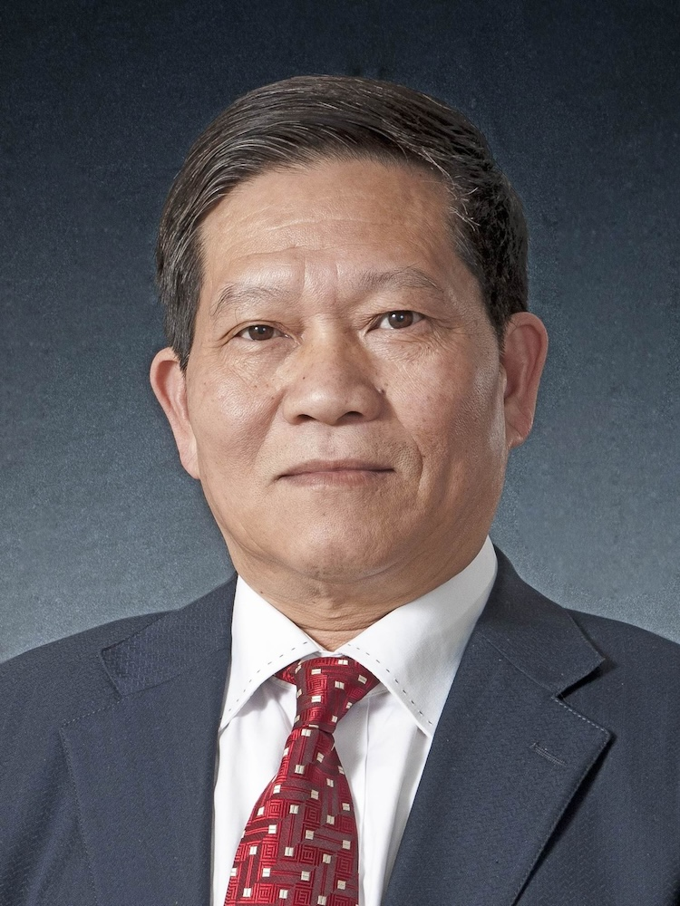

<!-- AUTO-GENERATED-BY: work/generate_obsidian_profiles.py -->

<!-- TEMPLATE: D:\workspace\信息收集整理\医生画像仓库\模板\医生画像模板.md -->

# 林培政

## 基础信息

| 字段 | 内容 |
|---|---|
| 姓名 | 林培政 |
| 医院 | 广州中医药大学第一附属医院 |
| 科室 |  |
| 职称/身份 | 男，1951年10月生，海南琼海人，中共党员；广东省名中医，教授，广东省名中医师承项目指导老师，享受国务院政府特殊津贴。 曾任温病学教研室主任，四内科主任，我院党委书记与院长，广州中医药大学副校长。 |
| 来源链接 | [官网原文](https://www.gztcm.com.cn/myzl/myhc/1hbab91krrfro.shtml) |
| 采集日期 | 2026-08-15 |

## 简介/擅长

## 科研项目与成果

- 广东省名中医，教授，广东省名中医师承项目指导老师，享受国务院政府特殊津贴。
- 自1988年起积极参与“温病学回归临床”改革，首创“温病学科教学、医疗、科研三位一体新体制”在全国同行中产生较大影响，是国家级的重点学科、精品课程、精品资源共享课程、优秀教学团队带头人，主编“十五”至“十二五”全国中医药高校国家级规划教材《温病学》，成果获含国家级二等奖等省部级以上奖励8项。

## 论文与学术产出

- 自1988年起积极参与“温病学回归临床”改革，首创“温病学科教学、医疗、科研三位一体新体制”在全国同行中产生较大影响，是国家级的重点学科、精品课程、精品资源共享课程、优秀教学团队带头人，主编“十五”至“十二五”全国中医药高校国家级规划教材《温病学》，成果获含国家级二等奖等省部级以上奖励8项。

## 可包装亮点

- 官网名医荟萃收录；
- 广东省名中医，教授，广东省名中医师承项目指导老师，享受国务院政府特殊津贴。
- 曾任温病学教研室主任，四内科主任，我院党委书记与院长，广州中医药大学副校长。
- 自1988年起积极参与“温病学回归临床”改革，首创“温病学科教学、医疗、科研三位一体新体制”在全国同行中产生较大影响，是国家级的重点学科、精品课程、精品资源共享课程、优秀教学团队带头人，主编“十五”至“十二五”全国中医药高校国家级规划教材《温病学》，成果获含国家级二等奖等省部级以上奖励8项。
- 1996年至2003年担任院领导期间较好推进医院建设与发展，尤其作为党委书记兼院长带领医院抗击 “非典”取得“零死亡、医护人员零感染、零转院”骄人成绩，获抗击“非典”三等功。

## 重点疾病/人群标签

- 慢性病：
- 肿瘤：
- 生殖疾病：
- 免疫/风湿：
- 术后恢复/康复：
- 疑难重症：

## 证据摘录

> 只摘录官网公开信息中的短句或关键字段，不复制大段原文。

- 官网身份字段：男，1951年10月生，海南琼海人，中共党员；广东省名中医，教授，广东省名中医师承项目指导老师，享受国务院政府特殊津贴。 曾任温病学教研室主任，四内科主任，我院党委书记与院长，广州中医药大学副校长。
- 官网亮眼经历线索：官网名医荟萃收录；广东省名中医，教授，广东省名中医师承项目指导老师，享受国务院政府特殊津贴。 曾任温病学教研室主任，四内科主任，我院党委书记与院长，广州中医药大学副校长。 自1988年起积极参与“温病学回归临床”改革，首创“温病学科教学、医疗、科研三位一体新体制”在全国同行中产生较大影响，是国家级的重点学科、精品课程、精品资源共享课程、优秀教学团队带头人，主编“十五”至“十二五”全国中医药高校国家级规划教材《温病学》，成果获含国家级二…
- 异常提示：名医荟萃详情未标当前科室
- 来源链接：https://www.gztcm.com.cn/myzl/myhc/1hbab91krrfro.shtml

## BD 画像摘要

当前画像仅作基础资料归档，后续使用需先完成人工复核。

## 合规边界

- 仅使用医院官网、官方公众号、官方小程序等公开渠道。
- 不采集私人电话、私人微信、家庭住址、患者隐私或非公开排班信息。
- 不写“保证治愈”“疗效第一”“包治疑难杂症”等无法由官网证明的表述。
