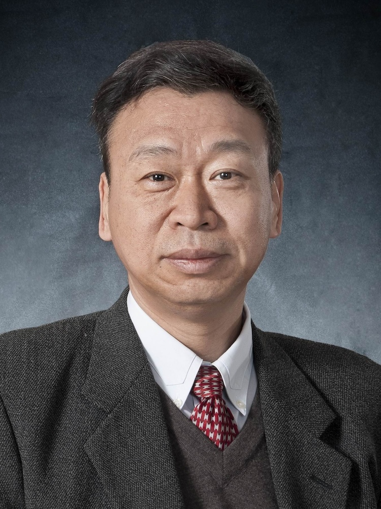

<!-- AUTO-GENERATED-BY: work/generate_obsidian_profiles.py -->

<!-- TEMPLATE: D:\workspace\信息收集整理\医生画像仓库\模板\医生画像模板.md -->

# 樊粤光

## 基础信息

| 字段 | 内容 |
|---|---|
| 姓名 | 樊粤光 |
| 医院 | 广州中医药大学第一附属医院 |
| 科室 |  |
| 职称/身份 | 男，1954年10月生，山西长子县人，中共党员；广东省名中医，广州中医药大学二级教授，主任医师，博士生导师，广东省医学领军人才，全国老中医药专家学术经验继承工作指导老师，广东省名中医师承项目指导老师。 曾任我院副院长，院长，教育部国家重点学科中医骨伤科学学科带头人。 |
| 来源链接 | [官网原文](https://www.gztcm.com.cn/myzl/myhc/1hbab7h2usa7b.shtml) |
| 采集日期 | 2026-08-15 |

## 简介/擅长

中西医结合治疗髋、膝关节疾病，研发出专科特色药物“关节康”，省内率先开展了关节镜、HTO和TKA等手术

## 教育与进修经历

- 1988年获得卫生部公派，作为高级访问学者被选送到美国伊利偌斯州立大学医学院进修学习骨科专业。

## 科研项目与成果

- 广东省名中医，广州中医药大学二级教授，主任医师，博士生导师，广东省医学领军人才，全国老中医药专家学术经验继承工作指导老师，广东省名中医师承项目指导老师。

## 论文与学术产出

- 主编多部全国高等院校本科教材，出版专著2部。

## 可包装亮点

- 官网名医荟萃收录；
- 广东省名中医，广州中医药大学二级教授，主任医师，博士生导师，广东省医学领军人才，全国老中医药专家学术经验继承工作指导老师，广东省名中医师承项目指导老师。
- 1988年获得卫生部公派，作为高级访问学者被选送到美国伊利偌斯州立大学医学院进修学习骨科专业。
- 曾任我院副院长，院长，教育部国家重点学科中医骨伤科学学科带头人。
- 曾任中华中医药学会骨伤科分会副主委委员，广东省中医药学会骨伤科专业委员会主委委员等职务。

## 重点疾病/人群标签

- 慢性病：
- 肿瘤：
- 生殖疾病：
- 免疫/风湿：
- 术后恢复/康复：
- 疑难重症：

## 证据摘录

> 只摘录官网公开信息中的短句或关键字段，不复制大段原文。

- 官网身份字段：男，1954年10月生，山西长子县人，中共党员；广东省名中医，广州中医药大学二级教授，主任医师，博士生导师，广东省医学领军人才，全国老中医药专家学术经验继承工作指导老师，广东省名中医师承项目指导老师。 曾任我院副院长，院长，教育部国家重点…
- 官网简介/擅长：中西医结合治疗髋、膝关节疾病，研发出专科特色药物“关节康”，省内率先开展了关节镜、HTO和TKA等手术
- 官网亮眼经历线索：官网名医荟萃收录；广东省名中医，广州中医药大学二级教授，主任医师，博士生导师，广东省医学领军人才，全国老中医药专家学术经验继承工作指导老师，广东省名中医师承项目指导老师。 1988年获得卫生部公派，作为高级访问学者被选送到美国伊利偌斯州立大学医学院进修学习骨科专业。 曾任我院副院长，院长，教育部国家重点学科中医骨伤科学学科带头人。 曾任中华中医药学会骨伤科分会副主委委员，广东省中医药学会骨伤科专业委员会主委委员等职务。
- 异常提示：名医荟萃详情未标当前科室
- 来源链接：https://www.gztcm.com.cn/myzl/myhc/1hbab7h2usa7b.shtml

## BD 画像摘要

当前画像仅作基础资料归档，后续使用需先完成人工复核。

## 合规边界

- 仅使用医院官网、官方公众号、官方小程序等公开渠道。
- 不采集私人电话、私人微信、家庭住址、患者隐私或非公开排班信息。
- 不写“保证治愈”“疗效第一”“包治疑难杂症”等无法由官网证明的表述。
