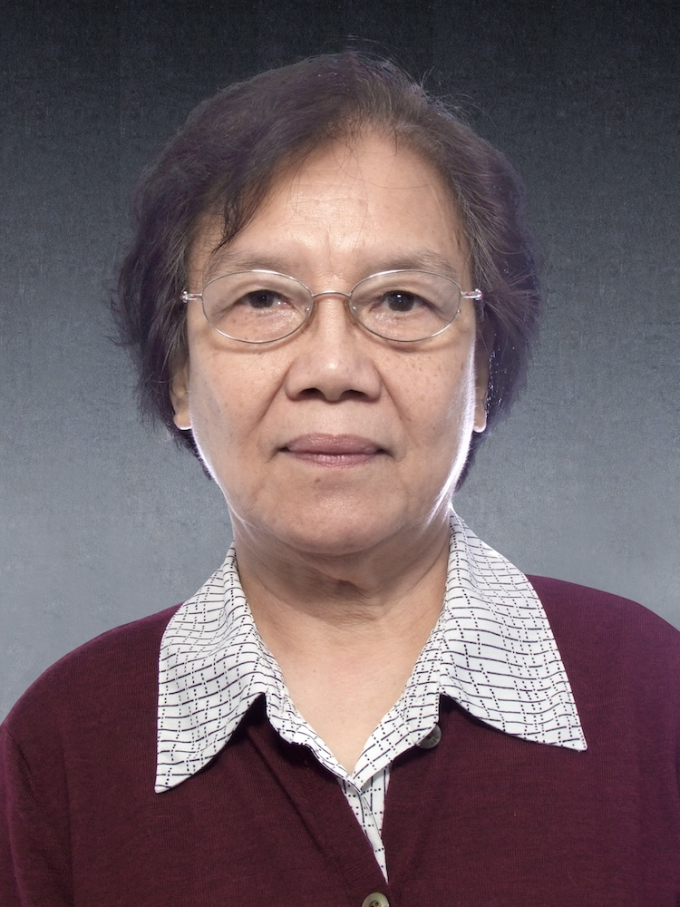

<!-- AUTO-GENERATED-BY: work/generate_obsidian_profiles.py -->

<!-- TEMPLATE: D:\workspace\信息收集整理\医生画像仓库\模板\医生画像模板.md -->

# 欧阳惠卿

## 基础信息

| 字段 | 内容 |
|---|---|
| 姓名 | 欧阳惠卿 |
| 医院 | 广州中医药大学第一附属医院 |
| 科室 |  |
| 职称/身份 | 女，1939年7月生，广东顺德人；首届全国名中医，广东省名中医，教授，博士生导师，全国老中医药专家学术经验继承工作指导老师，广东省名中医师承项目指导老师，妇科第二代学科带头人，以及本学科第一位博士后合作教授。 在罗元恺教授的支持下，1984年创建妇科实验室，成为了全国中医院校中第一所妇科实验室，铸造中医妇科学的实验平台，引导学科建设走上新台阶。 |
| 来源链接 | [官网原文](https://www.gztcm.com.cn/myzl/myhc/1hbac076voidk.shtml) |
| 采集日期 | 2026-08-15 |

## 简介/擅长

## 教育与进修经历

- 首届全国名中医，广东省名中医，教授，博士生导师，全国老中医药专家学术经验继承工作指导老师，广东省名中医师承项目指导老师，妇科第二代学科带头人，以及本学科第一位博士后合作教授。

## 科研项目与成果

- 首届全国名中医，广东省名中医，教授，博士生导师，全国老中医药专家学术经验继承工作指导老师，广东省名中医师承项目指导老师，妇科第二代学科带头人，以及本学科第一位博士后合作教授。
- 在罗元恺教授的支持下，1984年创建妇科实验室，成为了全国中医院校中第一所妇科实验室，铸造中医妇科学的实验平台，引导学科建设走上新台阶。

## 可包装亮点

- 官网名医荟萃收录；
- 首届全国名中医，广东省名中医，教授，博士生导师，全国老中医药专家学术经验继承工作指导老师，广东省名中医师承项目指导老师，妇科第二代学科带头人，以及本学科第一位博士后合作教授。
- 2016年被评为“羊城好医生”，2017年被评为“羊城名医”。
- 在罗元恺教授的支持下，1984年创建妇科实验室，成为了全国中医院校中第一所妇科实验室，铸造中医妇科学的实验平台，引导学科建设走上新台阶。

## 重点疾病/人群标签

- 慢性病：
- 肿瘤：
- 生殖疾病：
- 免疫/风湿：
- 术后恢复/康复：
- 疑难重症：

## 证据摘录

> 只摘录官网公开信息中的短句或关键字段，不复制大段原文。

- 官网身份字段：女，1939年7月生，广东顺德人；首届全国名中医，广东省名中医，教授，博士生导师，全国老中医药专家学术经验继承工作指导老师，广东省名中医师承项目指导老师，妇科第二代学科带头人，以及本学科第一位博士后合作教授。 在罗元恺教授的支持下，198…
- 官网亮眼经历线索：官网名医荟萃收录；首届全国名中医，广东省名中医，教授，博士生导师，全国老中医药专家学术经验继承工作指导老师，广东省名中医师承项目指导老师，妇科第二代学科带头人，以及本学科第一位博士后合作教授。 2016年被评为“羊城好医生”，2017年被评为“羊城名医”。 在罗元恺教授的支持下，1984年创建妇科实验室，成为了全国中医院校中第一所妇科实验室，铸造中医妇科学的实验平台，引导学科建设走上新台阶。
- 异常提示：名医荟萃详情未标当前科室
- 来源链接：https://www.gztcm.com.cn/myzl/myhc/1hbac076voidk.shtml

## BD 画像摘要

当前画像仅作基础资料归档，后续使用需先完成人工复核。

## 合规边界

- 仅使用医院官网、官方公众号、官方小程序等公开渠道。
- 不采集私人电话、私人微信、家庭住址、患者隐私或非公开排班信息。
- 不写“保证治愈”“疗效第一”“包治疑难杂症”等无法由官网证明的表述。
