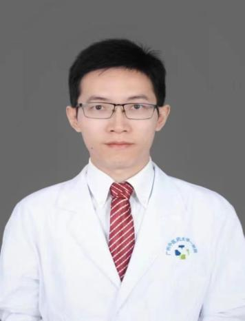

<!-- AUTO-GENERATED-BY: work/generate_obsidian_profiles.py -->

<!-- TEMPLATE: D:\workspace\信息收集整理\医生画像仓库\模板\医生画像模板.md -->

# 江其龙

## 基础信息

| 字段 | 内容 |
|---|---|
| 姓名 | 江其龙 |
| 医院 | 广州中医药大学第一附属医院 |
| 科室 | 肌病科 |
| 职称/身份 | 博士，副主任医师，硕士研究生导师；江其龙，博士，副主任医师，硕士研究生导师。 |
| 来源链接 | [官网原文](https://www.gztcm.com.cn/jibingke/kszj/1hk61olqelt32.shtml) |
| 采集日期 | 2026-08-15 |

## 简介/擅长

主要从事内科急危重症救治及重症肌无力的临床和基础研究。

## 科研项目与成果

- 主持国家自然科学基金、国家重点研发计划中医药现代化专项课题子项目、广东省中医局科研项目、广州中医药大学第一附属医院创新强院青年科研基金等多项。
- 获得软件著作专利登记2项，实用发明专利1项。

## 论文与学术产出

- 发表SCI及中文核心期刊学术论文10余篇。
- 获得软件著作专利登记2项，实用发明专利1项。

## 可包装亮点

- 江其龙，博士，副主任医师，硕士研究生导师。
- 广州中医药大学第一附属医院“菁英人才”，第七批全国老中医药专家学术继承人。
- 主要从事内科急危重症救治及重症肌无力的临床和基础研究。
- 主持国家自然科学基金、国家重点研发计划中医药现代化专项课题子项目、广东省中医局科研项目、广州中医药大学第一附属医院创新强院青年科研基金等多项。

## 重点疾病/人群标签

- 慢性病：
- 肿瘤：
- 生殖疾病：
- 免疫/风湿：
- 术后恢复/康复：
- 疑难重症：重症、急危重

## 证据摘录

> 只摘录官网公开信息中的短句或关键字段，不复制大段原文。

- 官网身份字段：博士，副主任医师，硕士研究生导师；江其龙，博士，副主任医师，硕士研究生导师。
- 官网简介/擅长：主要从事内科急危重症救治及重症肌无力的临床和基础研究。
- 官网亮眼经历线索：江其龙，博士，副主任医师，硕士研究生导师。 广州中医药大学第一附属医院“菁英人才”，第七批全国老中医药专家学术继承人。 主要从事内科急危重症救治及重症肌无力的临床和基础研究。 主持国家自然科学基金、国家重点研发计划中医药现代化专项课题子项目、广东省中医局科研项目、广州中医药大学第一附属医院创新强院青年科研基金等多项。
- 来源链接：https://www.gztcm.com.cn/jibingke/kszj/1hk61olqelt32.shtml

## BD 画像摘要

江其龙医生可作为疑难重症方向的基础画像候选。后续 BD 使用应继续以官网来源和人工复核为准，不添加疗效承诺或无来源包装。

## 合规边界

- 仅使用医院官网、官方公众号、官方小程序等公开渠道。
- 不采集私人电话、私人微信、家庭住址、患者隐私或非公开排班信息。
- 不写“保证治愈”“疗效第一”“包治疑难杂症”等无法由官网证明的表述。
