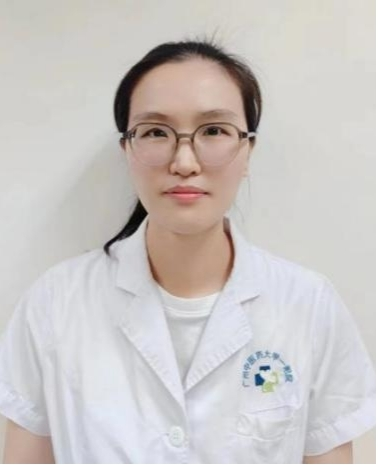

<!-- AUTO-GENERATED-BY: work/generate_obsidian_profiles.py -->

<!-- TEMPLATE: D:\workspace\信息收集整理\医生画像仓库\模板\医生画像模板.md -->

# 汪双双

## 基础信息

| 字段 | 内容 |
|---|---|
| 姓名 | 汪双双 |
| 医院 | 广州中医药大学第一附属医院 |
| 科室 | 肌病科 |
| 职称/身份 | 中西医结合临床硕士；汪双双，中西医结合临床硕士。 2011年7月至今就职于广州中医药大学第一附属医院脾胃病科，一直从事肌肉病方面的临床与教学工作，2010年参与制作的多媒体课件《神经系统的定位诊断》在中国教育技术协会中医药专业委员会第六届学术年会上评为优秀教学三等奖，2013年“邓铁涛教授诊治重症肌无力学术经验传承”课题获得邓铁涛基金第七批立项资助，2013年6月作为编委整理出版《国医大师邓铁涛教授医案及验方》一书。 |
| 来源链接 | [官网原文](https://www.gztcm.com.cn/jibingke/kszj/1hk61tcackcqv.shtml) |
| 采集日期 | 2026-08-15 |

## 简介/擅长

从事肌肉病方面的临床与教学工作

## 科研项目与成果

- 2011年7月至今就职于广州中医药大学第一附属医院脾胃病科，一直从事肌肉病方面的临床与教学工作，2010年参与制作的多媒体课件《神经系统的定位诊断》在中国教育技术协会中医药专业委员会第六届学术年会上评为优秀教学三等奖，2013年“邓铁涛教授诊治重症肌无力学术经验传承”课题获得邓铁涛基金第七批立项资助，2013年6月作为编委整理出版《国医大师邓铁涛教授医案及验方》一书。

## 可包装亮点

- 2011年7月至今就职于广州中医药大学第一附属医院脾胃病科，一直从事肌肉病方面的临床与教学工作，2010年参与制作的多媒体课件《神经系统的定位诊断》在中国教育技术协会中医药专业委员会第六届学术年会上评为优秀教学三等奖，2013年“邓铁涛教授诊治重症肌无力学术经验传承”课题获得邓铁涛基金第七批立项资助，2013年6月作为编委整理出版《国医大师邓铁涛教授医案及…

## 重点疾病/人群标签

- 慢性病：
- 肿瘤：
- 生殖疾病：
- 免疫/风湿：
- 术后恢复/康复：
- 疑难重症：重症

## 证据摘录

> 只摘录官网公开信息中的短句或关键字段，不复制大段原文。

- 官网身份字段：中西医结合临床硕士；汪双双，中西医结合临床硕士。 2011年7月至今就职于广州中医药大学第一附属医院脾胃病科，一直从事肌肉病方面的临床与教学工作，2010年参与制作的多媒体课件《神经系统的定位诊断》在中国教育技术协会中医药专业委员会第六届…
- 官网简介/擅长：从事肌肉病方面的临床与教学工作
- 官网亮眼经历线索：2011年7月至今就职于广州中医药大学第一附属医院脾胃病科，一直从事肌肉病方面的临床与教学工作，2010年参与制作的多媒体课件《神经系统的定位诊断》在中国教育技术协会中医药专业委员会第六届学术年会上评为优秀教学三等奖，2013年“邓铁涛教授诊治重症肌无力学术经验传承”课题获得邓铁涛基金第七批立项资助，2013年6月作为编委整理出版《国医大师邓铁涛教授医案及验方》一书。
- 来源链接：https://www.gztcm.com.cn/jibingke/kszj/1hk61tcackcqv.shtml

## BD 画像摘要

汪双双医生可作为疑难重症方向的基础画像候选。后续 BD 使用应继续以官网来源和人工复核为准，不添加疗效承诺或无来源包装。

## 合规边界

- 仅使用医院官网、官方公众号、官方小程序等公开渠道。
- 不采集私人电话、私人微信、家庭住址、患者隐私或非公开排班信息。
- 不写“保证治愈”“疗效第一”“包治疑难杂症”等无法由官网证明的表述。
