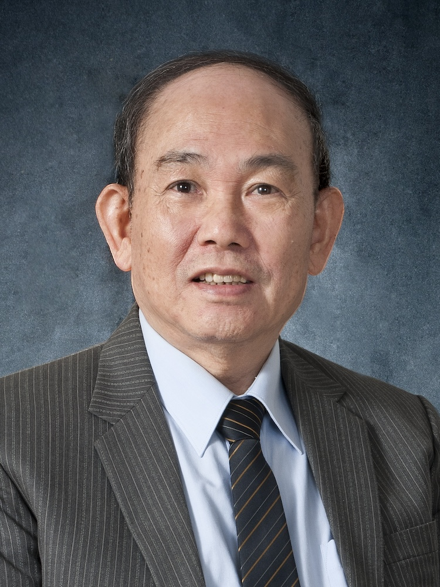

<!-- AUTO-GENERATED-BY: work/generate_obsidian_profiles.py -->

<!-- TEMPLATE: D:\workspace\信息收集整理\医生画像仓库\模板\医生画像模板.md -->

# 洪钦国

## 基础信息

| 字段 | 内容 |
|---|---|
| 姓名 | 洪钦国 |
| 医院 | 广州中医药大学第一附属医院 |
| 科室 |  |
| 职称/身份 | 男，1938年3月生，广东潮州人，中共党员；广东省名中医，教授，博士生导师，全国老中医药专家学术经验继承工作指导老师，岭南肾脏病名家。 曾任内科教研室副主任，中国卫生部新药评审委员会委员，广东省中西医结合肾病协会副主任委员与名誉主任委员。 |
| 来源链接 | [官网原文](https://www.gztcm.com.cn/myzl/myhc/1hbabhdopiqgv.shtml) |
| 采集日期 | 2026-08-15 |

## 简介/擅长

## 科研项目与成果

- 从事医疗、教学和科研工作50余年，推崇中西医结合，在治疗慢性肾小球肾炎、肾病综合征、IgA肾病、慢性肾衰竭等疾病方面经验丰富，创制出升清降浊胶囊、复方大黄灌肠液等制剂。
- 主持课题《肾复康治疗肾病综合征的临床与实验研究》获得广州中医药大学科技进步三等奖，发表学术论文50多篇，主编、参编著作10余部。

## 论文与学术产出

- 主持课题《肾复康治疗肾病综合征的临床与实验研究》获得广州中医药大学科技进步三等奖，发表学术论文50多篇，主编、参编著作10余部。

## 可包装亮点

- 官网名医荟萃收录；
- 广东省名中医，教授，博士生导师，全国老中医药专家学术经验继承工作指导老师，岭南肾脏病名家。
- 曾任内科教研室副主任，中国卫生部新药评审委员会委员，广东省中西医结合肾病协会副主任委员与名誉主任委员。
- 主持课题《肾复康治疗肾病综合征的临床与实验研究》获得广州中医药大学科技进步三等奖，发表学术论文50多篇，主编、参编著作10余部。

## 重点疾病/人群标签

- 慢性病：
- 肿瘤：
- 生殖疾病：
- 免疫/风湿：
- 术后恢复/康复：
- 疑难重症：

## 证据摘录

> 只摘录官网公开信息中的短句或关键字段，不复制大段原文。

- 官网身份字段：男，1938年3月生，广东潮州人，中共党员；广东省名中医，教授，博士生导师，全国老中医药专家学术经验继承工作指导老师，岭南肾脏病名家。 曾任内科教研室副主任，中国卫生部新药评审委员会委员，广东省中西医结合肾病协会副主任委员与名誉主任委员。
- 官网亮眼经历线索：官网名医荟萃收录；广东省名中医，教授，博士生导师，全国老中医药专家学术经验继承工作指导老师，岭南肾脏病名家。 曾任内科教研室副主任，中国卫生部新药评审委员会委员，广东省中西医结合肾病协会副主任委员与名誉主任委员。 主持课题《肾复康治疗肾病综合征的临床与实验研究》获得广州中医药大学科技进步三等奖，发表学术论文50多篇，主编、参编著作10余部。
- 异常提示：名医荟萃详情未标当前科室
- 来源链接：https://www.gztcm.com.cn/myzl/myhc/1hbabhdopiqgv.shtml

## BD 画像摘要

当前画像仅作基础资料归档，后续使用需先完成人工复核。

## 合规边界

- 仅使用医院官网、官方公众号、官方小程序等公开渠道。
- 不采集私人电话、私人微信、家庭住址、患者隐私或非公开排班信息。
- 不写“保证治愈”“疗效第一”“包治疑难杂症”等无法由官网证明的表述。
