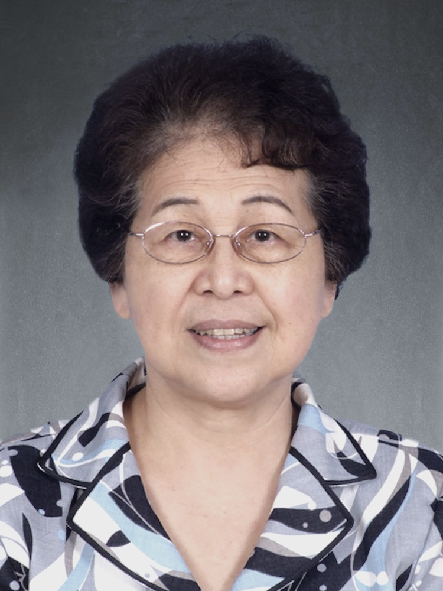

<!-- AUTO-GENERATED-BY: work/generate_obsidian_profiles.py -->

<!-- TEMPLATE: D:\workspace\信息收集整理\医生画像仓库\模板\医生画像模板.md -->

# 熊曼琪

## 基础信息

| 字段 | 内容 |
|---|---|
| 姓名 | 熊曼琪 |
| 医院 | 广州中医药大学第一附属医院 |
| 科室 |  |
| 职称/身份 | 女，1938年1月生，湖南益阳人；广东省名中医，广州中医药大学首席教授，博士生及博士后导师，全国老中医药专家学术经验继承工作指导老师，我国著名伤寒学家、糖尿病专家，享受国务院政府特殊津贴。 曾任国家级重点学科-中医临床基础学科带头人、经方治疗疑难病研究方向学术带头人，国务院学位委员会第四届学科评议组成员，我院糖尿病研究所名誉所长、中国中医药学会糖尿病分会副主任委员等。 |
| 来源链接 | [官网原文](https://www.gztcm.com.cn/myzl/myhc/1hbabqjtacn1l.shtml) |
| 采集日期 | 2026-08-15 |

## 简介/擅长

## 教育与进修经历

- 广东省名中医，广州中医药大学首席教授，博士生及博士后导师，全国老中医药专家学术经验继承工作指导老师，我国著名伤寒学家、糖尿病专家，享受国务院政府特殊津贴。
- 曾任国家级重点学科-中医临床基础学科带头人、经方治疗疑难病研究方向学术带头人，国务院学位委员会第四届学科评议组成员，我院糖尿病研究所名誉所长、中国中医药学会糖尿病分会副主任委员等。

## 科研项目与成果

- 率先建立伤寒论病区、伤寒论实验室，首创“泻热逐瘀法”治疗糖尿病，提出“中医药治疗糖尿病，必须研究胰岛素抵抗”。
- 曾获国家科技进步二等奖1项，国家教学成果二等奖2项。

## 可包装亮点

- 官网名医荟萃收录；
- 广东省名中医，广州中医药大学首席教授，博士生及博士后导师，全国老中医药专家学术经验继承工作指导老师，我国著名伤寒学家、糖尿病专家，享受国务院政府特殊津贴。
- 曾任国家级重点学科-中医临床基础学科带头人、经方治疗疑难病研究方向学术带头人，国务院学位委员会第四届学科评议组成员，我院糖尿病研究所名誉所长、中国中医药学会糖尿病分会副主任委员等。
- 长期从事经方治疗疑难病，尤其糖尿病慢性并发症等为主的临床研究。
- 率先建立伤寒论病区、伤寒论实验室，首创“泻热逐瘀法”治疗糖尿病，提出“中医药治疗糖尿病，必须研究胰岛素抵抗”。

## 重点疾病/人群标签

- 慢性病：
- 肿瘤：
- 生殖疾病：
- 免疫/风湿：
- 术后恢复/康复：
- 疑难重症：

## 证据摘录

> 只摘录官网公开信息中的短句或关键字段，不复制大段原文。

- 官网身份字段：女，1938年1月生，湖南益阳人；广东省名中医，广州中医药大学首席教授，博士生及博士后导师，全国老中医药专家学术经验继承工作指导老师，我国著名伤寒学家、糖尿病专家，享受国务院政府特殊津贴。 曾任国家级重点学科-中医临床基础学科带头人、经方…
- 官网亮眼经历线索：官网名医荟萃收录；广东省名中医，广州中医药大学首席教授，博士生及博士后导师，全国老中医药专家学术经验继承工作指导老师，我国著名伤寒学家、糖尿病专家，享受国务院政府特殊津贴。 曾任国家级重点学科-中医临床基础学科带头人、经方治疗疑难病研究方向学术带头人，国务院学位委员会第四届学科评议组成员，我院糖尿病研究所名誉所长、中国中医药学会糖尿病分会副主任委员等。 长期从事经方治疗疑难病，尤其糖尿病慢性并发症等为主的临床研究。 率先建立伤寒论病区…
- 异常提示：名医荟萃详情未标当前科室
- 来源链接：https://www.gztcm.com.cn/myzl/myhc/1hbabqjtacn1l.shtml

## BD 画像摘要

当前画像仅作基础资料归档，后续使用需先完成人工复核。

## 合规边界

- 仅使用医院官网、官方公众号、官方小程序等公开渠道。
- 不采集私人电话、私人微信、家庭住址、患者隐私或非公开排班信息。
- 不写“保证治愈”“疗效第一”“包治疑难杂症”等无法由官网证明的表述。
