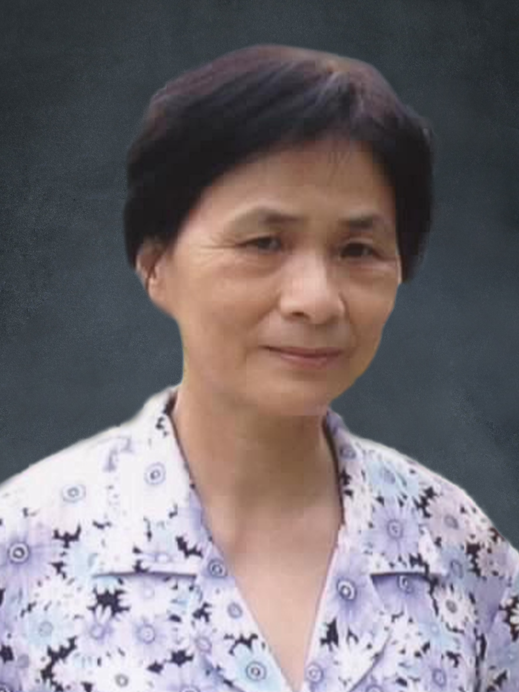

<!-- AUTO-GENERATED-BY: work/generate_obsidian_profiles.py -->

<!-- TEMPLATE: D:\workspace\信息收集整理\医生画像仓库\模板\医生画像模板.md -->

# 王士贞

## 基础信息

| 字段 | 内容 |
|---|---|
| 姓名 | 王士贞 |
| 医院 | 广州中医药大学第一附属医院 |
| 科室 |  |
| 职称/身份 | 女，1945年2月生，福建厦门人；教授，主任医师，博士生导师，全国老中医药专家学术经验继承工作指导老师。 曾任耳鼻咽喉科主任及学术带头人，中华中医药学会耳鼻咽喉科分会学术顾问，广东省中医药学会耳鼻咽喉专业委员会主任委员，广州市第九、第十届政协委员。 |
| 来源链接 | [官网原文](https://www.gztcm.com.cn/myzl/myhc/1hbabavkjfekm.shtml) |
| 采集日期 | 2026-08-15 |

## 简介/擅长

## 可包装亮点

- 官网名医荟萃收录；
- 教授，主任医师，博士生导师，全国老中医药专家学术经验继承工作指导老师。
- 曾任耳鼻咽喉科主任及学术带头人，中华中医药学会耳鼻咽喉科分会学术顾问，广东省中医药学会耳鼻咽喉专业委员会主任委员，广州市第九、第十届政协委员。
- 现任世界中医药学会联合会耳鼻喉口腔科专业委员会会长，广东省中医药学会终身理事。
- 2006年获得广州中医药大学科学技术进步二等奖，2015年获得中华中医药学会科学技术进步三等奖。

## 重点疾病/人群标签

- 慢性病：
- 肿瘤：
- 生殖疾病：
- 免疫/风湿：
- 术后恢复/康复：
- 疑难重症：

## 证据摘录

> 只摘录官网公开信息中的短句或关键字段，不复制大段原文。

- 官网身份字段：女，1945年2月生，福建厦门人；教授，主任医师，博士生导师，全国老中医药专家学术经验继承工作指导老师。 曾任耳鼻咽喉科主任及学术带头人，中华中医药学会耳鼻咽喉科分会学术顾问，广东省中医药学会耳鼻咽喉专业委员会主任委员，广州市第九、第十届…
- 官网亮眼经历线索：官网名医荟萃收录；教授，主任医师，博士生导师，全国老中医药专家学术经验继承工作指导老师。 曾任耳鼻咽喉科主任及学术带头人，中华中医药学会耳鼻咽喉科分会学术顾问，广东省中医药学会耳鼻咽喉专业委员会主任委员，广州市第九、第十届政协委员。 现任世界中医药学会联合会耳鼻喉口腔科专业委员会会长，广东省中医药学会终身理事。 2006年获得广州中医药大学科学技术进步二等奖，2015年获得中华中医药学会科学技术进步三等奖。
- 异常提示：名医荟萃详情未标当前科室
- 来源链接：https://www.gztcm.com.cn/myzl/myhc/1hbabavkjfekm.shtml

## BD 画像摘要

当前画像仅作基础资料归档，后续使用需先完成人工复核。

## 合规边界

- 仅使用医院官网、官方公众号、官方小程序等公开渠道。
- 不采集私人电话、私人微信、家庭住址、患者隐私或非公开排班信息。
- 不写“保证治愈”“疗效第一”“包治疑难杂症”等无法由官网证明的表述。
