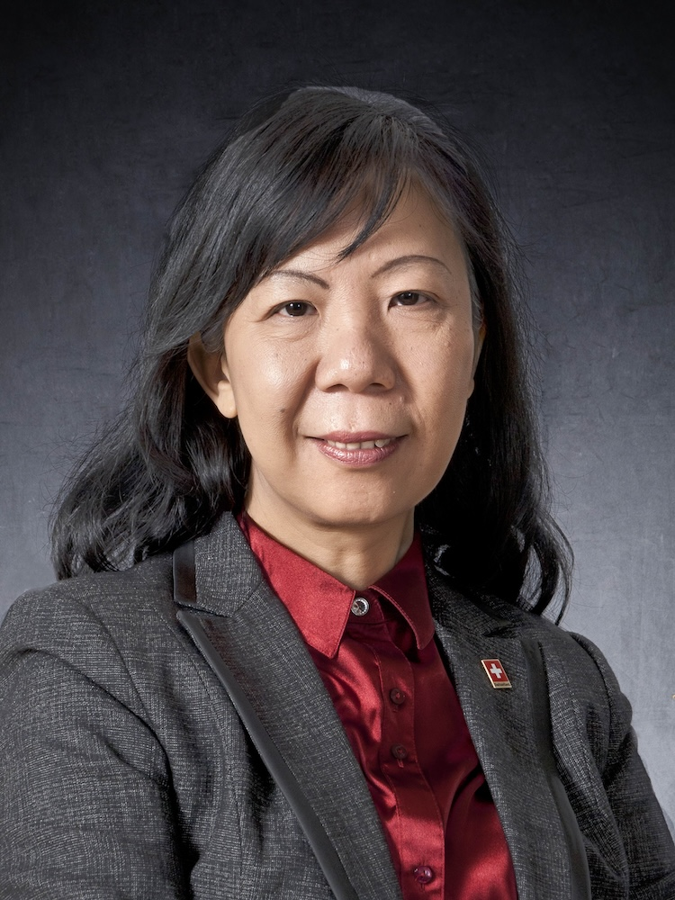

<!-- AUTO-GENERATED-BY: work/generate_obsidian_profiles.py -->

<!-- TEMPLATE: D:\workspace\信息收集整理\医生画像仓库\模板\医生画像模板.md -->

# 罗颂平

## 基础信息

| 字段 | 内容 |
|---|---|
| 姓名 | 罗颂平 |
| 医院 | 广州中医药大学第一附属医院 |
| 科室 |  |
| 职称/身份 | 女，1957年5月生，广东南海人；第二届全国名中医，教授，博士生导师，广东省政协第八、九、十、十一届常委，广东省医学领军人才，岐黄学者，广东省高等学校教学名师，“广东特支计划”教学名师，全国老中医药专家经验学术继承工作指导老师，广东省名中医师承项目指导老师，获全国五一劳动奖章，全国模范教师，全国教育系统巾帼建功标兵，全国医德标兵，享受国务院政府特殊津贴。 出身中医世家，罗元恺教授的学术继承人。 |
| 来源链接 | [官网原文](https://www.gztcm.com.cn/myzl/myhc/1hbab3o6htd57.shtml) |
| 采集日期 | 2026-08-15 |

## 简介/擅长

调经、助孕和安胎，创岭南妇科四季膏方并广泛应用于临床

## 教育与进修经历

- 毕业于广州中医药大学，获博士学位，师承欧阳惠卿教授。

## 科研项目与成果

- 第二届全国名中医，教授，博士生导师，广东省政协第八、九、十、十一届常委，广东省医学领军人才，岐黄学者，广东省高等学校教学名师，“广东特支计划”教学名师，全国老中医药专家经验学术继承工作指导老师，广东省名中医师承项目指导老师，获全国五一劳动奖章，全国模范教师，全国教育系统巾帼建功标兵，全国医德标兵，享受国务院政府特殊津贴。
- 在中医药防治复发性流产方面具有较大的学术影响，获广东省科技二等奖2项、国家中医药管理局科技成果乙等奖1项、全国妇幼健康科技奖二等奖1项。

## 可包装亮点

- 官网名医荟萃收录；
- 第二届全国名中医，教授，博士生导师，广东省政协第八、九、十、十一届常委，广东省医学领军人才，岐黄学者，广东省高等学校教学名师，“广东特支计划”教学名师，全国老中医药专家经验学术继承工作指导老师，广东省名中医师承项目指导老师，获全国五一劳动奖章，全国模范教师，全国教育系统巾帼建功标兵，全国医德标兵，享受国务院政府特殊津贴。
- “岭南罗氏妇科流派传承工作室”负责人，广东省非物质文化遗产“岭南罗氏妇科诊法”代表性传承人，国家重点学科中医妇科学学科带头人。
- 在中医药防治复发性流产方面具有较大的学术影响，获广东省科技二等奖2项、国家中医药管理局科技成果乙等奖1项、全国妇幼健康科技奖二等奖1项。

## 重点疾病/人群标签

- 慢性病：
- 肿瘤：
- 生殖疾病：
- 免疫/风湿：
- 术后恢复/康复：
- 疑难重症：

## 证据摘录

> 只摘录官网公开信息中的短句或关键字段，不复制大段原文。

- 官网身份字段：女，1957年5月生，广东南海人；第二届全国名中医，教授，博士生导师，广东省政协第八、九、十、十一届常委，广东省医学领军人才，岐黄学者，广东省高等学校教学名师，“广东特支计划”教学名师，全国老中医药专家经验学术继承工作指导老师，广东省名中…
- 官网简介/擅长：调经、助孕和安胎，创岭南妇科四季膏方并广泛应用于临床
- 官网亮眼经历线索：官网名医荟萃收录；第二届全国名中医，教授，博士生导师，广东省政协第八、九、十、十一届常委，广东省医学领军人才，岐黄学者，广东省高等学校教学名师，“广东特支计划”教学名师，全国老中医药专家经验学术继承工作指导老师，广东省名中医师承项目指导老师，获全国五一劳动奖章，全国模范教师，全国教育系统巾帼建功标兵，全国医德标兵，享受国务院政府特殊津贴。 “岭南罗氏妇科流派传承工作室”负责人，广东省非物质文化遗产“岭南罗氏妇科诊法”代表性传承人，国家…
- 异常提示：名医荟萃详情未标当前科室
- 来源链接：https://www.gztcm.com.cn/myzl/myhc/1hbab3o6htd57.shtml

## BD 画像摘要

当前画像仅作基础资料归档，后续使用需先完成人工复核。

## 合规边界

- 仅使用医院官网、官方公众号、官方小程序等公开渠道。
- 不采集私人电话、私人微信、家庭住址、患者隐私或非公开排班信息。
- 不写“保证治愈”“疗效第一”“包治疑难杂症”等无法由官网证明的表述。
