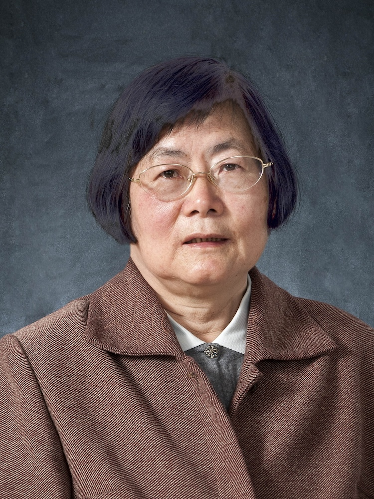

<!-- AUTO-GENERATED-BY: work/generate_obsidian_profiles.py -->

<!-- TEMPLATE: D:\workspace\信息收集整理\医生画像仓库\模板\医生画像模板.md -->

# 许鑫梅

## 基础信息

| 字段 | 内容 |
|---|---|
| 姓名 | 许鑫梅 |
| 医院 | 广州中医药大学第一附属医院 |
| 科室 |  |
| 职称/身份 | 女，1940年6月生，江苏吴江人；广东省名中医，教授，博士生导师，全国老中医药专家学术经验继承工作指导老师，享受国务院政府特殊津贴。 曾任国家重点专科、重点学科学术带头人，消化科主任，脾胃所副主任。 |
| 来源链接 | [官网原文](https://www.gztcm.com.cn/myzl/myhc/1hbabj6et6nld.shtml) |
| 采集日期 | 2026-08-15 |

## 简介/擅长

## 科研项目与成果

- 因科研工作成绩突出，1997年获大学“突出贡献科技工作者”奖。

## 论文与学术产出

- 她勤于著书，善于总结，主编《内经要览》《养生长寿》《临床诊疗常规》，副主编《中医内科学》《中医内科五脏病学》，参编《现代中医治疗学》《实用中医消化病学》等专著。

## 可包装亮点

- 官网名医荟萃收录；
- 广东省名中医，教授，博士生导师，全国老中医药专家学术经验继承工作指导老师，享受国务院政府特殊津贴。
- 曾任国家重点专科、重点学科学术带头人，消化科主任，脾胃所副主任。
- 曾任中国中医学会内科脾胃专委会委员，中国中西医结合学会广东分会脾胃专委会委员，《新中医》常务编委，《中医杂志》审稿专家，全国“许鑫梅名医工作室”指导专家。
- 作为主要完成人，获广东省高教局科技进步三等奖、省中医药管理局二等奖、大学基础研究奖二等奖、广州军区后勤部三等奖等；

## 重点疾病/人群标签

- 慢性病：
- 肿瘤：
- 生殖疾病：
- 免疫/风湿：
- 术后恢复/康复：
- 疑难重症：

## 证据摘录

> 只摘录官网公开信息中的短句或关键字段，不复制大段原文。

- 官网身份字段：女，1940年6月生，江苏吴江人；广东省名中医，教授，博士生导师，全国老中医药专家学术经验继承工作指导老师，享受国务院政府特殊津贴。 曾任国家重点专科、重点学科学术带头人，消化科主任，脾胃所副主任。
- 官网亮眼经历线索：官网名医荟萃收录；广东省名中医，教授，博士生导师，全国老中医药专家学术经验继承工作指导老师，享受国务院政府特殊津贴。 曾任国家重点专科、重点学科学术带头人，消化科主任，脾胃所副主任。 曾任中国中医学会内科脾胃专委会委员，中国中西医结合学会广东分会脾胃专委会委员，《新中医》常务编委，《中医杂志》审稿专家，全国“许鑫梅名医工作室”指导专家。 作为主要完成人，获广东省高教局科技进步三等奖、省中医药管理局二等奖、大学基础研究奖二等奖、广州军区…
- 异常提示：名医荟萃详情未标当前科室
- 来源链接：https://www.gztcm.com.cn/myzl/myhc/1hbabj6et6nld.shtml

## BD 画像摘要

当前画像仅作基础资料归档，后续使用需先完成人工复核。

## 合规边界

- 仅使用医院官网、官方公众号、官方小程序等公开渠道。
- 不采集私人电话、私人微信、家庭住址、患者隐私或非公开排班信息。
- 不写“保证治愈”“疗效第一”“包治疑难杂症”等无法由官网证明的表述。
