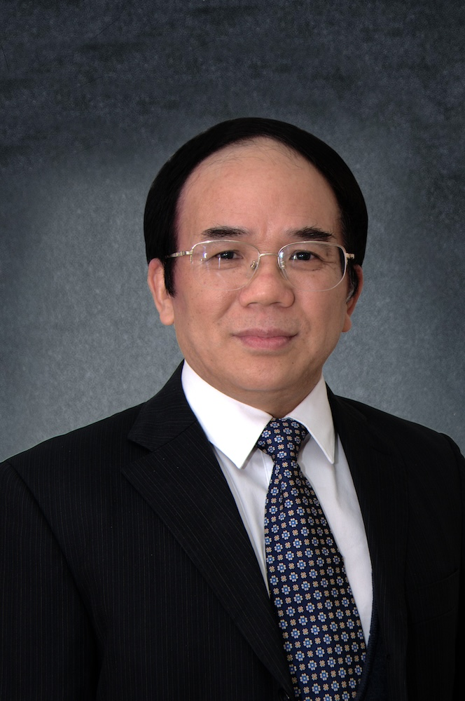

<!-- AUTO-GENERATED-BY: work/generate_obsidian_profiles.py -->

<!-- TEMPLATE: D:\workspace\信息收集整理\医生画像仓库\模板\医生画像模板.md -->

# 赖新生

## 基础信息

| 字段 | 内容 |
|---|---|
| 姓名 | 赖新生 |
| 医院 | 广州中医药大学第一附属医院 |
| 科室 |  |
| 职称/身份 | 男，1955年10月生，福建武平县人，中共党员；广东省名中医，广州中医药大学二级教授，博士生导师，博士后合作教授，首批全国中医传承博士后导师，全国老中医药专家学术经验继承工作指导老师，广东省名中医师承项目指导老师，我国著名中医针灸学家，享受国务院政府特殊津贴。 师从司徒铃教授，继承靳瑞教授学术思想，在靳老指导下完成“三针疗法”体系的创立工作。 |
| 来源链接 | [官网原文](https://www.gztcm.com.cn/myzl/myhc/1hbaanj6js5b1.shtml) |
| 采集日期 | 2026-08-15 |

## 简介/擅长

针药结合治疗变态反应性疾病、脑病和不孕不育疾患，创立“通元针法”，首次提出“经穴-脑相关”理论

## 教育与进修经历

- 广东省名中医，广州中医药大学二级教授，博士生导师，博士后合作教授，首批全国中医传承博士后导师，全国老中医药专家学术经验继承工作指导老师，广东省名中医师承项目指导老师，我国著名中医针灸学家，享受国务院政府特殊津贴。

## 科研项目与成果

- 广东省名中医，广州中医药大学二级教授，博士生导师，博士后合作教授，首批全国中医传承博士后导师，全国老中医药专家学术经验继承工作指导老师，广东省名中医师承项目指导老师，我国著名中医针灸学家，享受国务院政府特殊津贴。
- 现担任国家973计划专家组成员、国家自然科学基金和国家自然科学奖评审专家等职。
- 主持973计划、国家自然科学基金、国家重点项目课题22项，获国家和省部级奖励7项。

## 论文与学术产出

- 出版著作12部，论文340余篇，SCI论文20余篇。

## 可包装亮点

- 官网名医荟萃收录；
- 广东省名中医，广州中医药大学二级教授，博士生导师，博士后合作教授，首批全国中医传承博士后导师，全国老中医药专家学术经验继承工作指导老师，广东省名中医师承项目指导老师，我国著名中医针灸学家，享受国务院政府特殊津贴。
- 现担任国家973计划专家组成员、国家自然科学基金和国家自然科学奖评审专家等职。
- 主持973计划、国家自然科学基金、国家重点项目课题22项，获国家和省部级奖励7项。
- 出版著作12部，论文340余篇，SCI论文20余篇。

## 重点疾病/人群标签

- 慢性病：
- 肿瘤：
- 生殖疾病：
- 免疫/风湿：
- 术后恢复/康复：
- 疑难重症：

## 证据摘录

> 只摘录官网公开信息中的短句或关键字段，不复制大段原文。

- 官网身份字段：男，1955年10月生，福建武平县人，中共党员；广东省名中医，广州中医药大学二级教授，博士生导师，博士后合作教授，首批全国中医传承博士后导师，全国老中医药专家学术经验继承工作指导老师，广东省名中医师承项目指导老师，我国著名中医针灸学家，享…
- 官网简介/擅长：针药结合治疗变态反应性疾病、脑病和不孕不育疾患，创立“通元针法”，首次提出“经穴-脑相关”理论
- 官网亮眼经历线索：官网名医荟萃收录；广东省名中医，广州中医药大学二级教授，博士生导师，博士后合作教授，首批全国中医传承博士后导师，全国老中医药专家学术经验继承工作指导老师，广东省名中医师承项目指导老师，我国著名中医针灸学家，享受国务院政府特殊津贴。 现担任国家973计划专家组成员、国家自然科学基金和国家自然科学奖评审专家等职。 主持973计划、国家自然科学基金、国家重点项目课题22项，获国家和省部级奖励7项。 出版著作12部，论文340余篇，SCI论文…
- 异常提示：名医荟萃详情未标当前科室
- 来源链接：https://www.gztcm.com.cn/myzl/myhc/1hbaanj6js5b1.shtml

## BD 画像摘要

当前画像仅作基础资料归档，后续使用需先完成人工复核。

## 合规边界

- 仅使用医院官网、官方公众号、官方小程序等公开渠道。
- 不采集私人电话、私人微信、家庭住址、患者隐私或非公开排班信息。
- 不写“保证治愈”“疗效第一”“包治疑难杂症”等无法由官网证明的表述。
