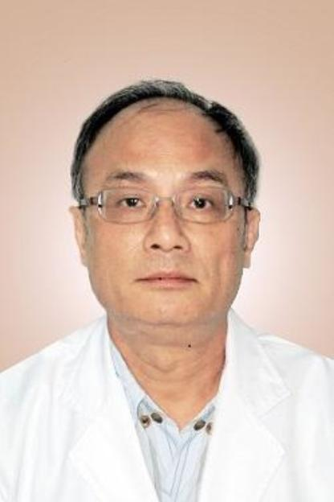

<!-- AUTO-GENERATED-BY: work/generate_obsidian_profiles.py -->

<!-- TEMPLATE: D:\workspace\信息收集整理\医生画像仓库\模板\医生画像模板.md -->

# 邓中光

## 基础信息

| 字段 | 内容 |
|---|---|
| 姓名 | 邓中光 |
| 医院 | 广州中医药大学第一附属医院 |
| 科室 | 肌病科 |
| 职称/身份 | 广东省名中医，教授；邓中光，广东省名中医，教授。 国医大师邓铁涛教授传人、广东省名中医，首批全国名老中医药专家学术经验继承工作指导老师邓铁涛教授的学术继承人，获“全国首届中医药传承高徒奖”。 |
| 来源链接 | [官网原文](https://www.gztcm.com.cn/jibingke/kszj/1hk6159tbrv2n.shtml) |
| 采集日期 | 2026-08-15 |

## 简介/擅长

临床擅长辨治内科杂病，尤其对重症肌无力、皮肌炎、硬皮病、带状疱疹、顽咳、内伤发热、手足筋络病等疑难杂症经验丰富。

## 科研项目与成果

- 曾参与“脾虚型重症肌无力的辨证论治与实验研究”、“邓铁涛中医诊疗经验及学术思想整理研究”、“中医五脏相关理论的继承与创新研究”等国家级、省部级课题，多次获得省部级以上科研奖励。
- 2010年承担国家中医药管理局“国医大师邓铁涛传承工作室建设”项目工作。

## 论文与学术产出

- 发表论文30多篇，参编医著10余部。

## 可包装亮点

- 国医大师邓铁涛教授传人、广东省名中医，首批全国名老中医药专家学术经验继承工作指导老师邓铁涛教授的学术继承人，获“全国首届中医药传承高徒奖”。
- 曾参与“脾虚型重症肌无力的辨证论治与实验研究”、“邓铁涛中医诊疗经验及学术思想整理研究”、“中医五脏相关理论的继承与创新研究”等国家级、省部级课题，多次获得省部级以上科研奖励。
- 2010年承担国家中医药管理局“国医大师邓铁涛传承工作室建设”项目工作。
- 发表论文30多篇，参编医著10余部。

## 重点疾病/人群标签

- 慢性病：
- 肿瘤：
- 生殖疾病：
- 免疫/风湿：
- 术后恢复/康复：
- 疑难重症：疑难、重症

## 证据摘录

> 只摘录官网公开信息中的短句或关键字段，不复制大段原文。

- 官网身份字段：广东省名中医，教授；邓中光，广东省名中医，教授。 国医大师邓铁涛教授传人、广东省名中医，首批全国名老中医药专家学术经验继承工作指导老师邓铁涛教授的学术继承人，获“全国首届中医药传承高徒奖”。
- 官网简介/擅长：临床擅长辨治内科杂病，尤其对重症肌无力、皮肌炎、硬皮病、带状疱疹、顽咳、内伤发热、手足筋络病等疑难杂症经验丰富。
- 官网亮眼经历线索：国医大师邓铁涛教授传人、广东省名中医，首批全国名老中医药专家学术经验继承工作指导老师邓铁涛教授的学术继承人，获“全国首届中医药传承高徒奖”。 曾参与“脾虚型重症肌无力的辨证论治与实验研究”、“邓铁涛中医诊疗经验及学术思想整理研究”、“中医五脏相关理论的继承与创新研究”等国家级、省部级课题，多次获得省部级以上科研奖励。 2010年承担国家中医药管理局“国医大师邓铁涛传承工作室建设”项目工作。 发表论文30多篇，参编医著10余部。
- 来源链接：https://www.gztcm.com.cn/jibingke/kszj/1hk6159tbrv2n.shtml

## BD 画像摘要

邓中光医生可作为疑难重症方向的基础画像候选。后续 BD 使用应继续以官网来源和人工复核为准，不添加疗效承诺或无来源包装。

## 合规边界

- 仅使用医院官网、官方公众号、官方小程序等公开渠道。
- 不采集私人电话、私人微信、家庭住址、患者隐私或非公开排班信息。
- 不写“保证治愈”“疗效第一”“包治疑难杂症”等无法由官网证明的表述。
