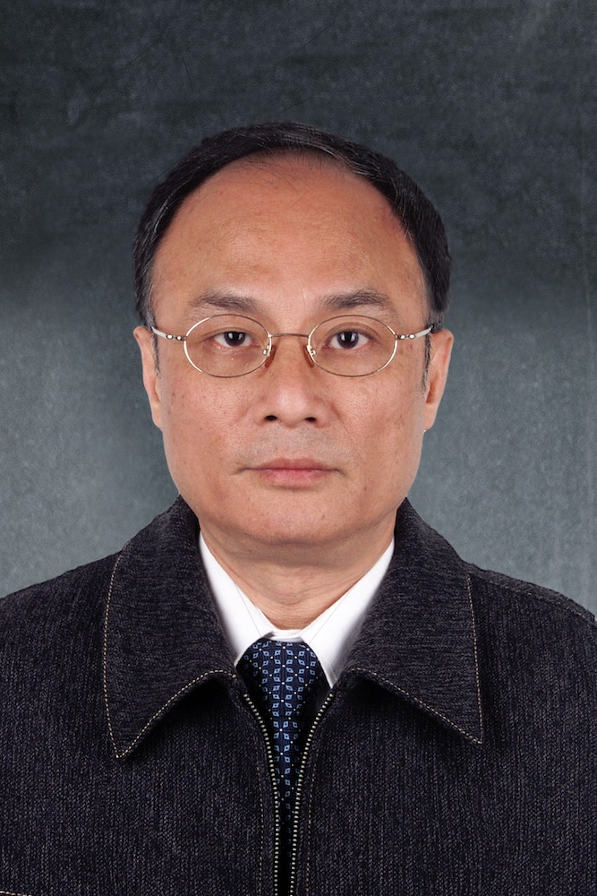

<!-- AUTO-GENERATED-BY: work/generate_obsidian_profiles.py -->

<!-- TEMPLATE: D:\workspace\信息收集整理\医生画像仓库\模板\医生画像模板.md -->

# 邓中光

## 基础信息

| 字段 | 内容 |
|---|---|
| 姓名 | 邓中光 |
| 医院 | 广州中医药大学第一附属医院 |
| 科室 |  |
| 职称/身份 | 男，1947年10月生，广东开平人；广东省名中医, 副主任中医师，首批全国老中医药专家学术经验继承工作邓铁涛学术继承人。 |
| 来源链接 | [官网原文](https://www.gztcm.com.cn/myzl/myhc/1hbaas5lh1hoi.shtml) |
| 采集日期 | 2026-08-15 |

## 简介/擅长

辨治内科杂病，尤其对重症肌无力、皮肌炎、硬皮病、带状疱疹、顽咳、内伤发热、手足筋络病等疑难杂症经验丰富

## 科研项目与成果

- 曾参与《脾虚型重症肌无力的辨证论治与实验研究》《邓铁涛中医诊疗经验及学术思想整理研究》《中医五脏相关理论的继承与创新研究》等国家级、省部级课题，2010年承担国家中医药管理局“国医大师邓铁涛传承工作室建设”项目。
- 多次获得省部级以上科研奖励，2007年获得“全国首届中医药传承高徒奖”。

## 论文与学术产出

- 发表论文30多篇，参编医著10余部。

## 可包装亮点

- 官网名医荟萃收录；
- 临床擅长辨治内科杂病，尤其对重症肌无力、皮肌炎、硬皮病、带状疱疹、顽咳、内伤发热、手足筋络病等疑难杂症经验丰富。
- 发表论文30多篇，参编医著10余部。
- 曾参与《脾虚型重症肌无力的辨证论治与实验研究》《邓铁涛中医诊疗经验及学术思想整理研究》《中医五脏相关理论的继承与创新研究》等国家级、省部级课题，2010年承担国家中医药管理局“国医大师邓铁涛传承工作室建设”项目。
- 多次获得省部级以上科研奖励，2007年获得“全国首届中医药传承高徒奖”。

## 重点疾病/人群标签

- 慢性病：
- 肿瘤：
- 生殖疾病：
- 免疫/风湿：
- 术后恢复/康复：
- 疑难重症：

## 证据摘录

> 只摘录官网公开信息中的短句或关键字段，不复制大段原文。

- 官网身份字段：男，1947年10月生，广东开平人；广东省名中医, 副主任中医师，首批全国老中医药专家学术经验继承工作邓铁涛学术继承人。
- 官网简介/擅长：辨治内科杂病，尤其对重症肌无力、皮肌炎、硬皮病、带状疱疹、顽咳、内伤发热、手足筋络病等疑难杂症经验丰富
- 官网亮眼经历线索：官网名医荟萃收录；临床擅长辨治内科杂病，尤其对重症肌无力、皮肌炎、硬皮病、带状疱疹、顽咳、内伤发热、手足筋络病等疑难杂症经验丰富。 发表论文30多篇，参编医著10余部。 曾参与《脾虚型重症肌无力的辨证论治与实验研究》《邓铁涛中医诊疗经验及学术思想整理研究》《中医五脏相关理论的继承与创新研究》等国家级、省部级课题，2010年承担国家中医药管理局“国医大师邓铁涛传承工作室建设”项目。 多次获得省部级以上科研奖励，2007年获得“全国首届中…
- 异常提示：名医荟萃详情未标当前科室
- 来源链接：https://www.gztcm.com.cn/myzl/myhc/1hbaas5lh1hoi.shtml

## BD 画像摘要

当前画像仅作基础资料归档，后续使用需先完成人工复核。

## 合规边界

- 仅使用医院官网、官方公众号、官方小程序等公开渠道。
- 不采集私人电话、私人微信、家庭住址、患者隐私或非公开排班信息。
- 不写“保证治愈”“疗效第一”“包治疑难杂症”等无法由官网证明的表述。
