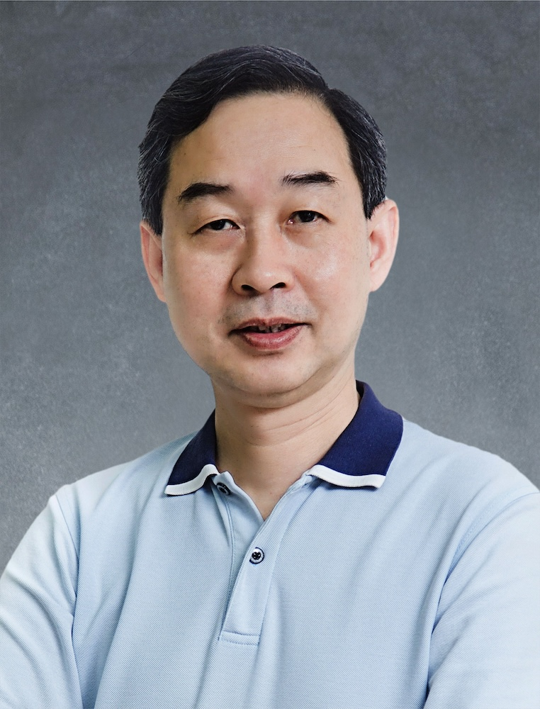

<!-- AUTO-GENERATED-BY: work/generate_obsidian_profiles.py -->

<!-- TEMPLATE: D:\workspace\信息收集整理\医生画像仓库\模板\医生画像模板.md -->

# 邓高丕

## 基础信息

| 字段 | 内容 |
|---|---|
| 姓名 | 邓高丕 |
| 医院 | 广州中医药大学第一附属医院 |
| 科室 |  |
| 职称/身份 | 男，1960年3月生，广东信宜人，中共党员；广东省名中医，教授，主任中医师，博士研究生导师，广东省名中医师承项目指导老师，广东省南粤优秀教师，广东省优秀中医临床人才。 现任一妇科主任，国家临床重点专科、国家中医重点专科、国家区域（华南区）中医妇科诊疗中心负责人，国家中医重点专科妇科协作组组长，广东省中医重点专科妇科技术协作组组长，广东省中医妇科质控中心负责人，华南中医妇科联盟主席，粤港澳大湾中医妇科联盟主席。 |
| 来源链接 | [官网原文](https://www.gztcm.com.cn/myzl/myhc/1hbaa8cjac0h8.shtml) |
| 采集日期 | 2026-08-15 |

## 简介/擅长

## 教育与进修经历

- 主持10多项国家和省部级科研课题，获各类成果奖10项，出版教材和著作30多部，发表论文160多篇，培养博士后、博士和硕士70多名。

## 科研项目与成果

- 广东省名中医，教授，主任中医师，博士研究生导师，广东省名中医师承项目指导老师，广东省南粤优秀教师，广东省优秀中医临床人才。
- 主持10多项国家和省部级科研课题，获各类成果奖10项，出版教材和著作30多部，发表论文160多篇，培养博士后、博士和硕士70多名。

## 论文与学术产出

- 主持10多项国家和省部级科研课题，获各类成果奖10项，出版教材和著作30多部，发表论文160多篇，培养博士后、博士和硕士70多名。

## 可包装亮点

- 官网名医荟萃收录；
- 广东省名中医，教授，主任中医师，博士研究生导师，广东省名中医师承项目指导老师，广东省南粤优秀教师，广东省优秀中医临床人才。
- 现任一妇科主任，国家临床重点专科、国家中医重点专科、国家区域（华南区）中医妇科诊疗中心负责人，国家中医重点专科妇科协作组组长，广东省中医重点专科妇科技术协作组组长，广东省中医妇科质控中心负责人，华南中医妇科联盟主席，粤港澳大湾中医妇科联盟主席。
- 兼任世界中医药学会联合会妇科专业委员会副会长，中国民族医药学会妇科专业委员会副会长等职。
- 主持10多项国家和省部级科研课题，获各类成果奖10项，出版教材和著作30多部，发表论文160多篇，培养博士后、博士和硕士70多名。

## 重点疾病/人群标签

- 慢性病：
- 肿瘤：
- 生殖疾病：
- 免疫/风湿：
- 术后恢复/康复：
- 疑难重症：

## 证据摘录

> 只摘录官网公开信息中的短句或关键字段，不复制大段原文。

- 官网身份字段：男，1960年3月生，广东信宜人，中共党员；广东省名中医，教授，主任中医师，博士研究生导师，广东省名中医师承项目指导老师，广东省南粤优秀教师，广东省优秀中医临床人才。 现任一妇科主任，国家临床重点专科、国家中医重点专科、国家区域（华南区）…
- 官网亮眼经历线索：官网名医荟萃收录；广东省名中医，教授，主任中医师，博士研究生导师，广东省名中医师承项目指导老师，广东省南粤优秀教师，广东省优秀中医临床人才。 现任一妇科主任，国家临床重点专科、国家中医重点专科、国家区域（华南区）中医妇科诊疗中心负责人，国家中医重点专科妇科协作组组长，广东省中医重点专科妇科技术协作组组长，广东省中医妇科质控中心负责人，华南中医妇科联盟主席，粤港澳大湾中医妇科联盟主席。 兼任世界中医药学会联合会妇科专业委员会副会长，中国…
- 异常提示：名医荟萃详情未标当前科室
- 来源链接：https://www.gztcm.com.cn/myzl/myhc/1hbaa8cjac0h8.shtml

## BD 画像摘要

当前画像仅作基础资料归档，后续使用需先完成人工复核。

## 合规边界

- 仅使用医院官网、官方公众号、官方小程序等公开渠道。
- 不采集私人电话、私人微信、家庭住址、患者隐私或非公开排班信息。
- 不写“保证治愈”“疗效第一”“包治疑难杂症”等无法由官网证明的表述。
