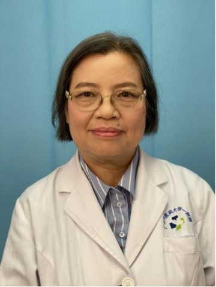

<!-- AUTO-GENERATED-BY: work/generate_obsidian_profiles.py -->

<!-- TEMPLATE: D:\workspace\信息收集整理\医生画像仓库\模板\医生画像模板.md -->

# 邱仕君

## 基础信息

| 字段 | 内容 |
|---|---|
| 姓名 | 邱仕君 |
| 医院 | 广州中医药大学第一附属医院 |
| 科室 | 肌病科 |
| 职称/身份 | 教授，全国老中医药专家邓铁涛教授学术继承人；邱仕君，教授，全国老中医药专家邓铁涛教授学术继承人。 广东省中医药学会药膳食疗专业委员会副主任委员。 |
| 来源链接 | [官网原文](https://www.gztcm.com.cn/jibingke/kszj/1hk61mrqsg0a6.shtml) |
| 采集日期 | 2026-08-15 |

## 简介/擅长

长期从事中医各家学说及老中医学术经验的整理研究及运用中医药治疗高血压、冠心病、重症肌无力等疾病的研究。

## 教育与进修经历

- 原广州中医药大学研究生处处长，全国中医药学位与研究生教育研究会副理事长，广东省学位与研究生教育学会第五届理事会常务理事。

## 可包装亮点

- 原广州中医药大学研究生处处长，全国中医药学位与研究生教育研究会副理事长，广东省学位与研究生教育学会第五届理事会常务理事。
- 广东省中医药学会药膳食疗专业委员会副主任委员。
- 1997 年获国家中医药管理局中医药基础研究二等奖，1998 年获广东省科委科技进步三等奖。
- 参加《中医近代史》研究获2002 年度广东省科技进步二等奖。

## 重点疾病/人群标签

- 慢性病：高血压、冠心病、重症
- 肿瘤：
- 生殖疾病：
- 免疫/风湿：
- 术后恢复/康复：
- 疑难重症：高血压、冠心病、重症

## 证据摘录

> 只摘录官网公开信息中的短句或关键字段，不复制大段原文。

- 官网身份字段：教授，全国老中医药专家邓铁涛教授学术继承人；邱仕君，教授，全国老中医药专家邓铁涛教授学术继承人。 广东省中医药学会药膳食疗专业委员会副主任委员。
- 官网简介/擅长：长期从事中医各家学说及老中医学术经验的整理研究及运用中医药治疗高血压、冠心病、重症肌无力等疾病的研究。
- 官网亮眼经历线索：原广州中医药大学研究生处处长，全国中医药学位与研究生教育研究会副理事长，广东省学位与研究生教育学会第五届理事会常务理事。 广东省中医药学会药膳食疗专业委员会副主任委员。 1997 年获国家中医药管理局中医药基础研究二等奖，1998 年获广东省科委科技进步三等奖。 参加《中医近代史》研究获2002 年度广东省科技进步二等奖。
- 来源链接：https://www.gztcm.com.cn/jibingke/kszj/1hk61mrqsg0a6.shtml

## BD 画像摘要

邱仕君医生可作为慢性病、疑难重症方向的基础画像候选。后续 BD 使用应继续以官网来源和人工复核为准，不添加疗效承诺或无来源包装。

## 合规边界

- 仅使用医院官网、官方公众号、官方小程序等公开渠道。
- 不采集私人电话、私人微信、家庭住址、患者隐私或非公开排班信息。
- 不写“保证治愈”“疗效第一”“包治疑难杂症”等无法由官网证明的表述。
