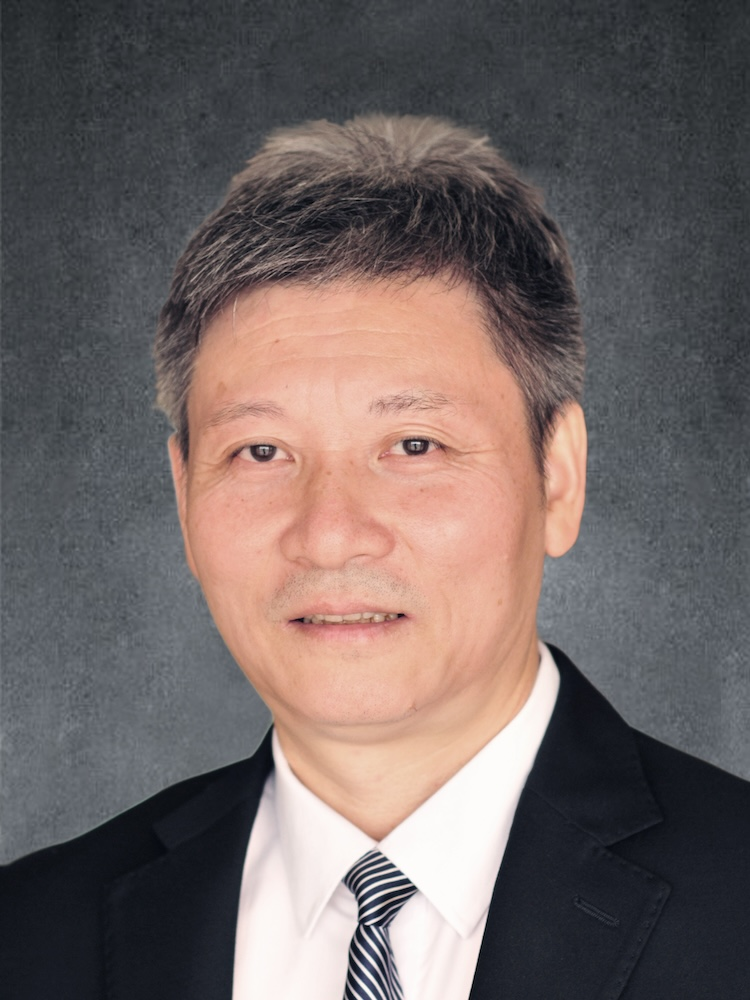

<!-- AUTO-GENERATED-BY: work/generate_obsidian_profiles.py -->

<!-- TEMPLATE: D:\workspace\信息收集整理\医生画像仓库\模板\医生画像模板.md -->

# 阮岩

## 基础信息

| 字段 | 内容 |
|---|---|
| 姓名 | 阮岩 |
| 医院 | 广州中医药大学第一附属医院 |
| 科室 |  |
| 职称/身份 | 男，1963年6月生，广东阳江人，中共党员；广东省名中医，教授，博士生导师，现任耳鼻喉科主任。 是国家重点学科中医五官科学科带头人，国家临床重点专科耳鼻喉科学术带头人，兼任中华中医药学会耳鼻喉科分会主任委员，中国中药协会耳鼻咽喉药物研究专业委员会主任委员,中国中西医结合学会耳鼻咽喉专业委员会副主任委员，国家中医药管理局重点专科耳鼻喉科协助组组长,中华中医药学会中医耳鼻咽喉诊疗指南专家指导组组长。 |
| 来源链接 | [官网原文](https://www.gztcm.com.cn/myzl/myhc/1hbaa75dj6q24.shtml) |
| 采集日期 | 2026-08-15 |

## 简介/擅长

## 论文与学术产出

- 师从我国著名中医耳鼻咽喉专家王德鉴教授、王士贞教授，提倡内外治结合治疗耳鼻咽喉疾病，主要从事变应性鼻炎、鼻窦炎研究，是人民卫生出版社全国高等院校中医药类专业卫生部“十二五”“十三五”“十四五”规划教材《中医耳鼻咽喉科学》主编。

## 可包装亮点

- 官网名医荟萃收录；
- 广东省名中医，教授，博士生导师，现任耳鼻喉科主任。
- 是国家重点学科中医五官科学科带头人，国家临床重点专科耳鼻喉科学术带头人，兼任中华中医药学会耳鼻喉科分会主任委员，中国中药协会耳鼻咽喉药物研究专业委员会主任委员,中国中西医结合学会耳鼻咽喉专业委员会副主任委员，国家中医药管理局重点专科耳鼻喉科协助组组长,中华中医药学会中医耳鼻咽喉诊疗指南专家指导组组长。

## 重点疾病/人群标签

- 慢性病：
- 肿瘤：
- 生殖疾病：
- 免疫/风湿：
- 术后恢复/康复：
- 疑难重症：

## 证据摘录

> 只摘录官网公开信息中的短句或关键字段，不复制大段原文。

- 官网身份字段：男，1963年6月生，广东阳江人，中共党员；广东省名中医，教授，博士生导师，现任耳鼻喉科主任。 是国家重点学科中医五官科学科带头人，国家临床重点专科耳鼻喉科学术带头人，兼任中华中医药学会耳鼻喉科分会主任委员，中国中药协会耳鼻咽喉药物研究专…
- 官网亮眼经历线索：官网名医荟萃收录；广东省名中医，教授，博士生导师，现任耳鼻喉科主任。 是国家重点学科中医五官科学科带头人，国家临床重点专科耳鼻喉科学术带头人，兼任中华中医药学会耳鼻喉科分会主任委员，中国中药协会耳鼻咽喉药物研究专业委员会主任委员,中国中西医结合学会耳鼻咽喉专业委员会副主任委员，国家中医药管理局重点专科耳鼻喉科协助组组长,中华中医药学会中医耳鼻咽喉诊疗指南专家指导组组长。
- 异常提示：名医荟萃详情未标当前科室
- 来源链接：https://www.gztcm.com.cn/myzl/myhc/1hbaa75dj6q24.shtml

## BD 画像摘要

当前画像仅作基础资料归档，后续使用需先完成人工复核。

## 合规边界

- 仅使用医院官网、官方公众号、官方小程序等公开渠道。
- 不采集私人电话、私人微信、家庭住址、患者隐私或非公开排班信息。
- 不写“保证治愈”“疗效第一”“包治疑难杂症”等无法由官网证明的表述。
