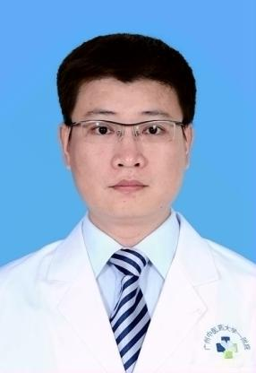

<!-- AUTO-GENERATED-BY: work/generate_obsidian_profiles.py -->

<!-- TEMPLATE: D:\workspace\信息收集整理\医生画像仓库\模板\医生画像模板.md -->

# 陈坚雄

## 基础信息

| 字段 | 内容 |
|---|---|
| 姓名 | 陈坚雄 |
| 医院 | 广州中医药大学第一附属医院 |
| 科室 | 肌病科 |
| 职称/身份 | 中医学博士，中西医结合博士后出站，主治医师；陈坚雄，中医学博士，中西医结合博士后出站，主治医师。 岭南邓氏内科流派传承人，师承邱仕君教授、刘小斌教授、周福生教授，广东省第二批名中医学术继承人。 |
| 来源链接 | [官网原文](https://www.gztcm.com.cn/jibingke/kszj/1hk61r27t215c.shtml) |
| 采集日期 | 2026-08-15 |

## 简介/擅长

重症肌无力、萎缩性胃炎、肠易激综合征、消化道溃疡、脂肪肝等。

## 教育与进修经历

- 陈坚雄，中医学博士，中西医结合博士后出站，主治医师。

## 论文与学术产出

- 主编《国医大师邓铁涛学说探讨与临证》《周福生中医学验传薪》等10余种论著。

## 可包装亮点

- 中华中医药学会中医基础理论分会委员、中华医学会医史学分会委员、广东省中医药学会岭南医学专委会秘书，中医药非遗传承保护专委会常务委员。

## 重点疾病/人群标签

- 慢性病：
- 肿瘤：
- 生殖疾病：
- 免疫/风湿：
- 术后恢复/康复：
- 疑难重症：重症

## 证据摘录

> 只摘录官网公开信息中的短句或关键字段，不复制大段原文。

- 官网身份字段：中医学博士，中西医结合博士后出站，主治医师；陈坚雄，中医学博士，中西医结合博士后出站，主治医师。 岭南邓氏内科流派传承人，师承邱仕君教授、刘小斌教授、周福生教授，广东省第二批名中医学术继承人。
- 官网简介/擅长：重症肌无力、萎缩性胃炎、肠易激综合征、消化道溃疡、脂肪肝等。
- 官网亮眼经历线索：中华中医药学会中医基础理论分会委员、中华医学会医史学分会委员、广东省中医药学会岭南医学专委会秘书，中医药非遗传承保护专委会常务委员。
- 来源链接：https://www.gztcm.com.cn/jibingke/kszj/1hk61r27t215c.shtml

## BD 画像摘要

陈坚雄医生可作为疑难重症方向的基础画像候选。后续 BD 使用应继续以官网来源和人工复核为准，不添加疗效承诺或无来源包装。

## 合规边界

- 仅使用医院官网、官方公众号、官方小程序等公开渠道。
- 不采集私人电话、私人微信、家庭住址、患者隐私或非公开排班信息。
- 不写“保证治愈”“疗效第一”“包治疑难杂症”等无法由官网证明的表述。
