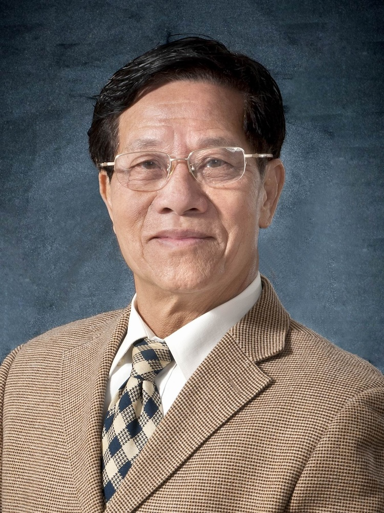

<!-- AUTO-GENERATED-BY: work/generate_obsidian_profiles.py -->

<!-- TEMPLATE: D:\workspace\信息收集整理\医生画像仓库\模板\医生画像模板.md -->

# 陈基长

## 基础信息

| 字段 | 内容 |
|---|---|
| 姓名 | 陈基长 |
| 医院 | 广州中医药大学第一附属医院 |
| 科室 |  |
| 职称/身份 | 男，1938年10月生，广东潮阳人，中共党员；广东省名中医，教授，博士生导师，全国老中医药专家学术经验继承工作指导老师。 曾兼任广东省中医药科技专家委员会委员，广东省中医骨伤科学会顾问，广东省中西医院结合股骨头坏死协会副主任委员等。 |
| 来源链接 | [官网原文](https://www.gztcm.com.cn/myzl/myhc/1hbabn11nmv1f.shtml) |
| 采集日期 | 2026-08-15 |

## 简介/擅长

使用西医诊断来协助中医辩证医治骨伤科疾病，以中医正骨手法治疗骨关节损伤、小儿骨伤、老年骨伤，尤其在治疗关节内骨折、陈旧性骨折、骨性关节炎、股骨头缺血性坏死等方面经验丰硕

## 可包装亮点

- 官网名医荟萃收录；
- 广东省名中医，教授，博士生导师，全国老中医药专家学术经验继承工作指导老师。
- 曾任广州中医药大学骨伤科教研室主任、学科带头人。
- 曾兼任广东省中医药科技专家委员会委员，广东省中医骨伤科学会顾问，广东省中西医院结合股骨头坏死协会副主任委员等。
- 曾获国家医学科技二等奖，广东省医疗科技一等奖等奖项。

## 重点疾病/人群标签

- 慢性病：
- 肿瘤：
- 生殖疾病：
- 免疫/风湿：
- 术后恢复/康复：
- 疑难重症：

## 证据摘录

> 只摘录官网公开信息中的短句或关键字段，不复制大段原文。

- 官网身份字段：男，1938年10月生，广东潮阳人，中共党员；广东省名中医，教授，博士生导师，全国老中医药专家学术经验继承工作指导老师。 曾兼任广东省中医药科技专家委员会委员，广东省中医骨伤科学会顾问，广东省中西医院结合股骨头坏死协会副主任委员等。
- 官网简介/擅长：使用西医诊断来协助中医辩证医治骨伤科疾病，以中医正骨手法治疗骨关节损伤、小儿骨伤、老年骨伤，尤其在治疗关节内骨折、陈旧性骨折、骨性关节炎、股骨头缺血性坏死等方面经验丰硕
- 官网亮眼经历线索：官网名医荟萃收录；广东省名中医，教授，博士生导师，全国老中医药专家学术经验继承工作指导老师。 曾任广州中医药大学骨伤科教研室主任、学科带头人。 曾兼任广东省中医药科技专家委员会委员，广东省中医骨伤科学会顾问，广东省中西医院结合股骨头坏死协会副主任委员等。 曾获国家医学科技二等奖，广东省医疗科技一等奖等奖项。
- 异常提示：名医荟萃详情未标当前科室
- 来源链接：https://www.gztcm.com.cn/myzl/myhc/1hbabn11nmv1f.shtml

## BD 画像摘要

当前画像仅作基础资料归档，后续使用需先完成人工复核。

## 合规边界

- 仅使用医院官网、官方公众号、官方小程序等公开渠道。
- 不采集私人电话、私人微信、家庭住址、患者隐私或非公开排班信息。
- 不写“保证治愈”“疗效第一”“包治疑难杂症”等无法由官网证明的表述。
