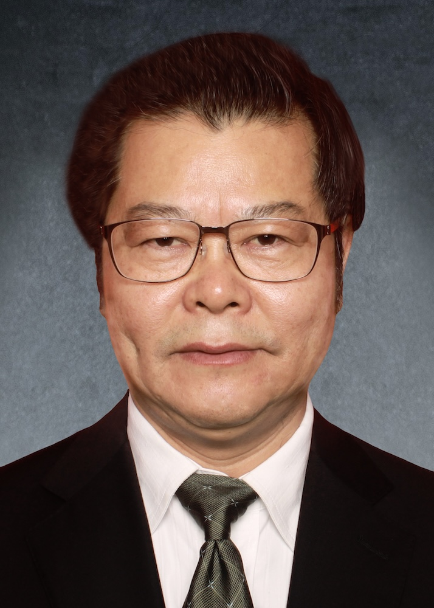

<!-- AUTO-GENERATED-BY: work/generate_obsidian_profiles.py -->

<!-- TEMPLATE: D:\workspace\信息收集整理\医生画像仓库\模板\医生画像模板.md -->

# 陈志雄

## 基础信息

| 字段 | 内容 |
|---|---|
| 姓名 | 陈志雄 |
| 医院 | 广州中医药大学第一附属医院 |
| 科室 |  |
| 职称/身份 | 男，1957年9月生，广东化州人；广东省名中医，广州中医药大学二级教授，主任中医师，博士生导师，广东省名中医师承项目指导老师，享受国务院政府特殊津贴。 三十余年在高校附属医院从事医、教、研、管理工作，中医理论和临床经验造诣精深，先后获全国中西医结合优秀中青年科技工作者，第一批国家中医药管理局 “全国优秀中医临床人才”称号，遴选为国家“百千万人才工程”国家级人选，全国中医院优秀院长。 |
| 来源链接 | [官网原文](https://www.gztcm.com.cn/myzl/myhc/1hbaat8ogtqnh.shtml) |
| 采集日期 | 2026-08-15 |

## 简介/擅长

## 科研项目与成果

- 广东省名中医，广州中医药大学二级教授，主任中医师，博士生导师，广东省名中医师承项目指导老师，享受国务院政府特殊津贴。
- 多次获省部、厅级科研及教学奖励。

## 论文与学术产出

- 主编《血液病手册》《血证集成》《广州市中医医院名医临床精要》，副主编《实用中医血液病学》《实用中医临床基本技能》等专著及发表论文40余篇。

## 可包装亮点

- 官网名医荟萃收录；
- 广东省名中医，广州中医药大学二级教授，主任中医师，博士生导师，广东省名中医师承项目指导老师，享受国务院政府特殊津贴。
- 三十余年在高校附属医院从事医、教、研、管理工作，中医理论和临床经验造诣精深，先后获全国中西医结合优秀中青年科技工作者，第一批国家中医药管理局 “全国优秀中医临床人才”称号，遴选为国家“百千万人才工程”国家级人选，全国中医院优秀院长。
- 现任中华中医药学会血液病分会副主任委员等。
- 主编《血液病手册》《血证集成》《广州市中医医院名医临床精要》，副主编《实用中医血液病学》《实用中医临床基本技能》等专著及发表论文40余篇。

## 重点疾病/人群标签

- 慢性病：
- 肿瘤：
- 生殖疾病：
- 免疫/风湿：
- 术后恢复/康复：
- 疑难重症：

## 证据摘录

> 只摘录官网公开信息中的短句或关键字段，不复制大段原文。

- 官网身份字段：男，1957年9月生，广东化州人；广东省名中医，广州中医药大学二级教授，主任中医师，博士生导师，广东省名中医师承项目指导老师，享受国务院政府特殊津贴。 三十余年在高校附属医院从事医、教、研、管理工作，中医理论和临床经验造诣精深，先后获全国…
- 官网亮眼经历线索：官网名医荟萃收录；广东省名中医，广州中医药大学二级教授，主任中医师，博士生导师，广东省名中医师承项目指导老师，享受国务院政府特殊津贴。 三十余年在高校附属医院从事医、教、研、管理工作，中医理论和临床经验造诣精深，先后获全国中西医结合优秀中青年科技工作者，第一批国家中医药管理局 “全国优秀中医临床人才”称号，遴选为国家“百千万人才工程”国家级人选，全国中医院优秀院长。 现任中华中医药学会血液病分会副主任委员等。 主编《血液病手册》《血证…
- 异常提示：名医荟萃详情未标当前科室
- 来源链接：https://www.gztcm.com.cn/myzl/myhc/1hbaat8ogtqnh.shtml

## BD 画像摘要

当前画像仅作基础资料归档，后续使用需先完成人工复核。

## 合规边界

- 仅使用医院官网、官方公众号、官方小程序等公开渠道。
- 不采集私人电话、私人微信、家庭住址、患者隐私或非公开排班信息。
- 不写“保证治愈”“疗效第一”“包治疑难杂症”等无法由官网证明的表述。
