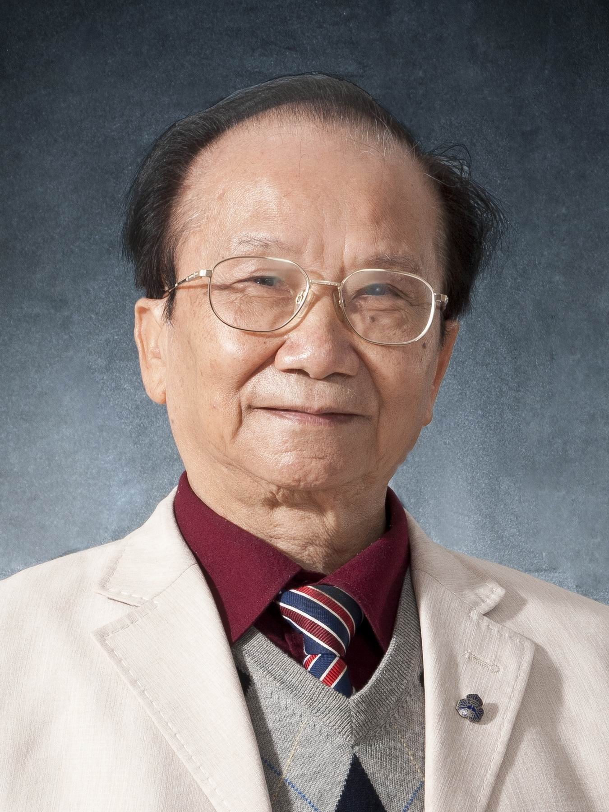

<!-- AUTO-GENERATED-BY: work/generate_obsidian_profiles.py -->

<!-- TEMPLATE: D:\workspace\信息收集整理\医生画像仓库\模板\医生画像模板.md -->

# 陈镜合

## 基础信息

| 字段 | 内容 |
|---|---|
| 姓名 | 陈镜合 |
| 医院 | 广州中医药大学第一附属医院 |
| 科室 |  |
| 职称/身份 | 男，1937年11月生，广东广州人；广东省名中医，广州中医药大学首席教授，博士生及博士后导师，广东省政府参事，全国老中医药专家学术经验继承工作指导导师，广东省名中医师承项目指导老师。 1988至1990年由国家教育部以高级访问学者资格赴日本、师从世界著名心脏专家河合忠一教授，曾任国家级重点学科中医内科学学科带头人，心血管研究方向学术带头人，中医急症学学术带头人。 |
| 来源链接 | [官网原文](https://www.gztcm.com.cn/myzl/myhc/1hbabos1snfuq.shtml) |
| 采集日期 | 2026-08-15 |

## 简介/擅长

## 教育与进修经历

- 广东省名中医，广州中医药大学首席教授，博士生及博士后导师，广东省政府参事，全国老中医药专家学术经验继承工作指导导师，广东省名中医师承项目指导老师。
- 1988至1990年由国家教育部以高级访问学者资格赴日本、师从世界著名心脏专家河合忠一教授，曾任国家级重点学科中医内科学学科带头人，心血管研究方向学术带头人，中医急症学学术带头人。

## 科研项目与成果

- 广东省名中医，广州中医药大学首席教授，博士生及博士后导师，广东省政府参事，全国老中医药专家学术经验继承工作指导导师，广东省名中医师承项目指导老师。
- 他数十年如一日地致力于中西结合急救的医教研工作，科研成果多次获得国家及省市科技奖项。

## 可包装亮点

- 官网名医荟萃收录；
- 1988至1990年由国家教育部以高级访问学者资格赴日本、师从世界著名心脏专家河合忠一教授，曾任国家级重点学科中医内科学学科带头人，心血管研究方向学术带头人，中医急症学学术带头人。
- 他数十年如一日地致力于中西结合急救的医教研工作，科研成果多次获得国家及省市科技奖项。

## 重点疾病/人群标签

- 慢性病：
- 肿瘤：
- 生殖疾病：
- 免疫/风湿：
- 术后恢复/康复：
- 疑难重症：

## 证据摘录

> 只摘录官网公开信息中的短句或关键字段，不复制大段原文。

- 官网身份字段：男，1937年11月生，广东广州人；广东省名中医，广州中医药大学首席教授，博士生及博士后导师，广东省政府参事，全国老中医药专家学术经验继承工作指导导师，广东省名中医师承项目指导老师。 1988至1990年由国家教育部以高级访问学者资格赴日…
- 官网亮眼经历线索：官网名医荟萃收录；1988至1990年由国家教育部以高级访问学者资格赴日本、师从世界著名心脏专家河合忠一教授，曾任国家级重点学科中医内科学学科带头人，心血管研究方向学术带头人，中医急症学学术带头人。 他数十年如一日地致力于中西结合急救的医教研工作，科研成果多次获得国家及省市科技奖项。
- 异常提示：名医荟萃详情未标当前科室
- 来源链接：https://www.gztcm.com.cn/myzl/myhc/1hbabos1snfuq.shtml

## BD 画像摘要

当前画像仅作基础资料归档，后续使用需先完成人工复核。

## 合规边界

- 仅使用医院官网、官方公众号、官方小程序等公开渠道。
- 不采集私人电话、私人微信、家庭住址、患者隐私或非公开排班信息。
- 不写“保证治愈”“疗效第一”“包治疑难杂症”等无法由官网证明的表述。
