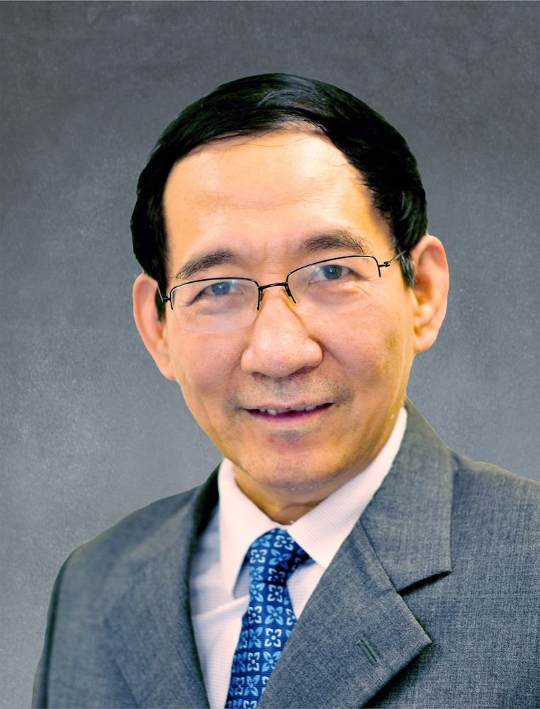

<!-- AUTO-GENERATED-BY: work/generate_obsidian_profiles.py -->

<!-- TEMPLATE: D:\workspace\信息收集整理\医生画像仓库\模板\医生画像模板.md -->

# 黄枫

## 基础信息

| 字段 | 内容 |
|---|---|
| 姓名 | 黄枫 |
| 医院 | 广州中医药大学第一附属医院 |
| 科室 |  |
| 职称/身份 | 男，1957年2月生，广东梅州人，中共党员；广东省名中医，教授，博士生导师，全国老中医药专家学术经验继承工作指导老师，广东省名中医师承项目指导老师，广东省名中医传承工作室（黄枫教授名医工作室）中医药专家。 现任我院骨伤中心主任、教研室主任，曾任广州中医药大学顺德医院院长、党委书记。 |
| 来源链接 | [官网原文](https://www.gztcm.com.cn/myzl/myhc/1hbaahfe4h87s.shtml) |
| 采集日期 | 2026-08-15 |

## 简介/擅长

中西医结合治疗骨与关节损伤，老年及儿童骨折，骨感染及创面修复，骨不连及肢体畸形

## 科研项目与成果

- 广东省名中医，教授，博士生导师，全国老中医药专家学术经验继承工作指导老师，广东省名中医师承项目指导老师，广东省名中医传承工作室（黄枫教授名医工作室）中医药专家。
- 从事临床、教学、科研工作近40年，重视岭南中医药传承发展，运用“筋骨并重”理论指导专科开展微创新技术治疗，擅长中西医结合治疗骨与关节损伤，老年及儿童骨折，骨感染及创面修复，骨不连及肢体畸形。

## 可包装亮点

- 官网名医荟萃收录；
- 广东省名中医，教授，博士生导师，全国老中医药专家学术经验继承工作指导老师，广东省名中医师承项目指导老师，广东省名中医传承工作室（黄枫教授名医工作室）中医药专家。
- 兼任世界中医药学会联合会骨关节疾病专业委员会副会长，广东省中医药学会骨伤科专业委员会主任委员等。

## 重点疾病/人群标签

- 慢性病：
- 肿瘤：
- 生殖疾病：
- 免疫/风湿：
- 术后恢复/康复：
- 疑难重症：

## 证据摘录

> 只摘录官网公开信息中的短句或关键字段，不复制大段原文。

- 官网身份字段：男，1957年2月生，广东梅州人，中共党员；广东省名中医，教授，博士生导师，全国老中医药专家学术经验继承工作指导老师，广东省名中医师承项目指导老师，广东省名中医传承工作室（黄枫教授名医工作室）中医药专家。 现任我院骨伤中心主任、教研室主任…
- 官网简介/擅长：中西医结合治疗骨与关节损伤，老年及儿童骨折，骨感染及创面修复，骨不连及肢体畸形
- 官网亮眼经历线索：官网名医荟萃收录；广东省名中医，教授，博士生导师，全国老中医药专家学术经验继承工作指导老师，广东省名中医师承项目指导老师，广东省名中医传承工作室（黄枫教授名医工作室）中医药专家。 兼任世界中医药学会联合会骨关节疾病专业委员会副会长，广东省中医药学会骨伤科专业委员会主任委员等。
- 异常提示：名医荟萃详情未标当前科室
- 来源链接：https://www.gztcm.com.cn/myzl/myhc/1hbaahfe4h87s.shtml

## BD 画像摘要

当前画像仅作基础资料归档，后续使用需先完成人工复核。

## 合规边界

- 仅使用医院官网、官方公众号、官方小程序等公开渠道。
- 不采集私人电话、私人微信、家庭住址、患者隐私或非公开排班信息。
- 不写“保证治愈”“疗效第一”“包治疑难杂症”等无法由官网证明的表述。
