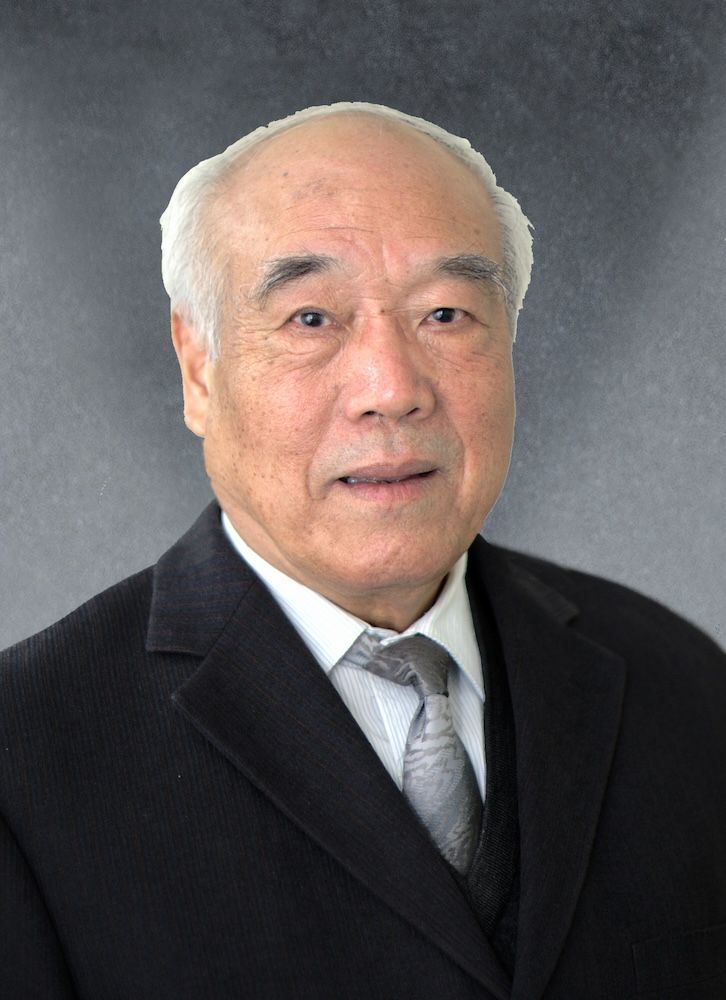

<!-- AUTO-GENERATED-BY: work/generate_obsidian_profiles.py -->

<!-- TEMPLATE: D:\workspace\信息收集整理\医生画像仓库\模板\医生画像模板.md -->

# 黄衍寿

## 基础信息

| 字段 | 内容 |
|---|---|
| 姓名 | 黄衍寿 |
| 医院 | 广州中医药大学第一附属医院 |
| 科室 |  |
| 职称/身份 | 男，1943年11月生，广东南雄人，中共党员；广东省名中医，教授，主任医师，博士生导师。 先后担任急诊科主任，心内科主任兼内科教研室主任，国家教委重点学科—中医内科学心血管方向学术带头人，国家中医药管理局心血管重点专科学术带头人，广东省中医药学会心血管专业委员会主任委员。 |
| 来源链接 | [官网原文](https://www.gztcm.com.cn/myzl/myhc/1hbabfidrdqkq.shtml) |
| 采集日期 | 2026-08-15 |

## 简介/擅长

## 科研项目与成果

- 参与研制的“心痛气雾剂”“补心气、滋心阴口服液”先后获得国家中医管理局科技成果二等奖。

## 可包装亮点

- 官网名医荟萃收录；
- 广东省名中医，教授，主任医师，博士生导师。
- 先后担任急诊科主任，心内科主任兼内科教研室主任，国家教委重点学科—中医内科学心血管方向学术带头人，国家中医药管理局心血管重点专科学术带头人，广东省中医药学会心血管专业委员会主任委员。
- 参与研制的“心痛气雾剂”“补心气、滋心阴口服液”先后获得国家中医管理局科技成果二等奖。
- 《益气活血利水法治疗慢性心衰的应用研究》分别获得中华中医药学会科学技术一等奖、广东省科学技术二等奖、中华人民共和国教育部科学技术进步一等奖。

## 重点疾病/人群标签

- 慢性病：
- 肿瘤：
- 生殖疾病：
- 免疫/风湿：
- 术后恢复/康复：
- 疑难重症：

## 证据摘录

> 只摘录官网公开信息中的短句或关键字段，不复制大段原文。

- 官网身份字段：男，1943年11月生，广东南雄人，中共党员；广东省名中医，教授，主任医师，博士生导师。 先后担任急诊科主任，心内科主任兼内科教研室主任，国家教委重点学科—中医内科学心血管方向学术带头人，国家中医药管理局心血管重点专科学术带头人，广东省中…
- 官网亮眼经历线索：官网名医荟萃收录；广东省名中医，教授，主任医师，博士生导师。 先后担任急诊科主任，心内科主任兼内科教研室主任，国家教委重点学科—中医内科学心血管方向学术带头人，国家中医药管理局心血管重点专科学术带头人，广东省中医药学会心血管专业委员会主任委员。 参与研制的“心痛气雾剂”“补心气、滋心阴口服液”先后获得国家中医管理局科技成果二等奖。 《益气活血利水法治疗慢性心衰的应用研究》分别获得中华中医药学会科学技术一等奖、广东省科学技术二等奖、中华…
- 异常提示：名医荟萃详情未标当前科室
- 来源链接：https://www.gztcm.com.cn/myzl/myhc/1hbabfidrdqkq.shtml

## BD 画像摘要

当前画像仅作基础资料归档，后续使用需先完成人工复核。

## 合规边界

- 仅使用医院官网、官方公众号、官方小程序等公开渠道。
- 不采集私人电话、私人微信、家庭住址、患者隐私或非公开排班信息。
- 不写“保证治愈”“疗效第一”“包治疑难杂症”等无法由官网证明的表述。
