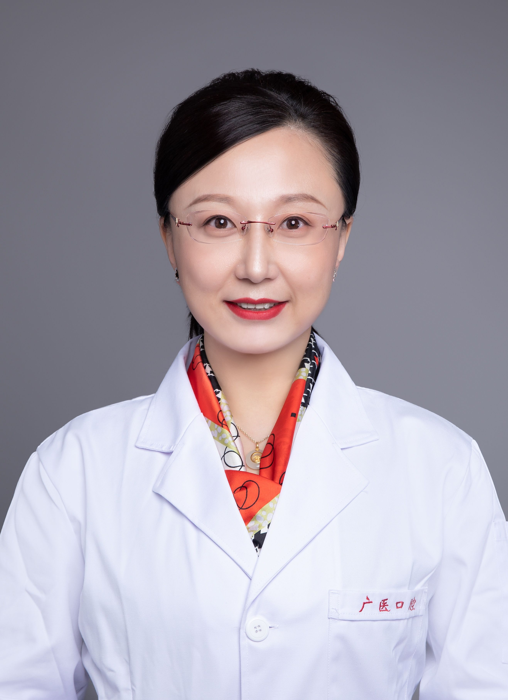

<!-- AUTO-GENERATED-BY: work/generate_obsidian_profiles.py -->

<!-- TEMPLATE: D:\workspace\信息收集整理\医生画像仓库\模板\医生画像模板.md -->

# 于丽娜

## 基础信息

| 字段 | 内容 |
|---|---|
| 姓名 | 于丽娜 |
| 医院 | 广州医科大学附属口腔医院 |
| 科室 | 口腔预防科 |
| 职称/身份 | 主任医师/副教授 |
| 来源链接 | [官网原文](https://www.gykqyy.com/list.html?category=55&id=20) |
| 采集日期 | 2026-08-13 |

## 简介/擅长

个性化口腔健康管理，致力于口腔健康科普宣教，注重“预防为主、防治结合、多学科联合诊疗”理念，擅长儿童及成人的龋病、牙周病、牙髓病、根尖周病等口腔常见疾病的诊治

## 教育与进修经历

- 中国教育部 2013 年度留学回国人员，多次参加美国、日本等国际学术会议，主持省部级课题4项，市级课题8项，获得校级精品课程1项，发表论文 20余篇。

## 科研项目与成果

- 中国教育部 2013 年度留学回国人员，多次参加美国、日本等国际学术会议，主持省部级课题4项，市级课题8项，获得校级精品课程1项，发表论文 20余篇。

## 论文与学术产出

- 中国教育部 2013 年度留学回国人员，多次参加美国、日本等国际学术会议，主持省部级课题4项，市级课题8项，获得校级精品课程1项，发表论文 20余篇。

## 可包装亮点

- 博士、主任医师、副教授、硕士研究生导师。
- 中国教育部 2013 年度留学回国人员，多次参加美国、日本等国际学术会议，主持省部级课题4项，市级课题8项，获得校级精品课程1项，发表论文 20余篇。
- 中华口腔医学会口腔预防医学专业委员会常务委员、中华预防医学会口腔卫生保健专业委员会委员、广东省口腔医学会口腔预防医学专委会副主任委员、广东省妇幼保健协会口腔保健专业委员会副主任委员、泛大湾区口腔预防联盟副主任委员、广东省预防医学会口腔疾病防治专委会常务委员、广州市科普专家。
- 先后获得“优秀党务工作者”、“羊城青年好医生”、“优秀教师”、“羊城好医生”“优秀研究生导师”、“广州最美医师”、“广州医科大学附属口腔医院首届名医”、“广州医科大学附属口腔医院一级人才”、“广州市优秀健康科普专家”“广州市优秀人才”“广东省、市科普专家”“广州市干部保健会诊专家”等荣誉称号。

## 重点疾病/人群标签

- 慢性病：
- 肿瘤：
- 生殖疾病：
- 免疫/风湿：
- 术后恢复/康复：
- 疑难重症：多学科

## 证据摘录

> 只摘录官网公开信息中的短句或关键字段，不复制大段原文。

- 官网身份字段：主任医师/副教授
- 官网简介/擅长：个性化口腔健康管理，致力于口腔健康科普宣教，注重“预防为主、防治结合、多学科联合诊疗”理念，擅长儿童及成人的龋病、牙周病、牙髓病、根尖周病等口腔常见疾病的诊治
- 官网亮眼经历线索：博士、主任医师、副教授、硕士研究生导师。 中国教育部 2013 年度留学回国人员，多次参加美国、日本等国际学术会议，主持省部级课题4项，市级课题8项，获得校级精品课程1项，发表论文 20余篇。 中华口腔医学会口腔预防医学专业委员会常务委员、中华预防医学会口腔卫生保健专业委员会委员、广东省口腔医学会口腔预防医学专委会副主任委员、广东省妇幼保健协会口腔保健专业委员会副主任委员、泛大湾区口腔预防联盟副主任委员、广东省预防医学会口腔疾病防治专…
- 来源链接：https://www.gykqyy.com/list.html?category=55&id=20

## BD 画像摘要

于丽娜医生可作为疑难重症方向的基础画像候选。后续 BD 使用应继续以官网来源和人工复核为准，不添加疗效承诺或无来源包装。

## 合规边界

- 仅使用医院官网、官方公众号、官方小程序等公开渠道。
- 不采集私人电话、私人微信、家庭住址、患者隐私或非公开排班信息。
- 不写“保证治愈”“疗效第一”“包治疑难杂症”等无法由官网证明的表述。
