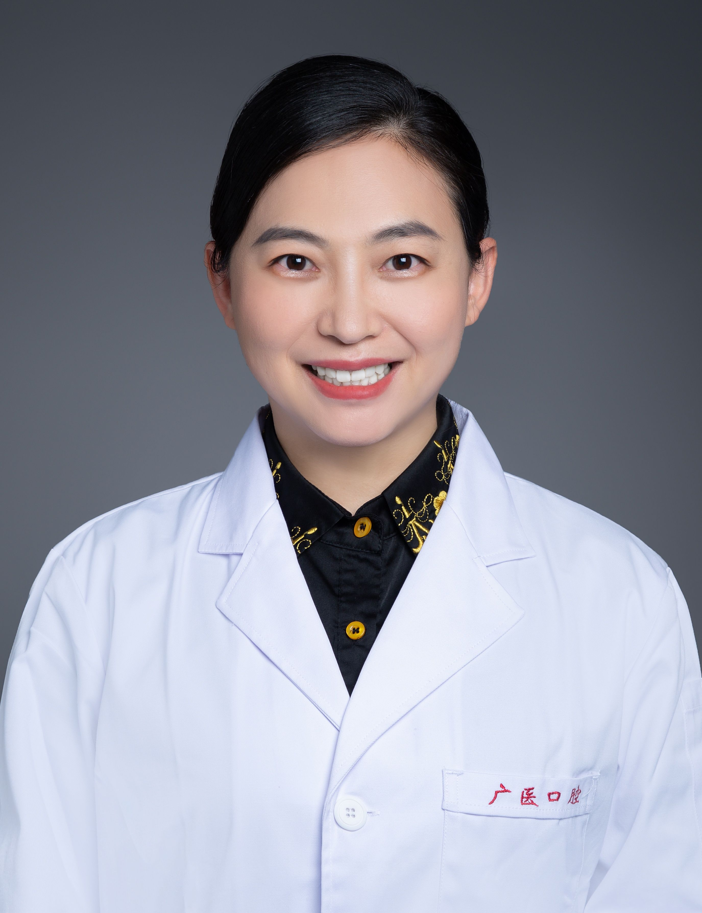

<!-- AUTO-GENERATED-BY: work/generate_obsidian_profiles.py -->

<!-- TEMPLATE: D:\workspace\信息收集整理\医生画像仓库\模板\医生画像模板.md -->

# 于淼

## 基础信息

| 字段 | 内容 |
|---|---|
| 姓名 | 于淼 |
| 医院 | 广州医科大学附属口腔医院 |
| 科室 | 越秀院区牙周病科、专家门诊特诊中心 |
| 职称/身份 | 主任医师 |
| 来源链接 | [官网原文](https://www.gykqyy.com/list.html?category=55&id=239) |
| 采集日期 | 2026-08-13 |

## 简介/擅长

牙周病、牙体牙髓病、种植修复等口腔疾病的综合诊治；尤其对牙周病的系统治疗（微创治疗）与综合防治有丰富的临床经验。

## 教育与进修经历

- 国家留学基金委公派鲁汶大学博士后，武汉大学博士，主要从事口腔内科学临床医疗、教学和科研工作，发表国内外论文30余篇，SCI收录10余篇，参编专著4部，授权国家发明专利2项，实用新型专利3项。

## 科研项目与成果

- 中华口腔医学会会员，全国卫生产业企业管理协会精准医疗分会理事，国际牙科研究联合会（IADR）会员，广东省口腔医学会口腔黏膜病学专业委员会委员，广东省医学会激光医学分会口腔学组成员，白求恩精神研究会医学人文分会理事，口腔医学分会牙周病学组（专委会）委员。
- 国家留学基金委公派鲁汶大学博士后，武汉大学博士，主要从事口腔内科学临床医疗、教学和科研工作，发表国内外论文30余篇，SCI收录10余篇，参编专著4部，授权国家发明专利2项，实用新型专利3项。
- 主持及参与国家及省市级课题30余项。

## 论文与学术产出

- 国家留学基金委公派鲁汶大学博士后，武汉大学博士，主要从事口腔内科学临床医疗、教学和科研工作，发表国内外论文30余篇，SCI收录10余篇，参编专著4部，授权国家发明专利2项，实用新型专利3项。

## 可包装亮点

- 博士，主任医师，硕士研究生导师；
- 中华口腔医学会会员，全国卫生产业企业管理协会精准医疗分会理事，国际牙科研究联合会（IADR）会员，广东省口腔医学会口腔黏膜病学专业委员会委员，广东省医学会激光医学分会口腔学组成员，白求恩精神研究会医学人文分会理事，口腔医学分会牙周病学组（专委会）委员。
- 获评“广东省实力中青年医生”、“羊城好医生”、“广医口腔好医生”称号，广州医科大学科技奖励“引文桂冠奖”，广州医科大学优秀班主任、大学生科技创新工作优秀指导老师、优秀研究生导师、优秀本科生导师、优秀教师。
- 国家留学基金委公派鲁汶大学博士后，武汉大学博士，主要从事口腔内科学临床医疗、教学和科研工作，发表国内外论文30余篇，SCI收录10余篇，参编专著4部，授权国家发明专利2项，实用新型专利3项。

## 重点疾病/人群标签

- 慢性病：
- 肿瘤：
- 生殖疾病：
- 免疫/风湿：
- 术后恢复/康复：
- 疑难重症：

## 证据摘录

> 只摘录官网公开信息中的短句或关键字段，不复制大段原文。

- 官网身份字段：主任医师
- 官网简介/擅长：牙周病、牙体牙髓病、种植修复等口腔疾病的综合诊治；尤其对牙周病的系统治疗（微创治疗）与综合防治有丰富的临床经验。
- 官网亮眼经历线索：博士，主任医师，硕士研究生导师； 中华口腔医学会会员，全国卫生产业企业管理协会精准医疗分会理事，国际牙科研究联合会（IADR）会员，广东省口腔医学会口腔黏膜病学专业委员会委员，广东省医学会激光医学分会口腔学组成员，白求恩精神研究会医学人文分会理事，口腔医学分会牙周病学组（专委会）委员。 获评“广东省实力中青年医生”、“羊城好医生”、“广医口腔好医生”称号，广州医科大学科技奖励“引文桂冠奖”，广州医科大学优秀班主任、大学生科技创新工作优…
- 来源链接：https://www.gykqyy.com/list.html?category=55&id=239

## BD 画像摘要

于淼医生可作为广州医科大学附属口腔医院越秀院区牙周病科、专家门诊特诊中心的基础医生资料入库。当前重点方向以总底表标签为准，官网未展示的信息保持空白。

## 合规边界

- 仅使用医院官网、官方公众号、官方小程序等公开渠道。
- 不采集私人电话、私人微信、家庭住址、患者隐私或非公开排班信息。
- 不写“保证治愈”“疗效第一”“包治疑难杂症”等无法由官网证明的表述。
