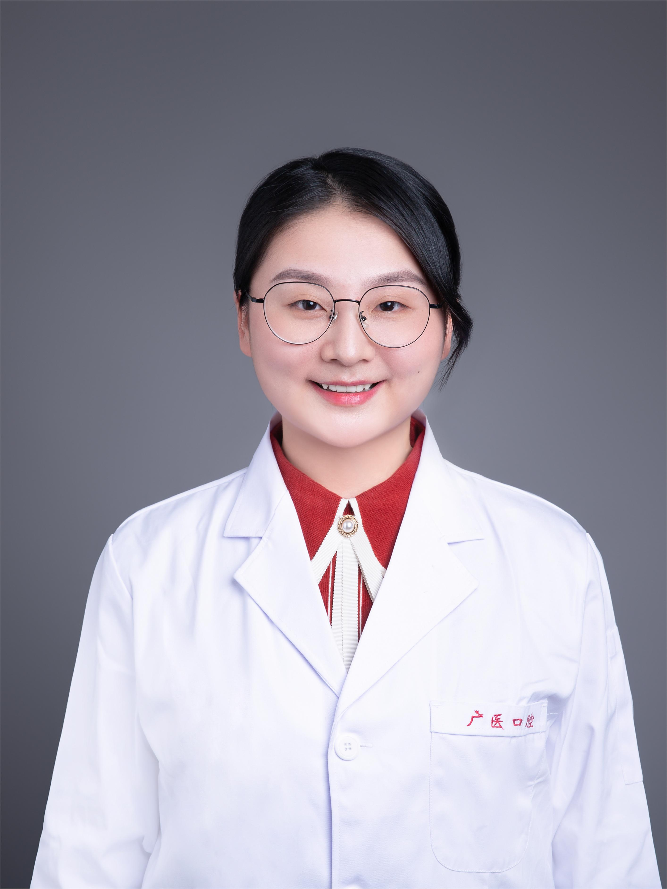

<!-- AUTO-GENERATED-BY: work/generate_obsidian_profiles.py -->

<!-- TEMPLATE: D:\workspace\信息收集整理\医生画像仓库\模板\医生画像模板.md -->

# 余培

## 基础信息

| 字段 | 内容 |
|---|---|
| 姓名 | 余培 |
| 医院 | 广州医科大学附属口腔医院 |
| 科室 | 荔湾院区口腔修复科、专家门诊特诊中心 |
| 职称/身份 | 副主任医师 |
| 来源链接 | [官网原文](https://www.gykqyy.com/list.html?category=55&id=72) |
| 采集日期 | 2026-08-13 |

## 简介/擅长

前牙美学修复,牙齿缺失的种植义齿修复、固定义齿修复和活动义齿修复,无牙颌的生物功能性活动义齿修复。

## 教育与进修经历

- 中山大学附属口腔医院博士后；
- 主持国家自然科学基金项目青年项目1项、中国博士后基金面上项目1项,参与多项国家级科研项目,发表SCI论文10余篇。

## 科研项目与成果

- 四川大学华西口腔医学院、美国哈佛大学福赛斯研究所联合培养博士中华口腔医学会口腔修复学专委会青年委员,中华口腔医学会口腔美学专委会会员,国际牙科研究协会(IADR)会员；
- 主持国家自然科学基金项目青年项目1项、中国博士后基金面上项目1项,参与多项国家级科研项目,发表SCI论文10余篇。

## 论文与学术产出

- 主持国家自然科学基金项目青年项目1项、中国博士后基金面上项目1项,参与多项国家级科研项目,发表SCI论文10余篇。

## 可包装亮点

- 博士，副主任医师；
- 四川大学华西口腔医学院、美国哈佛大学福赛斯研究所联合培养博士中华口腔医学会口腔修复学专委会青年委员,中华口腔医学会口腔美学专委会会员,国际牙科研究协会(IADR)会员；
- 主持国家自然科学基金项目青年项目1项、中国博士后基金面上项目1项,参与多项国家级科研项目,发表SCI论文10余篇。

## 重点疾病/人群标签

- 慢性病：
- 肿瘤：
- 生殖疾病：
- 免疫/风湿：
- 术后恢复/康复：
- 疑难重症：

## 证据摘录

> 只摘录官网公开信息中的短句或关键字段，不复制大段原文。

- 官网身份字段：副主任医师
- 官网简介/擅长：前牙美学修复,牙齿缺失的种植义齿修复、固定义齿修复和活动义齿修复,无牙颌的生物功能性活动义齿修复。
- 官网亮眼经历线索：博士，副主任医师； 四川大学华西口腔医学院、美国哈佛大学福赛斯研究所联合培养博士中华口腔医学会口腔修复学专委会青年委员,中华口腔医学会口腔美学专委会会员,国际牙科研究协会(IADR)会员； 主持国家自然科学基金项目青年项目1项、中国博士后基金面上项目1项,参与多项国家级科研项目,发表SCI论文10余篇。
- 来源链接：https://www.gykqyy.com/list.html?category=55&id=72

## BD 画像摘要

余培医生可作为广州医科大学附属口腔医院荔湾院区口腔修复科、专家门诊特诊中心的基础医生资料入库。当前重点方向以总底表标签为准，官网未展示的信息保持空白。

## 合规边界

- 仅使用医院官网、官方公众号、官方小程序等公开渠道。
- 不采集私人电话、私人微信、家庭住址、患者隐私或非公开排班信息。
- 不写“保证治愈”“疗效第一”“包治疑难杂症”等无法由官网证明的表述。
