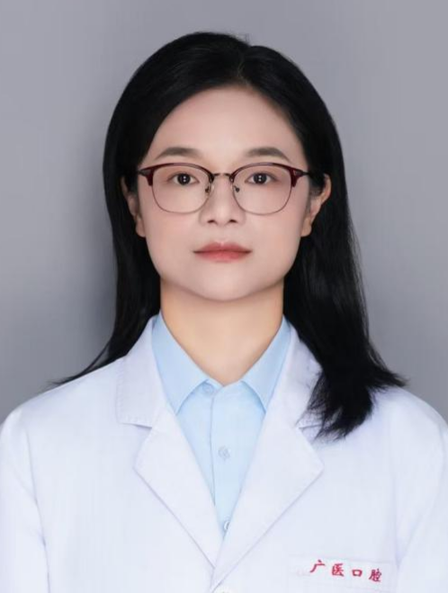

<!-- AUTO-GENERATED-BY: work/generate_obsidian_profiles.py -->

<!-- TEMPLATE: D:\workspace\信息收集整理\医生画像仓库\模板\医生画像模板.md -->

# 俞艳

## 基础信息

| 字段 | 内容 |
|---|---|
| 姓名 | 俞艳 |
| 医院 | 广州医科大学附属口腔医院 |
| 科室 | 荔湾院区牙体牙髓科 |
| 职称/身份 | 副主任医师 |
| 来源链接 | [官网原文](https://www.gykqyy.com/list.html?category=55&id=317) |
| 采集日期 | 2026-08-13 |

## 简介/擅长

龋病、牙髓病和根尖周病的规范化治疗、序列治疗、冠根一体化治疗。擅长前牙树脂美容修复、活髓保存、疑难显微根管治疗及牙体缺损CAD/CAM修复等

## 科研项目与成果

- 从事牙体牙髓病学临床、教学和科研工作10余年。
- 主持及参与多项国家和省校级课题。

## 论文与学术产出

- 发表SCI等论文20余篇。

## 可包装亮点

- 博士，副主任医师；
- 发表SCI等论文20余篇。
- 擅长前牙树脂美容修复、活髓保存、疑难显微根管治疗及牙体缺损CAD/CAM修复等。

## 重点疾病/人群标签

- 慢性病：
- 肿瘤：
- 生殖疾病：
- 免疫/风湿：
- 术后恢复/康复：
- 疑难重症：疑难

## 证据摘录

> 只摘录官网公开信息中的短句或关键字段，不复制大段原文。

- 官网身份字段：副主任医师
- 官网简介/擅长：龋病、牙髓病和根尖周病的规范化治疗、序列治疗、冠根一体化治疗。擅长前牙树脂美容修复、活髓保存、疑难显微根管治疗及牙体缺损CAD/CAM修复等
- 官网亮眼经历线索：博士，副主任医师； 发表SCI等论文20余篇。 擅长前牙树脂美容修复、活髓保存、疑难显微根管治疗及牙体缺损CAD/CAM修复等。
- 来源链接：https://www.gykqyy.com/list.html?category=55&id=317

## BD 画像摘要

俞艳医生可作为疑难重症方向的基础画像候选。后续 BD 使用应继续以官网来源和人工复核为准，不添加疗效承诺或无来源包装。

## 合规边界

- 仅使用医院官网、官方公众号、官方小程序等公开渠道。
- 不采集私人电话、私人微信、家庭住址、患者隐私或非公开排班信息。
- 不写“保证治愈”“疗效第一”“包治疑难杂症”等无法由官网证明的表述。
