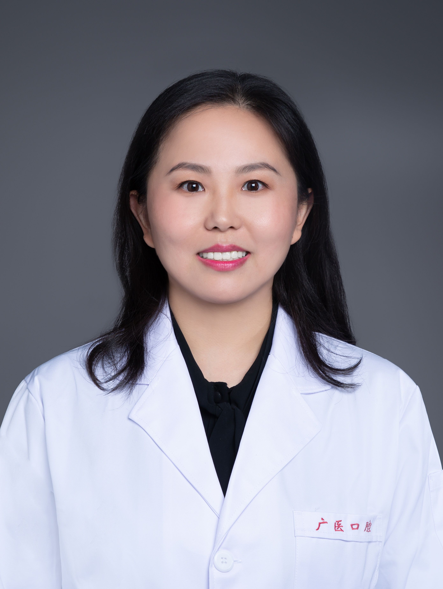

<!-- AUTO-GENERATED-BY: work/generate_obsidian_profiles.py -->

<!-- TEMPLATE: D:\workspace\信息收集整理\医生画像仓库\模板\医生画像模板.md -->

# 刘亚蕊

## 基础信息

| 字段 | 内容 |
|---|---|
| 姓名 | 刘亚蕊 |
| 医院 | 广州医科大学附属口腔医院 |
| 科室 | 荔湾院区儿童口腔科 |
| 职称/身份 | 副主任医师 |
| 来源链接 | [官网原文](https://www.gykqyy.com/list.html?category=55&id=33) |
| 采集日期 | 2026-08-13 |

## 简介/擅长

舒适化及全麻下儿童口腔治疗。儿童龋病的综合防治，乳牙及年轻恒牙的牙髓根尖周病诊治，儿童牙齿外伤，咬合诱导及儿童错颌畸形早期干预。

## 可包装亮点

- 副主任医师，荔湾院区儿童口腔科副主任；
- 中华口腔医学会儿童口腔专业委员会会员，广东省口腔医学会口腔预防专委会委员，广东省保健协会口腔专委会常委，广东省保健协会口腔数字化专委会常务委员广东省医院协会口腔数字化材料专委会委员 获第五届羊城青年好医生，获2021年口腔医院最美抗疫战士荣誉称号。

## 重点疾病/人群标签

- 慢性病：
- 肿瘤：
- 生殖疾病：
- 免疫/风湿：
- 术后恢复/康复：
- 疑难重症：

## 证据摘录

> 只摘录官网公开信息中的短句或关键字段，不复制大段原文。

- 官网身份字段：副主任医师
- 官网简介/擅长：舒适化及全麻下儿童口腔治疗。儿童龋病的综合防治，乳牙及年轻恒牙的牙髓根尖周病诊治，儿童牙齿外伤，咬合诱导及儿童错颌畸形早期干预。
- 官网亮眼经历线索：副主任医师，荔湾院区儿童口腔科副主任； 中华口腔医学会儿童口腔专业委员会会员，广东省口腔医学会口腔预防专委会委员，广东省保健协会口腔专委会常委，广东省保健协会口腔数字化专委会常务委员广东省医院协会口腔数字化材料专委会委员 获第五届羊城青年好医生，获2021年口腔医院最美抗疫战士荣誉称号。
- 来源链接：https://www.gykqyy.com/list.html?category=55&id=33

## BD 画像摘要

刘亚蕊医生可作为广州医科大学附属口腔医院荔湾院区儿童口腔科的基础医生资料入库。当前重点方向以总底表标签为准，官网未展示的信息保持空白。

## 合规边界

- 仅使用医院官网、官方公众号、官方小程序等公开渠道。
- 不采集私人电话、私人微信、家庭住址、患者隐私或非公开排班信息。
- 不写“保证治愈”“疗效第一”“包治疑难杂症”等无法由官网证明的表述。
