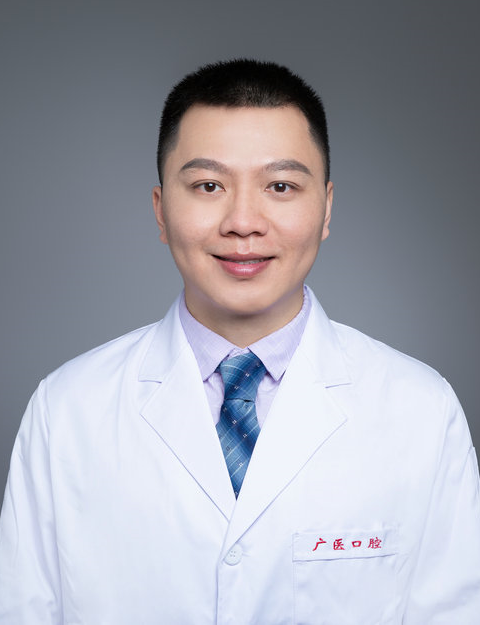

<!-- AUTO-GENERATED-BY: work/generate_obsidian_profiles.py -->

<!-- TEMPLATE: D:\workspace\信息收集整理\医生画像仓库\模板\医生画像模板.md -->

# 刘春江

## 基础信息

| 字段 | 内容 |
|---|---|
| 姓名 | 刘春江 |
| 医院 | 广州医科大学附属口腔医院 |
| 科室 | 麻醉手术中心 |
| 职称/身份 | 副主任医师 |
| 来源链接 | [官网原文](https://www.gykqyy.com/list.html?category=55&id=308) |
| 采集日期 | 2026-08-13 |

## 简介/擅长

擅长口腔颌面外科及儿童口腔科手术麻醉、口腔镇静镇痛舒适化治疗。

## 教育与进修经历

- 2000年毕业于广州医科大学临床医学专业。

## 论文与学术产出

- 发表论文及专著多篇。

## 可包装亮点

- 副主任医师、麻醉手术中心副主任；
- 现为中华口腔医学会麻醉专业委员会委员、中华口腔医学会镇静镇痛专业委员会专科会员、广东省口腔医学会口腔急诊专业委员会委员。
- 发表论文及专著多篇。

## 重点疾病/人群标签

- 慢性病：
- 肿瘤：
- 生殖疾病：
- 免疫/风湿：
- 术后恢复/康复：
- 疑难重症：

## 证据摘录

> 只摘录官网公开信息中的短句或关键字段，不复制大段原文。

- 官网身份字段：副主任医师
- 官网简介/擅长：擅长口腔颌面外科及儿童口腔科手术麻醉、口腔镇静镇痛舒适化治疗。
- 官网亮眼经历线索：副主任医师、麻醉手术中心副主任； 现为中华口腔医学会麻醉专业委员会委员、中华口腔医学会镇静镇痛专业委员会专科会员、广东省口腔医学会口腔急诊专业委员会委员。 发表论文及专著多篇。
- 来源链接：https://www.gykqyy.com/list.html?category=55&id=308

## BD 画像摘要

刘春江医生可作为广州医科大学附属口腔医院麻醉手术中心的基础医生资料入库。当前重点方向以总底表标签为准，官网未展示的信息保持空白。

## 合规边界

- 仅使用医院官网、官方公众号、官方小程序等公开渠道。
- 不采集私人电话、私人微信、家庭住址、患者隐私或非公开排班信息。
- 不写“保证治愈”“疗效第一”“包治疑难杂症”等无法由官网证明的表述。
