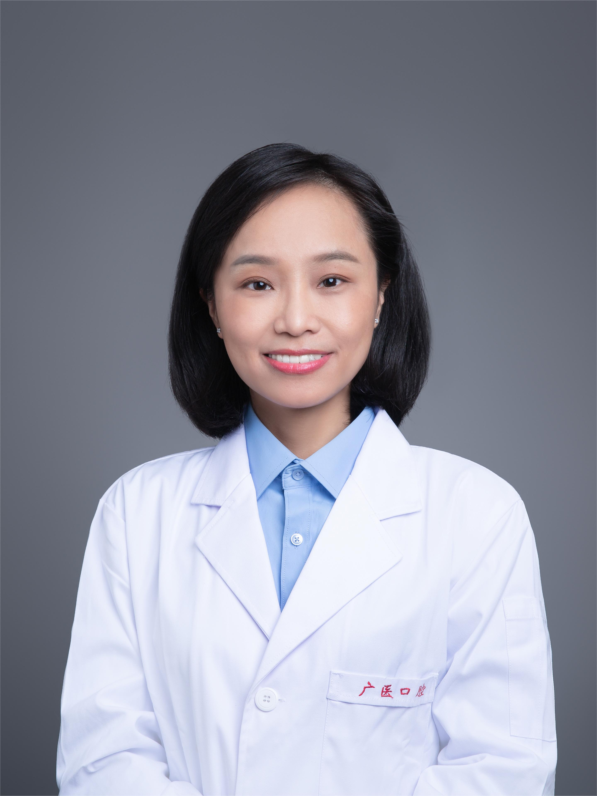

<!-- AUTO-GENERATED-BY: work/generate_obsidian_profiles.py -->

<!-- TEMPLATE: D:\workspace\信息收集整理\医生画像仓库\模板\医生画像模板.md -->

# 吕胡玲

## 基础信息

| 字段 | 内容 |
|---|---|
| 姓名 | 吕胡玲 |
| 医院 | 广州医科大学附属口腔医院 |
| 科室 | 荔湾院区口腔修复科 |
| 职称/身份 | 副主任医师 |
| 来源链接 | [官网原文](https://www.gykqyy.com/list.html?category=55&id=74) |
| 采集日期 | 2026-08-13 |

## 简介/擅长

固定义齿、活动义齿、种植义齿修复,生物功能性活动义齿修复(BPS),残根残冠的保存,针对牙列不齐、牙列稀疏、牙齿颜色欠佳的前牙美容美学修复,牙齿美白,以及套筒冠、磁性附着体等精密附件的复杂义齿修复。

## 教育与进修经历

- 美国baylor牙学院博士后、美国伊利诺伊大学芝加哥分校牙学院访问学者、四川大学华西口腔医学院口腔修复专业博士(本硕博连读)国际牙医研究学会(IADR)会员、中华口腔医学会会员、修复美学专委会会员；

## 科研项目与成果

- 发表SCI论文10余篇,主持市级科研项目1项。

## 论文与学术产出

- 发表SCI论文10余篇,主持市级科研项目1项。

## 可包装亮点

- 吕胡玲，副主任医师，博士；
- 美国baylor牙学院博士后、美国伊利诺伊大学芝加哥分校牙学院访问学者、四川大学华西口腔医学院口腔修复专业博士(本硕博连读)国际牙医研究学会(IADR)会员、中华口腔医学会会员、修复美学专委会会员；
- 发表SCI论文10余篇,主持市级科研项目1项。

## 重点疾病/人群标签

- 慢性病：
- 肿瘤：
- 生殖疾病：
- 免疫/风湿：
- 术后恢复/康复：
- 疑难重症：复杂

## 证据摘录

> 只摘录官网公开信息中的短句或关键字段，不复制大段原文。

- 官网身份字段：副主任医师
- 官网简介/擅长：固定义齿、活动义齿、种植义齿修复,生物功能性活动义齿修复(BPS),残根残冠的保存,针对牙列不齐、牙列稀疏、牙齿颜色欠佳的前牙美容美学修复,牙齿美白,以及套筒冠、磁性附着体等精密附件的复杂义齿修复。
- 官网亮眼经历线索：吕胡玲，副主任医师，博士； 美国baylor牙学院博士后、美国伊利诺伊大学芝加哥分校牙学院访问学者、四川大学华西口腔医学院口腔修复专业博士(本硕博连读)国际牙医研究学会(IADR)会员、中华口腔医学会会员、修复美学专委会会员； 发表SCI论文10余篇,主持市级科研项目1项。
- 来源链接：https://www.gykqyy.com/list.html?category=55&id=74

## BD 画像摘要

吕胡玲医生可作为疑难重症方向的基础画像候选。后续 BD 使用应继续以官网来源和人工复核为准，不添加疗效承诺或无来源包装。

## 合规边界

- 仅使用医院官网、官方公众号、官方小程序等公开渠道。
- 不采集私人电话、私人微信、家庭住址、患者隐私或非公开排班信息。
- 不写“保证治愈”“疗效第一”“包治疑难杂症”等无法由官网证明的表述。
