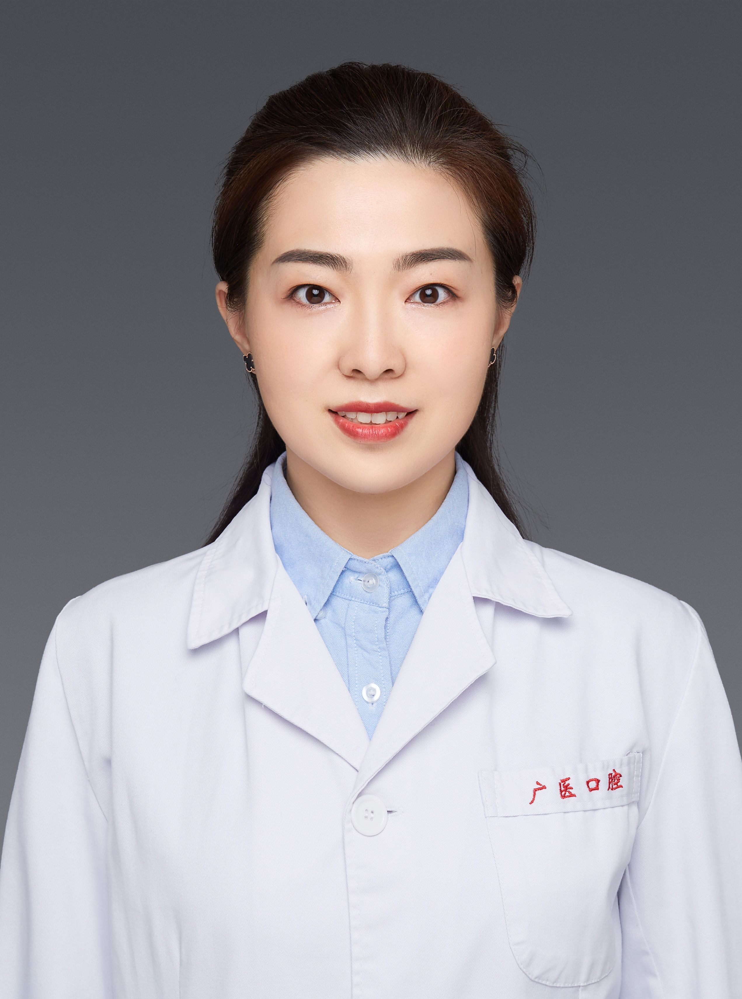

<!-- AUTO-GENERATED-BY: work/generate_obsidian_profiles.py -->

<!-- TEMPLATE: D:\workspace\信息收集整理\医生画像仓库\模板\医生画像模板.md -->

# 吴晓雪

## 基础信息

| 字段 | 内容 |
|---|---|
| 姓名 | 吴晓雪 |
| 医院 | 广州医科大学附属口腔医院 |
| 科室 | 荔湾院区口腔正畸科 |
| 职称/身份 | 副主任医师 |
| 来源链接 | [官网原文](https://www.gykqyy.com/list.html?category=55&id=112) |
| 采集日期 | 2026-08-13 |

## 简介/擅长

运用自锁托槽矫治技术、微种植体支抗技术、功能矫形技术、无托槽隐形、舌侧隐形等矫治技术治疗儿童及成人的各类错给畸形，如牙齿不齐、牙突嘴突、牙缝过多、地包天、开骀、下颌后缩、口腔不良习惯、成人颌骨畸形、唇腭裂序列治疗、正畸正颌联合治疗以及伴有牙周病、颞下颌关节炎的正畸治疗等

## 教育与进修经历

- 博士 毕业于第四军医大学，2011年毕业后留校(第四军医大学附属口腔医院正畸科)工作；
- 2017年公派赴美国Tucson进行Tweed经典方丝弓矫治技术专业培训，归国授予教官称号；

## 科研项目与成果

- 多次获得全国正畸年会青年医师病例大赛前五十强，在国内、国际发表正畸学相关文章十余篇，主持参与国家级及省级课题3项。

## 论文与学术产出

- 多次获得全国正畸年会青年医师病例大赛前五十强，在国内、国际发表正畸学相关文章十余篇，主持参与国家级及省级课题3项。

## 可包装亮点

- 博士，副主任医师，硕士研究生导师；
- 2017年公派赴美国Tucson进行Tweed经典方丝弓矫治技术专业培训，归国授予教官称号；
- 中华口腔医学会口腔正畸专业委员会会员；
- Tweed国际正畸协会中国区教官；

## 重点疾病/人群标签

- 慢性病：
- 肿瘤：
- 生殖疾病：
- 免疫/风湿：
- 术后恢复/康复：
- 疑难重症：

## 证据摘录

> 只摘录官网公开信息中的短句或关键字段，不复制大段原文。

- 官网身份字段：副主任医师
- 官网简介/擅长：运用自锁托槽矫治技术、微种植体支抗技术、功能矫形技术、无托槽隐形、舌侧隐形等矫治技术治疗儿童及成人的各类错给畸形，如牙齿不齐、牙突嘴突、牙缝过多、地包天、开骀、下颌后缩、口腔不良习惯、成人颌骨畸形、唇腭裂序列治疗、正畸正颌联合治疗以及伴有牙周病、颞下颌关节炎的正畸治疗等
- 官网亮眼经历线索：博士，副主任医师，硕士研究生导师； 2017年公派赴美国Tucson进行Tweed经典方丝弓矫治技术专业培训，归国授予教官称号； 中华口腔医学会口腔正畸专业委员会会员； Tweed国际正畸协会中国区教官；
- 来源链接：https://www.gykqyy.com/list.html?category=55&id=112

## BD 画像摘要

吴晓雪医生可作为广州医科大学附属口腔医院荔湾院区口腔正畸科的基础医生资料入库。当前重点方向以总底表标签为准，官网未展示的信息保持空白。

## 合规边界

- 仅使用医院官网、官方公众号、官方小程序等公开渠道。
- 不采集私人电话、私人微信、家庭住址、患者隐私或非公开排班信息。
- 不写“保证治愈”“疗效第一”“包治疑难杂症”等无法由官网证明的表述。
