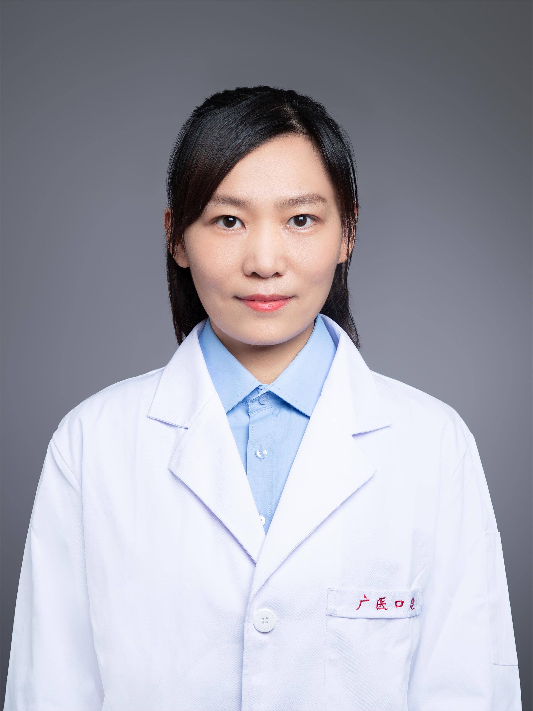

<!-- AUTO-GENERATED-BY: work/generate_obsidian_profiles.py -->

<!-- TEMPLATE: D:\workspace\信息收集整理\医生画像仓库\模板\医生画像模板.md -->

# 孔媛媛

## 基础信息

| 字段 | 内容 |
|---|---|
| 姓名 | 孔媛媛 |
| 医院 | 广州医科大学附属口腔医院 |
| 科室 | 荔湾院区牙体牙髓科、专家门诊特诊中心 |
| 职称/身份 | 副主任医师 |
| 来源链接 | [官网原文](https://www.gykqyy.com/list.html?category=55&id=87) |
| 采集日期 | 2026-08-13 |

## 简介/擅长

牙体牙髓常见疾病的诊断与治疗。

## 教育与进修经历

- 2014年毕业于广州医科大学,取得硕士学位；
- 2020年取得南方医科大学博士学位。

## 可包装亮点

- 孔媛媛，副主任医师，博士；

## 重点疾病/人群标签

- 慢性病：
- 肿瘤：
- 生殖疾病：
- 免疫/风湿：
- 术后恢复/康复：
- 疑难重症：

## 证据摘录

> 只摘录官网公开信息中的短句或关键字段，不复制大段原文。

- 官网身份字段：副主任医师
- 官网简介/擅长：牙体牙髓常见疾病的诊断与治疗。
- 官网亮眼经历线索：孔媛媛，副主任医师，博士；
- 来源链接：https://www.gykqyy.com/list.html?category=55&id=87

## BD 画像摘要

孔媛媛医生可作为广州医科大学附属口腔医院荔湾院区牙体牙髓科、专家门诊特诊中心的基础医生资料入库。当前重点方向以总底表标签为准，官网未展示的信息保持空白。

## 合规边界

- 仅使用医院官网、官方公众号、官方小程序等公开渠道。
- 不采集私人电话、私人微信、家庭住址、患者隐私或非公开排班信息。
- 不写“保证治愈”“疗效第一”“包治疑难杂症”等无法由官网证明的表述。
