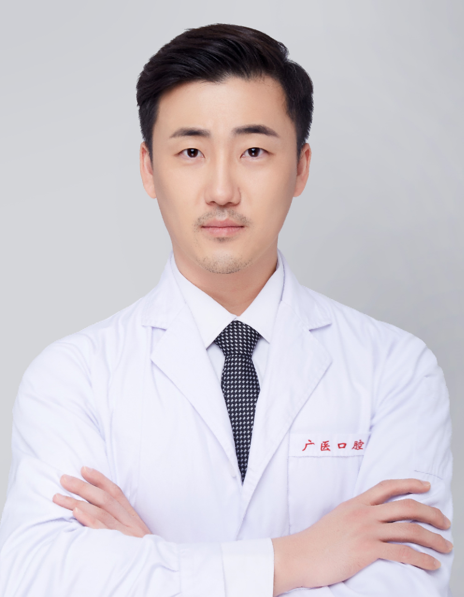

<!-- AUTO-GENERATED-BY: work/generate_obsidian_profiles.py -->

<!-- TEMPLATE: D:\workspace\信息收集整理\医生画像仓库\模板\医生画像模板.md -->

# 安银哲

## 基础信息

| 字段 | 内容 |
|---|---|
| 姓名 | 安银哲 |
| 医院 | 广州医科大学附属口腔医院 |
| 科室 | 越秀院区牙周病科 |
| 职称/身份 | 副主任医师 |
| 来源链接 | [官网原文](https://www.gykqyy.com/list.html?category=55&id=247) |
| 采集日期 | 2026-08-13 |

## 简介/擅长

牙周病及种植体周病的预防、诊断及治疗，牙周疾病的多学科联合治疗，牙周再生/美学手术和种植手术。

## 教育与进修经历

- 博士毕业于韩国延世大学牙科学院，主持省、市级科研项目4项，发表学术论文11篇，以第一作者或通讯作者发表SCI学术论文9篇，以副主编撰写 人民卫生出版社精品书籍《牙周松牙固定术操作详解》，曾获广州市高层次人才，广州市卫健委优秀人才，羊城青年好医生等称号 。

## 科研项目与成果

- 博士毕业于韩国延世大学牙科学院，主持省、市级科研项目4项，发表学术论文11篇，以第一作者或通讯作者发表SCI学术论文9篇，以副主编撰写 人民卫生出版社精品书籍《牙周松牙固定术操作详解》，曾获广州市高层次人才，广州市卫健委优秀人才，羊城青年好医生等称号 。

## 论文与学术产出

- 博士毕业于韩国延世大学牙科学院，主持省、市级科研项目4项，发表学术论文11篇，以第一作者或通讯作者发表SCI学术论文9篇，以副主编撰写 人民卫生出版社精品书籍《牙周松牙固定术操作详解》，曾获广州市高层次人才，广州市卫健委优秀人才，羊城青年好医生等称号 。

## 可包装亮点

- 博士，副主任医师；
- 博士毕业于韩国延世大学牙科学院，主持省、市级科研项目4项，发表学术论文11篇，以第一作者或通讯作者发表SCI学术论文9篇，以副主编撰写 人民卫生出版社精品书籍《牙周松牙固定术操作详解》，曾获广州市高层次人才，广州市卫健委优秀人才，羊城青年好医生等称号 。
- 兼任广东省口腔医学会牙周病学专业委员会委员、广东省精准医学会咬合与颞下颌疾病分会委员、广东省精准医学会修复种植分会委员、广东省保健协会口腔保健分会委员。
- 擅长：牙周病及种植体周病的预防、诊断及治疗，牙周疾病的多学科联合治疗，牙周再生/美学手术和种植手术。

## 重点疾病/人群标签

- 慢性病：
- 肿瘤：
- 生殖疾病：
- 免疫/风湿：
- 术后恢复/康复：
- 疑难重症：多学科

## 证据摘录

> 只摘录官网公开信息中的短句或关键字段，不复制大段原文。

- 官网身份字段：副主任医师
- 官网简介/擅长：牙周病及种植体周病的预防、诊断及治疗，牙周疾病的多学科联合治疗，牙周再生/美学手术和种植手术。
- 官网亮眼经历线索：博士，副主任医师； 博士毕业于韩国延世大学牙科学院，主持省、市级科研项目4项，发表学术论文11篇，以第一作者或通讯作者发表SCI学术论文9篇，以副主编撰写 人民卫生出版社精品书籍《牙周松牙固定术操作详解》，曾获广州市高层次人才，广州市卫健委优秀人才，羊城青年好医生等称号 。 兼任广东省口腔医学会牙周病学专业委员会委员、广东省精准医学会咬合与颞下颌疾病分会委员、广东省精准医学会修复种植分会委员、广东省保健协会口腔保健分会委员。 擅长：牙…
- 来源链接：https://www.gykqyy.com/list.html?category=55&id=247

## BD 画像摘要

安银哲医生可作为疑难重症方向的基础画像候选。后续 BD 使用应继续以官网来源和人工复核为准，不添加疗效承诺或无来源包装。

## 合规边界

- 仅使用医院官网、官方公众号、官方小程序等公开渠道。
- 不采集私人电话、私人微信、家庭住址、患者隐私或非公开排班信息。
- 不写“保证治愈”“疗效第一”“包治疑难杂症”等无法由官网证明的表述。
