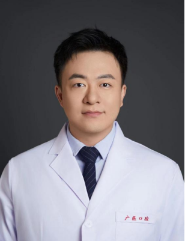

<!-- AUTO-GENERATED-BY: work/generate_obsidian_profiles.py -->

<!-- TEMPLATE: D:\workspace\信息收集整理\医生画像仓库\模板\医生画像模板.md -->

# 张戎

## 基础信息

| 字段 | 内容 |
|---|---|
| 姓名 | 张戎 |
| 医院 | 广州医科大学附属口腔医院 |
| 科室 | 越秀院区颞下颌关节科 |
| 职称/身份 | 主任医师 |
| 来源链接 | [官网原文](https://www.gykqyy.com/list.html?category=55&id=138) |
| 采集日期 | 2026-08-13 |

## 简介/擅长

颞下颌关节疾病的序列治疗、三叉神经痛、口颌面痛的梯度治疗、口腔牙周疾病的序列治疗及口腔全科诊疗等

## 教育与进修经历

- 解放军总医院博士后。
- 主持国家自然科学基金、中国博士后科学基金特别资助项目等国家级课题 2 项、省部级课题 3项，参编专著 3 部，参译专著 1 部。

## 科研项目与成果

- 主持国家自然科学基金、中国博士后科学基金特别资助项目等国家级课题 2 项、省部级课题 3项，参编专著 3 部，参译专著 1 部。
- 以第一发明人获授权国家发明专利 2 项，实用新型专利 1 项。

## 论文与学术产出

- SCI 期刊 Stem Cell Research & Therapy、Journal of Biological Engineering、Oral Diseases、BMC Musculoskeletal Disorders、Current Radiopharmaceuticals 审稿人、Journal of Clinical Pediatric Dentistry 青年编审、中文核心期刊《口腔颌面修复学杂志》、《中华老年口腔医学杂志》编委。
- 发表 SCI 论文 20余篇，其中以第一或通讯作者（含共同）在国际高水平 SCI 杂志发表论著 12 篇。
- 主持国家自然科学基金、中国博士后科学基金特别资助项目等国家级课题 2 项、省部级课题 3项，参编专著 3 部，参译专著 1 部。
- 曾荣获2024中国医疗美容行业优秀青年医师奖、第十届“羊城好医生”、2024年度广州市医学会医学优秀学术论文二等奖、2025广医口腔好医生等荣誉。

## 可包装亮点

- 博士，主任医师，硕士研究生导师，颞下颌关节科副主任，学科负责人；
- 国家公派美国宾夕法尼亚大学联合培养博士。
- 现任中华口腔医学会颞下颌关节病学及𬌗学专委会委员、中华口腔医学会全科口腔医学专委会委员、中华口腔医学会口腔美学专委会委员、中国整形美容协会口腔整形美容分会理事、中国老年学和老年医学学会口腔保健分会常委、广东省保健协会口腔保健分会常委、广东省精准医学会口腔修复种植分会委员。
- SCI 期刊 Stem Cell Research & Therapy、Journal of Biological Engineering、Oral Diseases、BMC Musculoskeletal Disorders、Current Radiopharmaceuticals 审稿人、Journal of Clinical Pediatric De…

## 重点疾病/人群标签

- 慢性病：
- 肿瘤：
- 生殖疾病：
- 免疫/风湿：
- 术后恢复/康复：
- 疑难重症：

## 证据摘录

> 只摘录官网公开信息中的短句或关键字段，不复制大段原文。

- 官网身份字段：主任医师
- 官网简介/擅长：颞下颌关节疾病的序列治疗、三叉神经痛、口颌面痛的梯度治疗、口腔牙周疾病的序列治疗及口腔全科诊疗等
- 官网亮眼经历线索：博士，主任医师，硕士研究生导师，颞下颌关节科副主任，学科负责人； 国家公派美国宾夕法尼亚大学联合培养博士。 现任中华口腔医学会颞下颌关节病学及𬌗学专委会委员、中华口腔医学会全科口腔医学专委会委员、中华口腔医学会口腔美学专委会委员、中国整形美容协会口腔整形美容分会理事、中国老年学和老年医学学会口腔保健分会常委、广东省保健协会口腔保健分会常委、广东省精准医学会口腔修复种植分会委员。 SCI 期刊 Stem Cell Research &…
- 来源链接：https://www.gykqyy.com/list.html?category=55&id=138

## BD 画像摘要

张戎医生可作为广州医科大学附属口腔医院越秀院区颞下颌关节科的基础医生资料入库。当前重点方向以总底表标签为准，官网未展示的信息保持空白。

## 合规边界

- 仅使用医院官网、官方公众号、官方小程序等公开渠道。
- 不采集私人电话、私人微信、家庭住址、患者隐私或非公开排班信息。
- 不写“保证治愈”“疗效第一”“包治疑难杂症”等无法由官网证明的表述。
