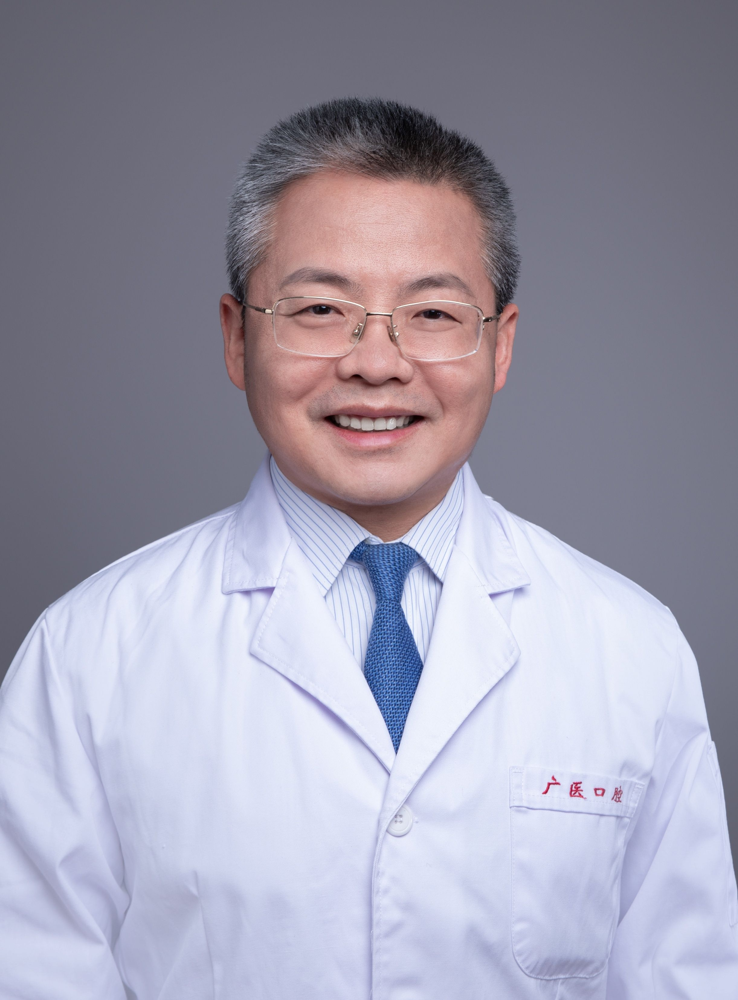

<!-- AUTO-GENERATED-BY: work/generate_obsidian_profiles.py -->

<!-- TEMPLATE: D:\workspace\信息收集整理\医生画像仓库\模板\医生画像模板.md -->

# 张清彬

## 基础信息

| 字段 | 内容 |
|---|---|
| 姓名 | 张清彬 |
| 医院 | 广州医科大学附属口腔医院 |
| 科室 | 荔湾院区颞下颌关节科、越秀院区颞下颌关节科 |
| 职称/身份 | 教授/主任医师 |
| 来源链接 | [官网原文](https://www.gykqyy.com/list.html?category=55&id=136) |
| 采集日期 | 2026-08-13 |

## 简介/擅长

颞下颌关节疾病的“序列治疗”，三叉神经痛及非典型面痛的“微创梯度”治疗。

## 教育与进修经历

- 曾参加中国医疗队支援非洲，博士后先后出站于首尔国立大学和解放军总医院；
- 国家卫健委技术推广服务专家、国家自然科学基金评审专家、教育部学位中心学位论文质量评审专家，中华口腔医学会全科口腔专委会常委、中华口腔医学会颞下颌关节病学及牙合学专委会常委、广东省精准医学应用学会咬合与颞下颌疾病分会首任主委、广东省医院协会口腔数字化材料专委会副主委、广东省口腔医师医学会副会长、广州市医师协会副会长等；

## 科研项目与成果

- 国家卫健委技术推广服务专家、国家自然科学基金评审专家、教育部学位中心学位论文质量评审专家，中华口腔医学会全科口腔专委会常委、中华口腔医学会颞下颌关节病学及牙合学专委会常委、广东省精准医学应用学会咬合与颞下颌疾病分会首任主委、广东省医院协会口腔数字化材料专委会副主委、广东省口腔医师医学会副会长、广州市医师协会副会长等；
- 先后主持国家重点研发计划（子课题）、国家自然科学基金、广东省自然科学基金、广州市科技计划重点研发项目等纵向课题20余项，主编教材及专著6部；

## 论文与学术产出

- 国家卫健委技术推广服务专家、国家自然科学基金评审专家、教育部学位中心学位论文质量评审专家，中华口腔医学会全科口腔专委会常委、中华口腔医学会颞下颌关节病学及牙合学专委会常委、广东省精准医学应用学会咬合与颞下颌疾病分会首任主委、广东省医院协会口腔数字化材料专委会副主委、广东省口腔医师医学会副会长、广州市医师协会副会长等；
- 先后主持国家重点研发计划（子课题）、国家自然科学基金、广东省自然科学基金、广州市科技计划重点研发项目等纵向课题20余项，主编教材及专著6部；
- 以第一作者或通讯作者发表文章70余篇，其中SCI收录27篇，担任《Cell proliferation》《华西口腔医学杂志》《中华老年口腔医学杂志》《中华口腔医学杂志》（电子版）《口腔疾病防治》《国际口腔医学杂志》等杂志审稿专家。

## 可包装亮点

- 博士，教授，主任医师，博士研究生导师，广州医科大学附属口腔医院党委书记；
- 国家卫健委技术推广服务专家、国家自然科学基金评审专家、教育部学位中心学位论文质量评审专家，中华口腔医学会全科口腔专委会常委、中华口腔医学会颞下颌关节病学及牙合学专委会常委、广东省精准医学应用学会咬合与颞下颌疾病分会首任主委、广东省医院协会口腔数字化材料专委会副主委、广东省口腔医师医学会副会长、广州市医师协会副会长等；
- 先后主持国家重点研发计划（子课题）、国家自然科学基金、广东省自然科学基金、广州市科技计划重点研发项目等纵向课题20余项，主编教材及专著6部；
- 以第一作者或通讯作者发表文章70余篇，其中SCI收录27篇，担任《Cell proliferation》《华西口腔医学杂志》《中华老年口腔医学杂志》《中华口腔医学杂志》（电子版）《口腔疾病防治》《国际口腔医学杂志》等杂志审稿专家。

## 重点疾病/人群标签

- 慢性病：
- 肿瘤：
- 生殖疾病：
- 免疫/风湿：
- 术后恢复/康复：
- 疑难重症：

## 证据摘录

> 只摘录官网公开信息中的短句或关键字段，不复制大段原文。

- 官网身份字段：教授/主任医师
- 官网简介/擅长：颞下颌关节疾病的“序列治疗”，三叉神经痛及非典型面痛的“微创梯度”治疗。
- 官网亮眼经历线索：博士，教授，主任医师，博士研究生导师，广州医科大学附属口腔医院党委书记； 国家卫健委技术推广服务专家、国家自然科学基金评审专家、教育部学位中心学位论文质量评审专家，中华口腔医学会全科口腔专委会常委、中华口腔医学会颞下颌关节病学及牙合学专委会常委、广东省精准医学应用学会咬合与颞下颌疾病分会首任主委、广东省医院协会口腔数字化材料专委会副主委、广东省口腔医师医学会副会长、广州市医师协会副会长等； 先后主持国家重点研发计划（子课题）、国家自然…
- 来源链接：https://www.gykqyy.com/list.html?category=55&id=136

## BD 画像摘要

张清彬医生可作为广州医科大学附属口腔医院荔湾院区颞下颌关节科、越秀院区颞下颌关节科的基础医生资料入库。当前重点方向以总底表标签为准，官网未展示的信息保持空白。

## 合规边界

- 仅使用医院官网、官方公众号、官方小程序等公开渠道。
- 不采集私人电话、私人微信、家庭住址、患者隐私或非公开排班信息。
- 不写“保证治愈”“疗效第一”“包治疑难杂症”等无法由官网证明的表述。
