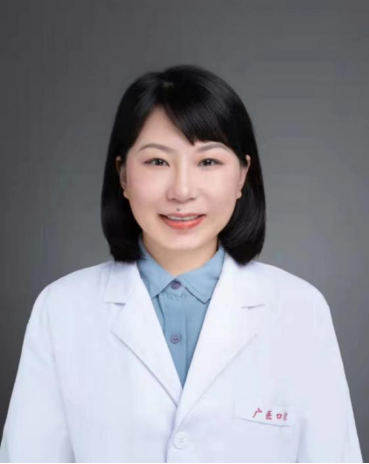

<!-- AUTO-GENERATED-BY: work/generate_obsidian_profiles.py -->

<!-- TEMPLATE: D:\workspace\信息收集整理\医生画像仓库\模板\医生画像模板.md -->

# 徐冬雪

## 基础信息

| 字段 | 内容 |
|---|---|
| 姓名 | 徐冬雪 |
| 医院 | 广州医科大学附属口腔医院 |
| 科室 | 荔湾院区儿童口腔科 |
| 职称/身份 | 副主任医师 |
| 来源链接 | [官网原文](https://www.gykqyy.com/list.html?category=55&id=32) |
| 采集日期 | 2026-08-13 |

## 简介/擅长

婴幼儿龋的综合防治、乳牙及年轻恒牙的牙髓根尖周病诊疗、儿童牙外伤的诊治、全麻下口腔疾病综合治疗、乳牙间隙管理、儿童行为管理及口腔健康管理。

## 教育与进修经历

- 毕业于中国医科大学，儿童口腔医学专业。
- 中华口腔医学会会员，儿童口腔医学专业委员会会员，口腔生物学专委会会员，广东省口腔医学会儿童口腔医学专业委员会委员，中国牙病防治基金会儿童乳牙预成冠培训志愿者讲师，主要从事儿童及口腔预防医学的临床、教学及科研工作。

## 科研项目与成果

- 中华口腔医学会会员，儿童口腔医学专业委员会会员，口腔生物学专委会会员，广东省口腔医学会儿童口腔医学专业委员会委员，中国牙病防治基金会儿童乳牙预成冠培训志愿者讲师，主要从事儿童及口腔预防医学的临床、教学及科研工作。
- 先后主持市厅级课题2项，校级课题1项，并参与多项省市级课题。

## 论文与学术产出

- 在国内外学术刊物上发表学术论文10余篇，参与出版学术著作1部。

## 可包装亮点

- 副主任医师，硕士研究生导师；
- 中华口腔医学会会员，儿童口腔医学专业委员会会员，口腔生物学专委会会员，广东省口腔医学会儿童口腔医学专业委员会委员，中国牙病防治基金会儿童乳牙预成冠培训志愿者讲师，主要从事儿童及口腔预防医学的临床、教学及科研工作。
- 在国内外学术刊物上发表学术论文10余篇，参与出版学术著作1部。

## 重点疾病/人群标签

- 慢性病：
- 肿瘤：
- 生殖疾病：
- 免疫/风湿：
- 术后恢复/康复：
- 疑难重症：

## 证据摘录

> 只摘录官网公开信息中的短句或关键字段，不复制大段原文。

- 官网身份字段：副主任医师
- 官网简介/擅长：婴幼儿龋的综合防治、乳牙及年轻恒牙的牙髓根尖周病诊疗、儿童牙外伤的诊治、全麻下口腔疾病综合治疗、乳牙间隙管理、儿童行为管理及口腔健康管理。
- 官网亮眼经历线索：副主任医师，硕士研究生导师； 中华口腔医学会会员，儿童口腔医学专业委员会会员，口腔生物学专委会会员，广东省口腔医学会儿童口腔医学专业委员会委员，中国牙病防治基金会儿童乳牙预成冠培训志愿者讲师，主要从事儿童及口腔预防医学的临床、教学及科研工作。 在国内外学术刊物上发表学术论文10余篇，参与出版学术著作1部。
- 来源链接：https://www.gykqyy.com/list.html?category=55&id=32

## BD 画像摘要

徐冬雪医生可作为广州医科大学附属口腔医院荔湾院区儿童口腔科的基础医生资料入库。当前重点方向以总底表标签为准，官网未展示的信息保持空白。

## 合规边界

- 仅使用医院官网、官方公众号、官方小程序等公开渠道。
- 不采集私人电话、私人微信、家庭住址、患者隐私或非公开排班信息。
- 不写“保证治愈”“疗效第一”“包治疑难杂症”等无法由官网证明的表述。
