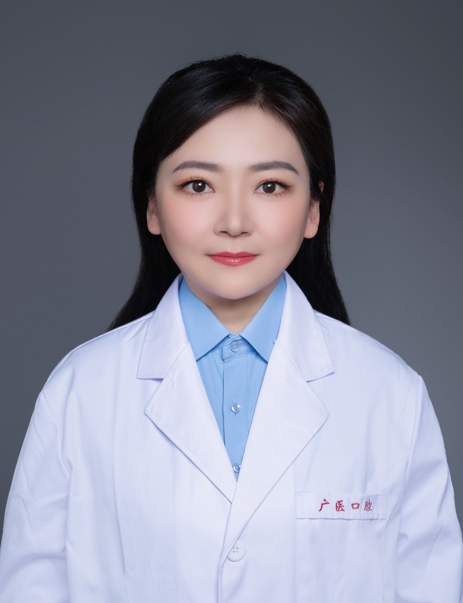

<!-- AUTO-GENERATED-BY: work/generate_obsidian_profiles.py -->

<!-- TEMPLATE: D:\workspace\信息收集整理\医生画像仓库\模板\医生画像模板.md -->

# 朱玉婷

## 基础信息

| 字段 | 内容 |
|---|---|
| 姓名 | 朱玉婷 |
| 医院 | 广州医科大学附属口腔医院 |
| 科室 | 越秀院区牙体牙髓科 |
| 职称/身份 | 副主任医师 |
| 来源链接 | [官网原文](https://www.gykqyy.com/list.html?category=55&id=211) |
| 采集日期 | 2026-08-13 |

## 简介/擅长

龋病、牙髓病、根尖周病等口腔内科疾病的系统治疗，在口腔疑难根管显微治疗、美容充填修复、着色牙漂白术、椅旁 CAD/CAM 即刻牙体修复技术方面具有丰富的临床经验

## 教育与进修经历

- 四川大学华西口腔医学院毕业、中华口腔医学会牙体牙髓病学专业委员会专科会员、广东省口腔医学会牙体牙髓病学专业委员会委员、发表数篇核心期刊论文、参与多项省市课题研究、多次参加全国及国际性学术会议。

## 科研项目与成果

- 四川大学华西口腔医学院毕业、中华口腔医学会牙体牙髓病学专业委员会专科会员、广东省口腔医学会牙体牙髓病学专业委员会委员、发表数篇核心期刊论文、参与多项省市课题研究、多次参加全国及国际性学术会议。

## 论文与学术产出

- 四川大学华西口腔医学院毕业、中华口腔医学会牙体牙髓病学专业委员会专科会员、广东省口腔医学会牙体牙髓病学专业委员会委员、发表数篇核心期刊论文、参与多项省市课题研究、多次参加全国及国际性学术会议。

## 可包装亮点

- 四川大学华西口腔医学院毕业、中华口腔医学会牙体牙髓病学专业委员会专科会员、广东省口腔医学会牙体牙髓病学专业委员会委员、发表数篇核心期刊论文、参与多项省市课题研究、多次参加全国及国际性学术会议。

## 重点疾病/人群标签

- 慢性病：
- 肿瘤：
- 生殖疾病：
- 免疫/风湿：
- 术后恢复/康复：
- 疑难重症：疑难

## 证据摘录

> 只摘录官网公开信息中的短句或关键字段，不复制大段原文。

- 官网身份字段：副主任医师
- 官网简介/擅长：龋病、牙髓病、根尖周病等口腔内科疾病的系统治疗，在口腔疑难根管显微治疗、美容充填修复、着色牙漂白术、椅旁 CAD/CAM 即刻牙体修复技术方面具有丰富的临床经验
- 官网亮眼经历线索：四川大学华西口腔医学院毕业、中华口腔医学会牙体牙髓病学专业委员会专科会员、广东省口腔医学会牙体牙髓病学专业委员会委员、发表数篇核心期刊论文、参与多项省市课题研究、多次参加全国及国际性学术会议。
- 来源链接：https://www.gykqyy.com/list.html?category=55&id=211

## BD 画像摘要

朱玉婷医生可作为疑难重症方向的基础画像候选。后续 BD 使用应继续以官网来源和人工复核为准，不添加疗效承诺或无来源包装。

## 合规边界

- 仅使用医院官网、官方公众号、官方小程序等公开渠道。
- 不采集私人电话、私人微信、家庭住址、患者隐私或非公开排班信息。
- 不写“保证治愈”“疗效第一”“包治疑难杂症”等无法由官网证明的表述。
