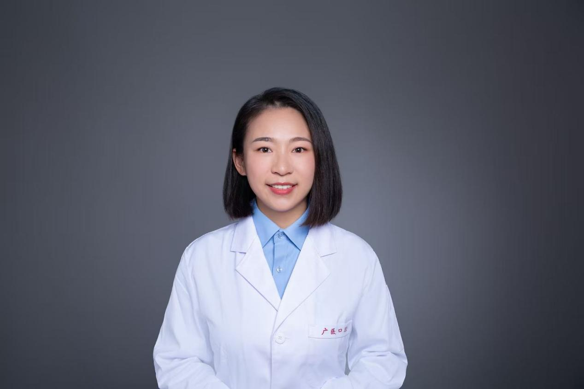

<!-- AUTO-GENERATED-BY: work/generate_obsidian_profiles.py -->

<!-- TEMPLATE: D:\workspace\信息收集整理\医生画像仓库\模板\医生画像模板.md -->

# 李传洁

## 基础信息

| 字段 | 内容 |
|---|---|
| 姓名 | 李传洁 |
| 医院 | 广州医科大学附属口腔医院 |
| 科室 | 越秀院区颞下颌关节科 |
| 职称/身份 | 副主任医师 |
| 来源链接 | [官网原文](https://www.gykqyy.com/list.html?category=55&id=141) |
| 采集日期 | 2026-08-13 |

## 简介/擅长

擅长颞下颌关节紊乱病（疼痛性疾病、关节疾病）的保守序列治疗，擅长各类牙体、牙列缺损的固定和活动修复、美学修复，擅长磨牙症相关颞下颌关节紊乱病的诊治。

## 科研项目与成果

- 主持或参与课题10余项，发表SCI论文10余篇，获批专利2项。

## 论文与学术产出

- 主持或参与课题10余项，发表SCI论文10余篇，获批专利2项。
- 兼任《口腔颌面修复学杂志》编委，BMC Oral Health、BMC Musculoskeletal Disorders等SCI期刊审稿人。
- 《颞下颌关节与面痛就医指南》副主编、参编高职十三五规划教材《口腔颌面外科学》、参译《颞下颌紊乱病诊治指南》、参编《口腔全科医疗临床病例精粹》等。

## 可包装亮点

- 博士、副主任医师。
- 任中华口腔医学会颞下颌关节及牙合学专业委员会青年委员、中国整形美容协会分会理事、广东省颞下颌关节及牙合学专业委员会委员、广东省整形美容协会理事会理事、广东省精准医学应用学会咬合与颞下颌疾病分会常委、广东省保健协会数字口腔分会常委、广东省老年保健协会委员。
- 曾获“羊城青年好医生”、广州市“最美抗疫战士”、院级“青年岗位能手”、院级“优秀共产党员”等称号。
- 主持或参与课题10余项，发表SCI论文10余篇，获批专利2项。

## 重点疾病/人群标签

- 慢性病：
- 肿瘤：
- 生殖疾病：
- 免疫/风湿：
- 术后恢复/康复：疼痛
- 疑难重症：

## 证据摘录

> 只摘录官网公开信息中的短句或关键字段，不复制大段原文。

- 官网身份字段：副主任医师
- 官网简介/擅长：擅长颞下颌关节紊乱病（疼痛性疾病、关节疾病）的保守序列治疗，擅长各类牙体、牙列缺损的固定和活动修复、美学修复，擅长磨牙症相关颞下颌关节紊乱病的诊治。
- 官网亮眼经历线索：博士、副主任医师。 任中华口腔医学会颞下颌关节及牙合学专业委员会青年委员、中国整形美容协会分会理事、广东省颞下颌关节及牙合学专业委员会委员、广东省整形美容协会理事会理事、广东省精准医学应用学会咬合与颞下颌疾病分会常委、广东省保健协会数字口腔分会常委、广东省老年保健协会委员。 曾获“羊城青年好医生”、广州市“最美抗疫战士”、院级“青年岗位能手”、院级“优秀共产党员”等称号。 主持或参与课题10余项，发表SCI论文10余篇，获批专利2项。
- 来源链接：https://www.gykqyy.com/list.html?category=55&id=141

## BD 画像摘要

李传洁医生可作为术后恢复/康复方向的基础画像候选。后续 BD 使用应继续以官网来源和人工复核为准，不添加疗效承诺或无来源包装。

## 合规边界

- 仅使用医院官网、官方公众号、官方小程序等公开渠道。
- 不采集私人电话、私人微信、家庭住址、患者隐私或非公开排班信息。
- 不写“保证治愈”“疗效第一”“包治疑难杂症”等无法由官网证明的表述。
