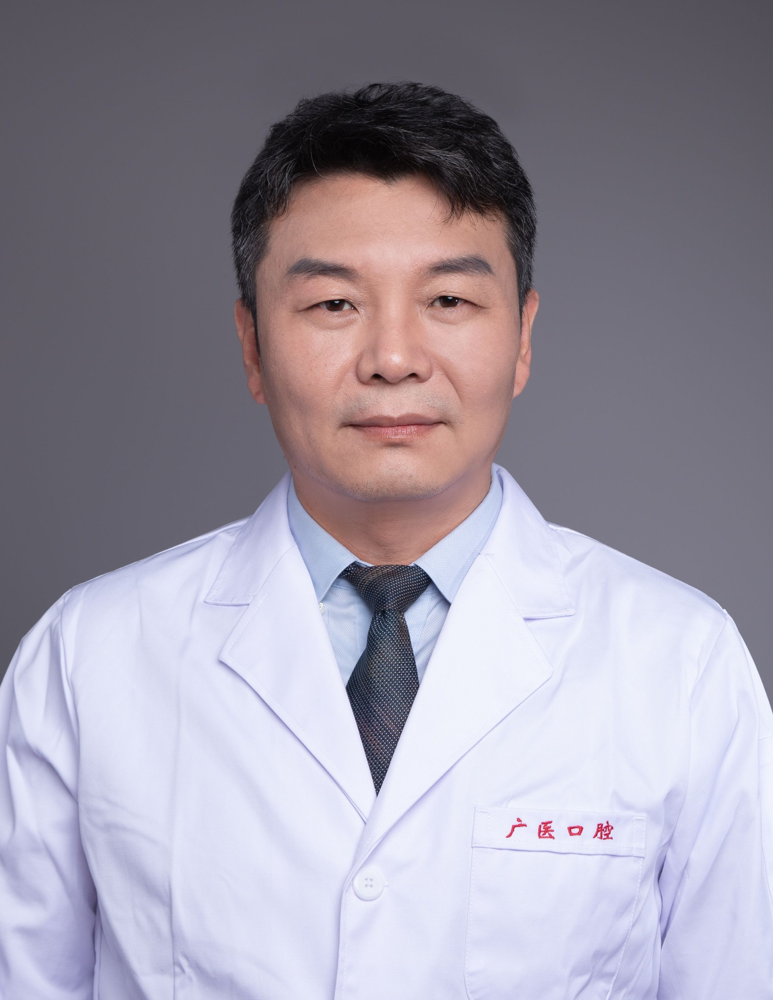

<!-- AUTO-GENERATED-BY: work/generate_obsidian_profiles.py -->

<!-- TEMPLATE: D:\workspace\信息收集整理\医生画像仓库\模板\医生画像模板.md -->

# 李江

## 基础信息

| 字段 | 内容 |
|---|---|
| 姓名 | 李江 |
| 医院 | 广州医科大学附属口腔医院 |
| 科室 | 越秀院区口腔修复科 |
| 职称/身份 | 教授/主任医师 |
| 来源链接 | [官网原文](https://www.gykqyy.com/list.html?category=55&id=195) |
| 采集日期 | 2026-08-13 |

## 简介/擅长

口腔修复、种植领域的各种疑难杂症,包括咬合重建、美学修复、数字化修复、复杂全口义齿修复等

## 教育与进修经历

- 曾教育部公派留学德国，广东省口腔组织修复与重建工程中心负责人、广东省临床重点专科建设项目（口腔修复专业）负责人、广州市口腔修复与内科学重点学科负责人、国际牙医师学院院士(FELLOW)；

## 科研项目与成果

- 曾教育部公派留学德国，广东省口腔组织修复与重建工程中心负责人、广东省临床重点专科建设项目（口腔修复专业）负责人、广州市口腔修复与内科学重点学科负责人、国际牙医师学院院士(FELLOW)；
- 主持国家重点研发专项等各级各类项目22项，发表SCI文章30余篇，获国家发明专利2项。

## 论文与学术产出

- 主持国家重点研发专项等各级各类项目22项，发表SCI文章30余篇，获国家发明专利2项。

## 可包装亮点

- 博士，教授，主任医师，博士研究生导师，广州医科大学附属口腔医院院长；
- 曾教育部公派留学德国，广东省口腔组织修复与重建工程中心负责人、广东省临床重点专科建设项目（口腔修复专业）负责人、广州市口腔修复与内科学重点学科负责人、国际牙医师学院院士(FELLOW)；
- 现任中华口腔医学会理事、中国医师协会口腔医师分会委员、中华口腔医学会口腔修复专委会常委、中国医院协会口腔分会常委等，广州市高层次人才杰出专家；
- 主持国家重点研发专项等各级各类项目22项，发表SCI文章30余篇，获国家发明专利2项。

## 重点疾病/人群标签

- 慢性病：
- 肿瘤：
- 生殖疾病：
- 免疫/风湿：
- 术后恢复/康复：
- 疑难重症：疑难、复杂

## 证据摘录

> 只摘录官网公开信息中的短句或关键字段，不复制大段原文。

- 官网身份字段：教授/主任医师
- 官网简介/擅长：口腔修复、种植领域的各种疑难杂症,包括咬合重建、美学修复、数字化修复、复杂全口义齿修复等
- 官网亮眼经历线索：博士，教授，主任医师，博士研究生导师，广州医科大学附属口腔医院院长； 曾教育部公派留学德国，广东省口腔组织修复与重建工程中心负责人、广东省临床重点专科建设项目（口腔修复专业）负责人、广州市口腔修复与内科学重点学科负责人、国际牙医师学院院士(FELLOW)； 现任中华口腔医学会理事、中国医师协会口腔医师分会委员、中华口腔医学会口腔修复专委会常委、中国医院协会口腔分会常委等，广州市高层次人才杰出专家； 主持国家重点研发专项等各级各类项目2…
- 来源链接：https://www.gykqyy.com/list.html?category=55&id=195

## BD 画像摘要

李江医生可作为疑难重症方向的基础画像候选。后续 BD 使用应继续以官网来源和人工复核为准，不添加疗效承诺或无来源包装。

## 合规边界

- 仅使用医院官网、官方公众号、官方小程序等公开渠道。
- 不采集私人电话、私人微信、家庭住址、患者隐私或非公开排班信息。
- 不写“保证治愈”“疗效第一”“包治疑难杂症”等无法由官网证明的表述。
