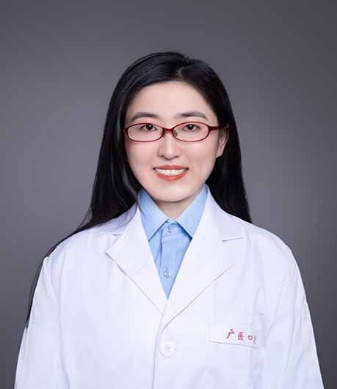

<!-- AUTO-GENERATED-BY: work/generate_obsidian_profiles.py -->

<!-- TEMPLATE: D:\workspace\信息收集整理\医生画像仓库\模板\医生画像模板.md -->

# 李阳

## 基础信息

| 字段 | 内容 |
|---|---|
| 姓名 | 李阳 |
| 医院 | 广州医科大学附属口腔医院 |
| 科室 | 荔湾院区牙体牙髓科 |
| 职称/身份 | 副主任医师 |
| 来源链接 | [官网原文](https://www.gykqyy.com/list.html?category=55&id=86) |
| 采集日期 | 2026-08-13 |

## 简介/擅长

龋病和牙髓根尖周病的诊疗、显微根管治疗术、牙体缺损的美学修复和CAD/CAM微创修复等。

## 教育与进修经历

- 博士毕业于中山大学光华口腔医学院，获口腔临床医学博士学位。

## 科研项目与成果

- 长期致力于牙体牙髓病学的临床、教学与科研工作，主持及参与国家自然科学基金、省市级科研项目多项，在牙髓根尖周疾病发病机制与诊疗技术方面开展系统研究。

## 可包装亮点

- 李阳，副主任医师、副研究员，博士。
- 现任广东省口腔医学会牙体牙髓病学专业委员会青年委员。
- 长期致力于牙体牙髓病学的临床、教学与科研工作，主持及参与国家自然科学基金、省市级科研项目多项，在牙髓根尖周疾病发病机制与诊疗技术方面开展系统研究。

## 重点疾病/人群标签

- 慢性病：
- 肿瘤：
- 生殖疾病：
- 免疫/风湿：
- 术后恢复/康复：
- 疑难重症：

## 证据摘录

> 只摘录官网公开信息中的短句或关键字段，不复制大段原文。

- 官网身份字段：副主任医师
- 官网简介/擅长：龋病和牙髓根尖周病的诊疗、显微根管治疗术、牙体缺损的美学修复和CAD/CAM微创修复等。
- 官网亮眼经历线索：李阳，副主任医师、副研究员，博士。 现任广东省口腔医学会牙体牙髓病学专业委员会青年委员。 长期致力于牙体牙髓病学的临床、教学与科研工作，主持及参与国家自然科学基金、省市级科研项目多项，在牙髓根尖周疾病发病机制与诊疗技术方面开展系统研究。
- 来源链接：https://www.gykqyy.com/list.html?category=55&id=86

## BD 画像摘要

李阳医生可作为广州医科大学附属口腔医院荔湾院区牙体牙髓科的基础医生资料入库。当前重点方向以总底表标签为准，官网未展示的信息保持空白。

## 合规边界

- 仅使用医院官网、官方公众号、官方小程序等公开渠道。
- 不采集私人电话、私人微信、家庭住址、患者隐私或非公开排班信息。
- 不写“保证治愈”“疗效第一”“包治疑难杂症”等无法由官网证明的表述。
