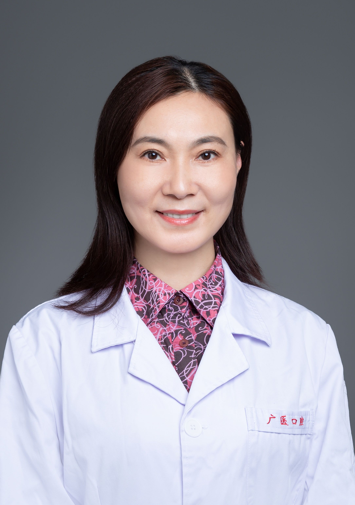

<!-- AUTO-GENERATED-BY: work/generate_obsidian_profiles.py -->

<!-- TEMPLATE: D:\workspace\信息收集整理\医生画像仓库\模板\医生画像模板.md -->

# 杨莉

## 基础信息

| 字段 | 内容 |
|---|---|
| 姓名 | 杨莉 |
| 医院 | 广州医科大学附属口腔医院 |
| 科室 | 专家门诊特诊中心 |
| 职称/身份 | 主任医师 |
| 来源链接 | [官网原文](https://www.gykqyy.com/list.html?category=55&id=3) |
| 采集日期 | 2026-08-13 |

## 简介/擅长

牙髓病，根尖周病显微根管治疗、冠根一体化治疗，牙体缺损数字化精准微创修复，显微根尖手术治疗技术等

## 教育与进修经历

- 毕业于武汉大学口腔医学院，从事口腔临床工作近30年，第四届羊城好医生、第一届广医口腔好医生， 广东省口腔医学会老年口腔专业委员会副主任委员，广东省预防医学会口腔疾病防治专业委员会副主任委员，广东省口腔医学会儿童口腔专委会常务委员，广东省口腔医学会牙体牙髓病学专委会常务委员。

## 可包装亮点

- 主任医师，硕士研究生导师，广医口腔名医，东晓南门诊部主任；
- 毕业于武汉大学口腔医学院，从事口腔临床工作近30年，第四届羊城好医生、第一届广医口腔好医生， 广东省口腔医学会老年口腔专业委员会副主任委员，广东省预防医学会口腔疾病防治专业委员会副主任委员，广东省口腔医学会儿童口腔专委会常务委员，广东省口腔医学会牙体牙髓病学专委会常务委员。
- 擅长：牙髓病，根尖周病显微根管治疗、冠根一体化治疗，牙体缺损数字化精准微创修复，显微根尖手术治疗技术等。

## 重点疾病/人群标签

- 慢性病：
- 肿瘤：
- 生殖疾病：
- 免疫/风湿：
- 术后恢复/康复：
- 疑难重症：

## 证据摘录

> 只摘录官网公开信息中的短句或关键字段，不复制大段原文。

- 官网身份字段：主任医师
- 官网简介/擅长：牙髓病，根尖周病显微根管治疗、冠根一体化治疗，牙体缺损数字化精准微创修复，显微根尖手术治疗技术等
- 官网亮眼经历线索：主任医师，硕士研究生导师，广医口腔名医，东晓南门诊部主任； 毕业于武汉大学口腔医学院，从事口腔临床工作近30年，第四届羊城好医生、第一届广医口腔好医生， 广东省口腔医学会老年口腔专业委员会副主任委员，广东省预防医学会口腔疾病防治专业委员会副主任委员，广东省口腔医学会儿童口腔专委会常务委员，广东省口腔医学会牙体牙髓病学专委会常务委员。 擅长：牙髓病，根尖周病显微根管治疗、冠根一体化治疗，牙体缺损数字化精准微创修复，显微根尖手术治疗技术等。
- 来源链接：https://www.gykqyy.com/list.html?category=55&id=3

## BD 画像摘要

杨莉医生可作为广州医科大学附属口腔医院专家门诊特诊中心的基础医生资料入库。当前重点方向以总底表标签为准，官网未展示的信息保持空白。

## 合规边界

- 仅使用医院官网、官方公众号、官方小程序等公开渠道。
- 不采集私人电话、私人微信、家庭住址、患者隐私或非公开排班信息。
- 不写“保证治愈”“疗效第一”“包治疑难杂症”等无法由官网证明的表述。
