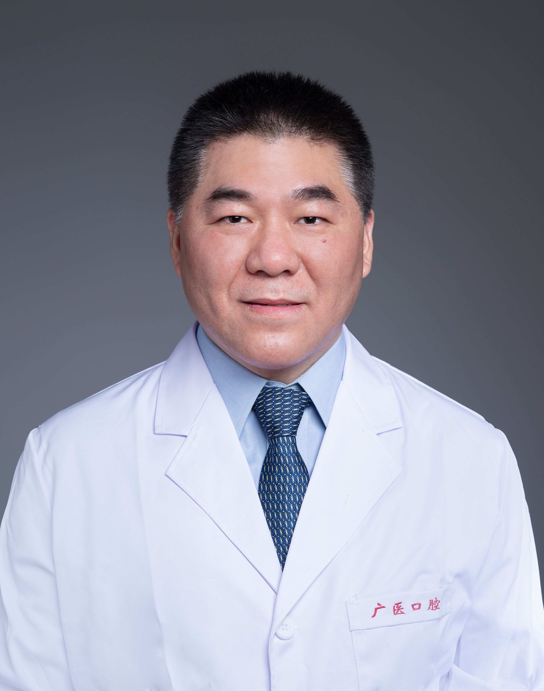

<!-- AUTO-GENERATED-BY: work/generate_obsidian_profiles.py -->

<!-- TEMPLATE: D:\workspace\信息收集整理\医生画像仓库\模板\医生画像模板.md -->

# 杨雪超

## 基础信息

| 字段 | 内容 |
|---|---|
| 姓名 | 杨雪超 |
| 医院 | 广州医科大学附属口腔医院 |
| 科室 | 越秀院区牙体牙髓科、专家门诊特诊中心 |
| 职称/身份 | 教授/主任医师 |
| 来源链接 | [官网原文](https://www.gykqyy.com/list.html?category=55&id=210) |
| 采集日期 | 2026-08-13 |

## 简介/擅长

显微根管治疗、微创根尖手术、微创牙体修复等，在国际上较早将3D打印技术应用于牙体牙髓疾病治疗中

## 教育与进修经历

- 武汉大学及荷兰Radboud University双博士学位，现兼任中华口腔医学会牙体牙髓病学专业委员会委员、老年口腔专业委员会委员、中国医药生物技术协会3D打印分会常委等。

## 科研项目与成果

- 主要研究方向为牙髓炎症机制和牙体硬组织再生，主持包括国家自然科学基金在内的多项国家、省部级科研课题，先后发表科研论文70余篇，其中SCI收录39篇，授权国家发明专利4项、实用新型专利7项。

## 论文与学术产出

- 主要研究方向为牙髓炎症机制和牙体硬组织再生，主持包括国家自然科学基金在内的多项国家、省部级科研课题，先后发表科研论文70余篇，其中SCI收录39篇，授权国家发明专利4项、实用新型专利7项。
- 主编人卫出版社《微创牙体修复技术图解》、《‍镍钛根管预备和热牙胶根管充填技术》、《‍数字化口腔临床技术图解丛书》系列。

## 可包装亮点

- 武汉大学及荷兰Radboud University双博士学位，现兼任中华口腔医学会牙体牙髓病学专业委员会委员、老年口腔专业委员会委员、中国医药生物技术协会3D打印分会常委等。
- 2015年遴选为“广州市医学重点人才”；
- 2018年遴选为首批“广东省杰出青年医学人才”。
- 2018年入选“岭南名医录”及“羊城好医生”， 2022年获第五届“广州最美医师”称号，2023年获广东省科技进步二等奖。

## 重点疾病/人群标签

- 慢性病：
- 肿瘤：
- 生殖疾病：
- 免疫/风湿：
- 术后恢复/康复：
- 疑难重症：

## 证据摘录

> 只摘录官网公开信息中的短句或关键字段，不复制大段原文。

- 官网身份字段：教授/主任医师
- 官网简介/擅长：显微根管治疗、微创根尖手术、微创牙体修复等，在国际上较早将3D打印技术应用于牙体牙髓疾病治疗中
- 官网亮眼经历线索：武汉大学及荷兰Radboud University双博士学位，现兼任中华口腔医学会牙体牙髓病学专业委员会委员、老年口腔专业委员会委员、中国医药生物技术协会3D打印分会常委等。 2015年遴选为“广州市医学重点人才”； 2018年遴选为首批“广东省杰出青年医学人才”。 2018年入选“岭南名医录”及“羊城好医生”， 2022年获第五届“广州最美医师”称号，2023年获广东省科技进步二等奖。
- 来源链接：https://www.gykqyy.com/list.html?category=55&id=210

## BD 画像摘要

杨雪超医生可作为广州医科大学附属口腔医院越秀院区牙体牙髓科、专家门诊特诊中心的基础医生资料入库。当前重点方向以总底表标签为准，官网未展示的信息保持空白。

## 合规边界

- 仅使用医院官网、官方公众号、官方小程序等公开渠道。
- 不采集私人电话、私人微信、家庭住址、患者隐私或非公开排班信息。
- 不写“保证治愈”“疗效第一”“包治疑难杂症”等无法由官网证明的表述。
