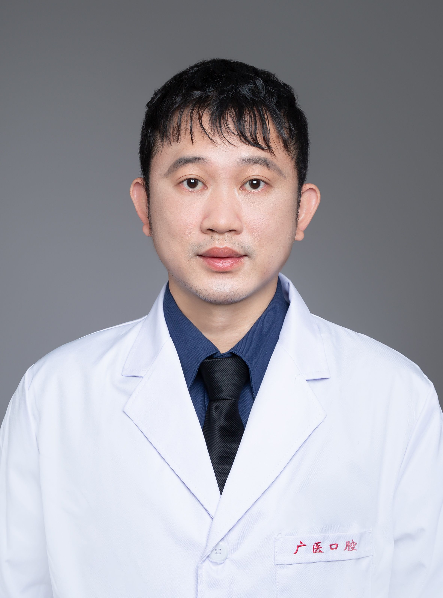

<!-- AUTO-GENERATED-BY: work/generate_obsidian_profiles.py -->

<!-- TEMPLATE: D:\workspace\信息收集整理\医生画像仓库\模板\医生画像模板.md -->

# 欧阳可雄

## 基础信息

| 字段 | 内容 |
|---|---|
| 姓名 | 欧阳可雄 |
| 医院 | 广州医科大学附属口腔医院 |
| 科室 | 荔湾院区口腔颌面外科 |
| 职称/身份 | 主任医师 |
| 来源链接 | [官网原文](https://www.gykqyy.com/list.html?category=55&id=52) |
| 采集日期 | 2026-08-13 |

## 简介/擅长

头颈部肿瘤综合治疗、游离皮瓣修复、颌骨骨折及颌面部损伤、唇腭裂序列治疗、困难牙齿拔除、牙体种植

## 教育与进修经历

- 2002 年本科毕业于中山大学口腔医学院获学士学位，2006年获得中山大学口腔临床硕士学位，2015年获南方医科大学临床博士学位，2006 年起至今在广州医科大学附属口腔医院从事口腔领面外科临床、教学、科研工作；
- 2015 年赴美国旧金山短期学习，2017年在上海第九人民医院半年进修学习口腔颌面部缺损修复和重建；

## 科研项目与成果

- 2002 年本科毕业于中山大学口腔医学院获学士学位，2006年获得中山大学口腔临床硕士学位，2015年获南方医科大学临床博士学位，2006 年起至今在广州医科大学附属口腔医院从事口腔领面外科临床、教学、科研工作；

## 可包装亮点

- 博士，主任医师，硕士研究生导师，荔湾院区口腔颌面外科副主任；
- 2015 年赴美国旧金山短期学习，2017年在上海第九人民医院半年进修学习口腔颌面部缺损修复和重建；
- 现任广东省口腔医学会牙及牙槽外科专委会常务委员、广东省口腔医学会口腔领面外科委员会委员、广东省口腔医学会镇静镇痛委员会委员。

## 重点疾病/人群标签

- 慢性病：
- 肿瘤：肿瘤
- 生殖疾病：
- 免疫/风湿：
- 术后恢复/康复：
- 疑难重症：

## 证据摘录

> 只摘录官网公开信息中的短句或关键字段，不复制大段原文。

- 官网身份字段：主任医师
- 官网简介/擅长：头颈部肿瘤综合治疗、游离皮瓣修复、颌骨骨折及颌面部损伤、唇腭裂序列治疗、困难牙齿拔除、牙体种植
- 官网亮眼经历线索：博士，主任医师，硕士研究生导师，荔湾院区口腔颌面外科副主任； 2015 年赴美国旧金山短期学习，2017年在上海第九人民医院半年进修学习口腔颌面部缺损修复和重建； 现任广东省口腔医学会牙及牙槽外科专委会常务委员、广东省口腔医学会口腔领面外科委员会委员、广东省口腔医学会镇静镇痛委员会委员。
- 来源链接：https://www.gykqyy.com/list.html?category=55&id=52

## BD 画像摘要

欧阳可雄医生可作为肿瘤方向的基础画像候选。后续 BD 使用应继续以官网来源和人工复核为准，不添加疗效承诺或无来源包装。

## 合规边界

- 仅使用医院官网、官方公众号、官方小程序等公开渠道。
- 不采集私人电话、私人微信、家庭住址、患者隐私或非公开排班信息。
- 不写“保证治愈”“疗效第一”“包治疑难杂症”等无法由官网证明的表述。
