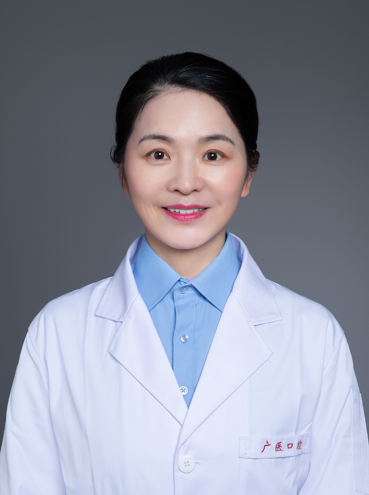

<!-- AUTO-GENERATED-BY: work/generate_obsidian_profiles.py -->

<!-- TEMPLATE: D:\workspace\信息收集整理\医生画像仓库\模板\医生画像模板.md -->

# 王丽萍

## 基础信息

| 字段 | 内容 |
|---|---|
| 姓名 | 王丽萍 |
| 医院 | 广州医科大学附属口腔医院 |
| 科室 | 荔湾院区口腔种植科、越秀院区口腔种植科 |
| 职称/身份 | 教授/主任医师 |
| 来源链接 | [官网原文](https://www.gykqyy.com/list.html?category=55&id=123) |
| 采集日期 | 2026-08-13 |

## 简介/擅长

各类牙缺失的种植、美学种植修复、数字化种植、即刻种植即刻修复、各种复杂骨增量技术、内窥镜辅助下的上颌窦提升术、种植导航、基于美学与功能的无牙颌种植修复与咬合重建等多种复杂种植修复

## 论文与学术产出

- 主编人民卫生出版社专著《骨增量种植修复临床操作图谱》；

## 可包装亮点

- 教授，主任医师，博士研究生导师，口腔种植学科主任；
- 中华口腔医学会修复专委会常委、中华口腔医学会种植专委会常委，广东省口腔医学会种植专委会副主任委员、广东省临床医学会种植专委会副主任委员、 BITC 专家组成员及终身会员；
- 曾获广州医师奖、 “羊城好医生”等多项奖项及荣誉称号 。

## 重点疾病/人群标签

- 慢性病：
- 肿瘤：
- 生殖疾病：
- 免疫/风湿：
- 术后恢复/康复：
- 疑难重症：复杂

## 证据摘录

> 只摘录官网公开信息中的短句或关键字段，不复制大段原文。

- 官网身份字段：教授/主任医师
- 官网简介/擅长：各类牙缺失的种植、美学种植修复、数字化种植、即刻种植即刻修复、各种复杂骨增量技术、内窥镜辅助下的上颌窦提升术、种植导航、基于美学与功能的无牙颌种植修复与咬合重建等多种复杂种植修复
- 官网亮眼经历线索：教授，主任医师，博士研究生导师，口腔种植学科主任； 中华口腔医学会修复专委会常委、中华口腔医学会种植专委会常委，广东省口腔医学会种植专委会副主任委员、广东省临床医学会种植专委会副主任委员、 BITC 专家组成员及终身会员； 曾获广州医师奖、 “羊城好医生”等多项奖项及荣誉称号 。
- 来源链接：https://www.gykqyy.com/list.html?category=55&id=123

## BD 画像摘要

王丽萍医生可作为疑难重症方向的基础画像候选。后续 BD 使用应继续以官网来源和人工复核为准，不添加疗效承诺或无来源包装。

## 合规边界

- 仅使用医院官网、官方公众号、官方小程序等公开渠道。
- 不采集私人电话、私人微信、家庭住址、患者隐私或非公开排班信息。
- 不写“保证治愈”“疗效第一”“包治疑难杂症”等无法由官网证明的表述。
