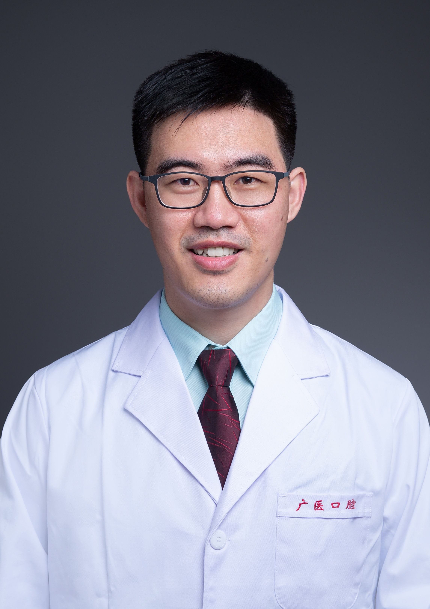

<!-- AUTO-GENERATED-BY: work/generate_obsidian_profiles.py -->

<!-- TEMPLATE: D:\workspace\信息收集整理\医生画像仓库\模板\医生画像模板.md -->

# 王伟东

## 基础信息

| 字段 | 内容 |
|---|---|
| 姓名 | 王伟东 |
| 医院 | 广州医科大学附属口腔医院 |
| 科室 | 越秀院区牙体牙髓科 |
| 职称/身份 | 副主任医师 |
| 来源链接 | [官网原文](https://www.gykqyy.com/list.html?category=55&id=212) |
| 采集日期 | 2026-08-13 |

## 简介/擅长

各种龋病、牙髓根尖周病及牙体缺损、隐裂牙的诊疗，擅长显微根管治疗及CAD/CAM微创牙体美学修复

## 论文与学术产出

- 发表数篇核心期刊论文，参编人民卫生出版社出版的《口腔住院医师专科技术图解丛书·镍钛根管预备和热牙胶根管充填技术图解》及《口腔住院医师专科技术图解丛书 · 微创牙体修复技术图解》。

## 可包装亮点

- 副主任医师，硕士研究生导师；
- 中华口腔医学会牙体牙髓学专业委员会专科会员、广东省青年医师协会会员；
- 发表数篇核心期刊论文，参编人民卫生出版社出版的《口腔住院医师专科技术图解丛书·镍钛根管预备和热牙胶根管充填技术图解》及《口腔住院医师专科技术图解丛书 · 微创牙体修复技术图解》。

## 重点疾病/人群标签

- 慢性病：
- 肿瘤：
- 生殖疾病：
- 免疫/风湿：
- 术后恢复/康复：
- 疑难重症：

## 证据摘录

> 只摘录官网公开信息中的短句或关键字段，不复制大段原文。

- 官网身份字段：副主任医师
- 官网简介/擅长：各种龋病、牙髓根尖周病及牙体缺损、隐裂牙的诊疗，擅长显微根管治疗及CAD/CAM微创牙体美学修复
- 官网亮眼经历线索：副主任医师，硕士研究生导师； 中华口腔医学会牙体牙髓学专业委员会专科会员、广东省青年医师协会会员； 发表数篇核心期刊论文，参编人民卫生出版社出版的《口腔住院医师专科技术图解丛书·镍钛根管预备和热牙胶根管充填技术图解》及《口腔住院医师专科技术图解丛书 · 微创牙体修复技术图解》。
- 来源链接：https://www.gykqyy.com/list.html?category=55&id=212

## BD 画像摘要

王伟东医生可作为广州医科大学附属口腔医院越秀院区牙体牙髓科的基础医生资料入库。当前重点方向以总底表标签为准，官网未展示的信息保持空白。

## 合规边界

- 仅使用医院官网、官方公众号、官方小程序等公开渠道。
- 不采集私人电话、私人微信、家庭住址、患者隐私或非公开排班信息。
- 不写“保证治愈”“疗效第一”“包治疑难杂症”等无法由官网证明的表述。
