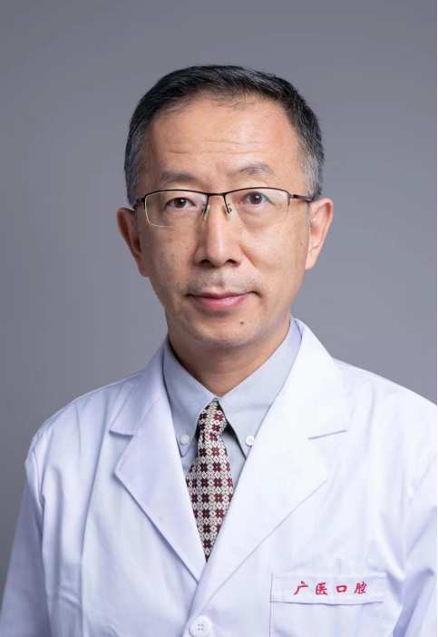

<!-- AUTO-GENERATED-BY: work/generate_obsidian_profiles.py -->

<!-- TEMPLATE: D:\workspace\信息收集整理\医生画像仓库\模板\医生画像模板.md -->

# 王朝俭

## 基础信息

| 字段 | 内容 |
|---|---|
| 姓名 | 王朝俭 |
| 医院 | 广州医科大学附属口腔医院 |
| 科室 | 放射科 |
| 职称/身份 | 主任医师 |
| 来源链接 | [官网原文](https://www.gykqyy.com/list.html?category=55&id=301) |
| 采集日期 | 2026-08-13 |

## 简介/擅长

MRI在颞下颌关节疾病诊断的应用、颞颌关节上腔造影技术、涎腺造影技术

## 论文与学术产出

- 发表临床类及教学类论文 2 0 余篇 ；
- 参编国家级数字教材 1 部 、 “ 十二五 ”职业教育国家规划教材 1 部 。

## 可包装亮点

- 主任医师，硕士研究生导师，广医口腔名医，口腔放射科学科主任；
- 中华口腔医学会口腔颌面放射专业委员会常务委员、广东省口腔医学会口腔颌面放射专业委员会主任委员、广东省口腔医学会理事会理事、广东省精准医学应用学会咬合与颞下颌疾病分会常务委员、广东省医学美容学会口腔医学会常务委员、广东省医学美容学会口腔医学会监事会监事、广东省口腔影像设备工程技术研究中心顾问；
- 发表临床类及教学类论文 2 0 余篇 ；

## 重点疾病/人群标签

- 慢性病：
- 肿瘤：
- 生殖疾病：
- 免疫/风湿：
- 术后恢复/康复：
- 疑难重症：

## 证据摘录

> 只摘录官网公开信息中的短句或关键字段，不复制大段原文。

- 官网身份字段：主任医师
- 官网简介/擅长：MRI在颞下颌关节疾病诊断的应用、颞颌关节上腔造影技术、涎腺造影技术
- 官网亮眼经历线索：主任医师，硕士研究生导师，广医口腔名医，口腔放射科学科主任； 中华口腔医学会口腔颌面放射专业委员会常务委员、广东省口腔医学会口腔颌面放射专业委员会主任委员、广东省口腔医学会理事会理事、广东省精准医学应用学会咬合与颞下颌疾病分会常务委员、广东省医学美容学会口腔医学会常务委员、广东省医学美容学会口腔医学会监事会监事、广东省口腔影像设备工程技术研究中心顾问； 发表临床类及教学类论文 2 0 余篇 ；
- 来源链接：https://www.gykqyy.com/list.html?category=55&id=301

## BD 画像摘要

王朝俭医生可作为广州医科大学附属口腔医院放射科的基础医生资料入库。当前重点方向以总底表标签为准，官网未展示的信息保持空白。

## 合规边界

- 仅使用医院官网、官方公众号、官方小程序等公开渠道。
- 不采集私人电话、私人微信、家庭住址、患者隐私或非公开排班信息。
- 不写“保证治愈”“疗效第一”“包治疑难杂症”等无法由官网证明的表述。
