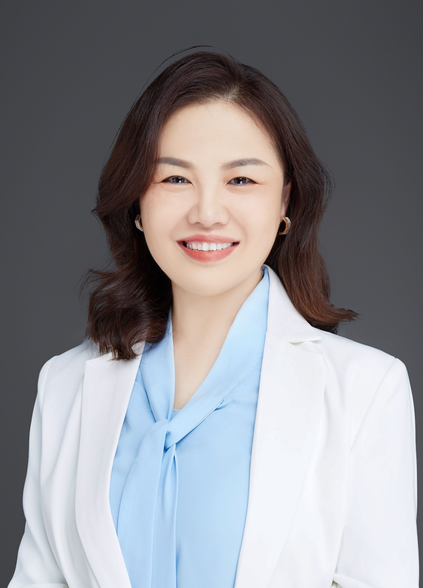

<!-- AUTO-GENERATED-BY: work/generate_obsidian_profiles.py -->

<!-- TEMPLATE: D:\workspace\信息收集整理\医生画像仓库\模板\医生画像模板.md -->

# 申玉芹

## 基础信息

| 字段 | 内容 |
|---|---|
| 姓名 | 申玉芹 |
| 医院 | 广州医科大学附属口腔医院 |
| 科室 | 荔湾院区牙周病科、越秀院区牙周病科、专家门诊特诊中心 |
| 职称/身份 | 教授/主任医师 |
| 来源链接 | [官网原文](https://www.gykqyy.com/list.html?category=55&id=240) |
| 采集日期 | 2026-08-13 |

## 简介/擅长

长期从事牙周疾病的治疗与研究，对伴有全身系统病患者、牙周疑难病、少见病和罕见病的治疗有丰富经验，尤其对重度牙周病的系统治疗联合治疗综合方案的设计、前牙区美学手术治疗、牙周软硬组织再生性手术等有深入研究。擅长牙周显微外科手术、牙周可视化治疗、口腔多学科联合治疗方案的设计及协同治疗

## 教育与进修经历

- 博士，教授，主任医师，博士生导师，博士后合作导师，广医口腔名医，牙周病学科主任；

## 科研项目与成果

- 主持或参与国家级项目3项、省级项目18项；
- 授权国家发明专利2项，实用新型专利多项 。

## 论文与学术产出

- 发表论文60余篇，其中 SCI 收录30篇；

## 可包装亮点

- 博士，教授，主任医师，博士生导师，博士后合作导师，广医口腔名医，牙周病学科主任；
- 中华口腔医学会牙周病学专委会常务委员，广东省口腔医学会牙周病学专业委员会副主任委员，广东省老年保健协会口腔临床医学专委会常委等；
- 获评2021年度“羊城好医生”；
- 发表论文60余篇，其中 SCI 收录30篇；

## 重点疾病/人群标签

- 慢性病：
- 肿瘤：
- 生殖疾病：
- 免疫/风湿：
- 术后恢复/康复：
- 疑难重症：疑难、多学科、罕见

## 证据摘录

> 只摘录官网公开信息中的短句或关键字段，不复制大段原文。

- 官网身份字段：教授/主任医师
- 官网简介/擅长：长期从事牙周疾病的治疗与研究，对伴有全身系统病患者、牙周疑难病、少见病和罕见病的治疗有丰富经验，尤其对重度牙周病的系统治疗联合治疗综合方案的设计、前牙区美学手术治疗、牙周软硬组织再生性手术等有深入研究。擅长牙周显微外科手术、牙周可视化治疗、口腔多学科联合治疗方案的设计及协同治疗
- 官网亮眼经历线索：博士，教授，主任医师，博士生导师，博士后合作导师，广医口腔名医，牙周病学科主任； 中华口腔医学会牙周病学专委会常务委员，广东省口腔医学会牙周病学专业委员会副主任委员，广东省老年保健协会口腔临床医学专委会常委等； 获评2021年度“羊城好医生”； 发表论文60余篇，其中 SCI 收录30篇；
- 来源链接：https://www.gykqyy.com/list.html?category=55&id=240

## BD 画像摘要

申玉芹医生可作为疑难重症方向的基础画像候选。后续 BD 使用应继续以官网来源和人工复核为准，不添加疗效承诺或无来源包装。

## 合规边界

- 仅使用医院官网、官方公众号、官方小程序等公开渠道。
- 不采集私人电话、私人微信、家庭住址、患者隐私或非公开排班信息。
- 不写“保证治愈”“疗效第一”“包治疑难杂症”等无法由官网证明的表述。
