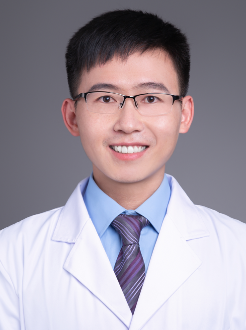

<!-- AUTO-GENERATED-BY: work/generate_obsidian_profiles.py -->

<!-- TEMPLATE: D:\workspace\信息收集整理\医生画像仓库\模板\医生画像模板.md -->

# 秦文光

## 基础信息

| 字段 | 内容 |
|---|---|
| 姓名 | 秦文光 |
| 医院 | 广州医科大学附属口腔医院 |
| 科室 | 荔湾院区牙周病科 |
| 职称/身份 | 副主任医师 |
| 来源链接 | [官网原文](https://www.gykqyy.com/list.html?category=55&id=106) |
| 采集日期 | 2026-08-13 |

## 简介/擅长

牙周疾病的诊断和微创舒适治疗；重度牙周炎的多学科联合治疗；种植牙修复治疗。

## 科研项目与成果

- 从事口腔医疗、教学、科研工作10余年，任广东省口腔医学会牙周病学专委会委员，广东省保健协会口腔保健分会常务委员，广东省精准医学会牙周疾病分会委员，全国卫生产业企业管理协会精准医疗分会委员、理事，国际口腔种植学会（ITI）成员。
- 曾获“第十一届羊城好医生”、“第十六届广州医科大学教学成果奖”、“口腔医院优秀教师与技术能手”等荣誉称号。
- 科研方向为牙周疾病临床防治与全身疾病关联性、牙周组织再生，主持相关科研项目10项（已结题8项），第一作者或通讯作者（含共同）发表论文17篇，近年来在国家或省级学术年会/继续教育学习班上汇报10余次。

## 论文与学术产出

- 《口腔疾病防治》青年编委，人卫版《牙周松牙固定术操作详解》副主编，广东省一流课程《牙周病学》骨干教师，广州地区特色技术核心成员，年均完成牙周病/牙周炎/种植义齿修复等临床病例4000余例。
- 科研方向为牙周疾病临床防治与全身疾病关联性、牙周组织再生，主持相关科研项目10项（已结题8项），第一作者或通讯作者（含共同）发表论文17篇，近年来在国家或省级学术年会/继续教育学习班上汇报10余次。

## 可包装亮点

- 从事口腔医疗、教学、科研工作10余年，任广东省口腔医学会牙周病学专委会委员，广东省保健协会口腔保健分会常务委员，广东省精准医学会牙周疾病分会委员，全国卫生产业企业管理协会精准医疗分会委员、理事，国际口腔种植学会（ITI）成员。
- 曾获“第十一届羊城好医生”、“第十六届广州医科大学教学成果奖”、“口腔医院优秀教师与技术能手”等荣誉称号。
- 科研方向为牙周疾病临床防治与全身疾病关联性、牙周组织再生，主持相关科研项目10项（已结题8项），第一作者或通讯作者（含共同）发表论文17篇，近年来在国家或省级学术年会/继续教育学习班上汇报10余次。

## 重点疾病/人群标签

- 慢性病：
- 肿瘤：
- 生殖疾病：
- 免疫/风湿：
- 术后恢复/康复：
- 疑难重症：多学科

## 证据摘录

> 只摘录官网公开信息中的短句或关键字段，不复制大段原文。

- 官网身份字段：副主任医师
- 官网简介/擅长：牙周疾病的诊断和微创舒适治疗；重度牙周炎的多学科联合治疗；种植牙修复治疗。
- 官网亮眼经历线索：从事口腔医疗、教学、科研工作10余年，任广东省口腔医学会牙周病学专委会委员，广东省保健协会口腔保健分会常务委员，广东省精准医学会牙周疾病分会委员，全国卫生产业企业管理协会精准医疗分会委员、理事，国际口腔种植学会（ITI）成员。 曾获“第十一届羊城好医生”、“第十六届广州医科大学教学成果奖”、“口腔医院优秀教师与技术能手”等荣誉称号。 科研方向为牙周疾病临床防治与全身疾病关联性、牙周组织再生，主持相关科研项目10项（已结题8项），第一作…
- 来源链接：https://www.gykqyy.com/list.html?category=55&id=106

## BD 画像摘要

秦文光医生可作为疑难重症方向的基础画像候选。后续 BD 使用应继续以官网来源和人工复核为准，不添加疗效承诺或无来源包装。

## 合规边界

- 仅使用医院官网、官方公众号、官方小程序等公开渠道。
- 不采集私人电话、私人微信、家庭住址、患者隐私或非公开排班信息。
- 不写“保证治愈”“疗效第一”“包治疑难杂症”等无法由官网证明的表述。
