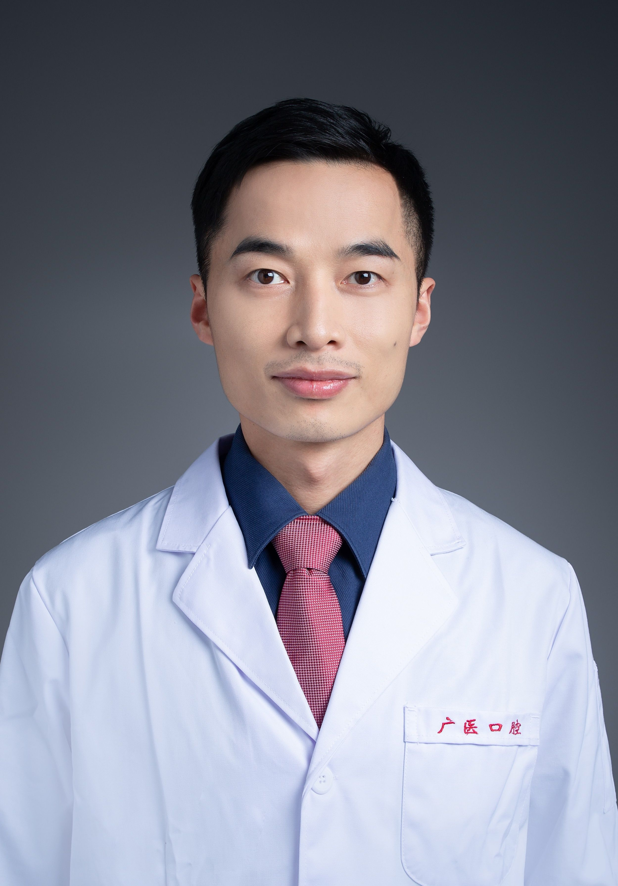

<!-- AUTO-GENERATED-BY: work/generate_obsidian_profiles.py -->

<!-- TEMPLATE: D:\workspace\信息收集整理\医生画像仓库\模板\医生画像模板.md -->

# 罗涛

## 基础信息

| 字段 | 内容 |
|---|---|
| 姓名 | 罗涛 |
| 医院 | 广州医科大学附属口腔医院 |
| 科室 | 越秀院区口腔修复科 |
| 职称/身份 | 副主任医师 |
| 来源链接 | [官网原文](https://www.gykqyy.com/list.html?category=55&id=197) |
| 采集日期 | 2026-08-13 |

## 简介/擅长

牙种植，无牙颌种植与修复;美学全瓷及贴面修复，四环素牙与氟斑牙的美 白修复，前牙美学设计与修复重建

## 教育与进修经历

- 美国Emory大学博士后，广州市高层次人才，武汉大学口腔修复学博士，国际口腔种植学会成员，长期从事口腔种植与口腔修复的临床，教学与科研带教工作，主持国家自然科学基金1项，多次担任口腔种植会议的翻译与授课工作，具有丰富的口腔美学与种植专科经验。

## 科研项目与成果

- 美国Emory大学博士后，广州市高层次人才，武汉大学口腔修复学博士，国际口腔种植学会成员，长期从事口腔种植与口腔修复的临床，教学与科研带教工作，主持国家自然科学基金1项，多次担任口腔种植会议的翻译与授课工作，具有丰富的口腔美学与种植专科经验。

## 可包装亮点

- 博士，副主任医师，硕士研究生导师；
- 美国Emory大学博士后，广州市高层次人才，武汉大学口腔修复学博士，国际口腔种植学会成员，长期从事口腔种植与口腔修复的临床，教学与科研带教工作，主持国家自然科学基金1项，多次担任口腔种植会议的翻译与授课工作，具有丰富的口腔美学与种植专科经验。

## 重点疾病/人群标签

- 慢性病：
- 肿瘤：
- 生殖疾病：
- 免疫/风湿：
- 术后恢复/康复：
- 疑难重症：

## 证据摘录

> 只摘录官网公开信息中的短句或关键字段，不复制大段原文。

- 官网身份字段：副主任医师
- 官网简介/擅长：牙种植，无牙颌种植与修复;美学全瓷及贴面修复，四环素牙与氟斑牙的美 白修复，前牙美学设计与修复重建
- 官网亮眼经历线索：博士，副主任医师，硕士研究生导师； 美国Emory大学博士后，广州市高层次人才，武汉大学口腔修复学博士，国际口腔种植学会成员，长期从事口腔种植与口腔修复的临床，教学与科研带教工作，主持国家自然科学基金1项，多次担任口腔种植会议的翻译与授课工作，具有丰富的口腔美学与种植专科经验。
- 来源链接：https://www.gykqyy.com/list.html?category=55&id=197

## BD 画像摘要

罗涛医生可作为广州医科大学附属口腔医院越秀院区口腔修复科的基础医生资料入库。当前重点方向以总底表标签为准，官网未展示的信息保持空白。

## 合规边界

- 仅使用医院官网、官方公众号、官方小程序等公开渠道。
- 不采集私人电话、私人微信、家庭住址、患者隐私或非公开排班信息。
- 不写“保证治愈”“疗效第一”“包治疑难杂症”等无法由官网证明的表述。
