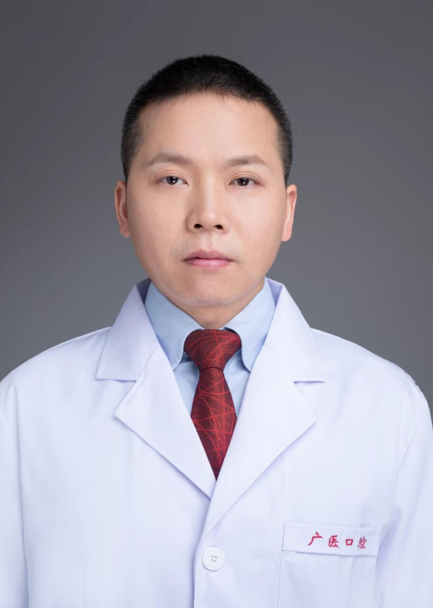

<!-- AUTO-GENERATED-BY: work/generate_obsidian_profiles.py -->

<!-- TEMPLATE: D:\workspace\信息收集整理\医生画像仓库\模板\医生画像模板.md -->

# 覃兆军

## 基础信息

| 字段 | 内容 |
|---|---|
| 姓名 | 覃兆军 |
| 医院 | 广州医科大学附属口腔医院 |
| 科室 | 麻醉手术中心 |
| 职称/身份 | 主任医师 |
| 来源链接 | [官网原文](https://www.gykqyy.com/list.html?category=55&id=302) |
| 采集日期 | 2026-08-13 |

## 简介/擅长

擅长疑难危重症患者、老年及小儿患者手术的麻醉处理；超声引导下神经阻滞技术；口腔麻醉及口腔舒适化医疗技术。

## 可包装亮点

- 中共党员，博士，主任医师，硕士研究生导师，麻醉手术中心主任 ；
- 现为中华口腔医学会口腔麻醉学专业委员会委员、中华口腔医学会镇静镇痛专业委员会委员、广州市医师协会麻醉科医师分会委员、广州市医学会麻醉学分会委员、广州市医院协会麻醉管理分会常委、广州市医师协会疼痛科医师分会委员会常委。
- 擅长：疑难危重症患者、老年及小儿患者手术的麻醉处理；

## 重点疾病/人群标签

- 慢性病：
- 肿瘤：
- 生殖疾病：
- 免疫/风湿：
- 术后恢复/康复：疼痛、疑难、危重
- 疑难重症：疼痛、疑难、危重

## 证据摘录

> 只摘录官网公开信息中的短句或关键字段，不复制大段原文。

- 官网身份字段：主任医师
- 官网简介/擅长：擅长疑难危重症患者、老年及小儿患者手术的麻醉处理；超声引导下神经阻滞技术；口腔麻醉及口腔舒适化医疗技术。
- 官网亮眼经历线索：中共党员，博士，主任医师，硕士研究生导师，麻醉手术中心主任 ； 现为中华口腔医学会口腔麻醉学专业委员会委员、中华口腔医学会镇静镇痛专业委员会委员、广州市医师协会麻醉科医师分会委员、广州市医学会麻醉学分会委员、广州市医院协会麻醉管理分会常委、广州市医师协会疼痛科医师分会委员会常委。 擅长：疑难危重症患者、老年及小儿患者手术的麻醉处理；
- 来源链接：https://www.gykqyy.com/list.html?category=55&id=302

## BD 画像摘要

覃兆军医生可作为术后恢复/康复、疑难重症方向的基础画像候选。后续 BD 使用应继续以官网来源和人工复核为准，不添加疗效承诺或无来源包装。

## 合规边界

- 仅使用医院官网、官方公众号、官方小程序等公开渠道。
- 不采集私人电话、私人微信、家庭住址、患者隐私或非公开排班信息。
- 不写“保证治愈”“疗效第一”“包治疑难杂症”等无法由官网证明的表述。
