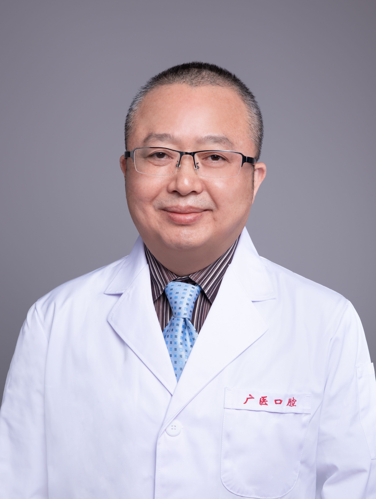

<!-- AUTO-GENERATED-BY: work/generate_obsidian_profiles.py -->

<!-- TEMPLATE: D:\workspace\信息收集整理\医生画像仓库\模板\医生画像模板.md -->

# 郭吕华

## 基础信息

| 字段 | 内容 |
|---|---|
| 姓名 | 郭吕华 |
| 医院 | 广州医科大学附属口腔医院 |
| 科室 | 越秀院区口腔修复科 |
| 职称/身份 | 教授/主任医师 |
| 来源链接 | [官网原文](https://www.gykqyy.com/list.html?category=55&id=196) |
| 采集日期 | 2026-08-13 |

## 简介/擅长

各类活动义齿修复、无牙颌种植修复、即刻种植即刻修复、前牙种植美学修复、各类缺牙的微创修复，数字化种植修复与美牙修复

## 科研项目与成果

- 主持国家级、省部级科研项目 10 余项，发表论文80余篇，其中SCI收录30余篇；

## 论文与学术产出

- 第九轮全国高等学校五年制本科口腔医学专业“十四五”规划教材《口腔修复学》编委，主编人民卫生出版社《数字化口腔修复工艺图解》《无牙牙合种植修复图解》等专著多部 ，担任《 MolecularOncology 》《 Nano-medicine anoBiotechnology 》等9部SCl期刊的审稿人及《口腔疾病防治》《中华口腔医学研究》《 广州医科大学学报 》等中文期刊编委；
- 主持国家级、省部级科研项目 10 余项，发表论文80余篇，其中SCI收录30余篇；

## 可包装亮点

- 博士，教授，主任医师，博士研究生导师，广医口腔名医；
- 中华口腔医学会种植专业委员会委员、广东省口腔医学会理事、广东省口腔医学会口腔种植专业委员会常务委员、广东省口腔医学会口腔修复专业委员会常务委员；
- 曾获首届“南粤好医生 ” 、第三届“ 羊城好医生 ”；
- 主持国家级、省部级科研项目 10 余项，发表论文80余篇，其中SCI收录30余篇；

## 重点疾病/人群标签

- 慢性病：
- 肿瘤：
- 生殖疾病：
- 免疫/风湿：
- 术后恢复/康复：
- 疑难重症：

## 证据摘录

> 只摘录官网公开信息中的短句或关键字段，不复制大段原文。

- 官网身份字段：教授/主任医师
- 官网简介/擅长：各类活动义齿修复、无牙颌种植修复、即刻种植即刻修复、前牙种植美学修复、各类缺牙的微创修复，数字化种植修复与美牙修复
- 官网亮眼经历线索：博士，教授，主任医师，博士研究生导师，广医口腔名医； 中华口腔医学会种植专业委员会委员、广东省口腔医学会理事、广东省口腔医学会口腔种植专业委员会常务委员、广东省口腔医学会口腔修复专业委员会常务委员； 曾获首届“南粤好医生 ” 、第三届“ 羊城好医生 ”； 主持国家级、省部级科研项目 10 余项，发表论文80余篇，其中SCI收录30余篇；
- 来源链接：https://www.gykqyy.com/list.html?category=55&id=196

## BD 画像摘要

郭吕华医生可作为广州医科大学附属口腔医院越秀院区口腔修复科的基础医生资料入库。当前重点方向以总底表标签为准，官网未展示的信息保持空白。

## 合规边界

- 仅使用医院官网、官方公众号、官方小程序等公开渠道。
- 不采集私人电话、私人微信、家庭住址、患者隐私或非公开排班信息。
- 不写“保证治愈”“疗效第一”“包治疑难杂症”等无法由官网证明的表述。
